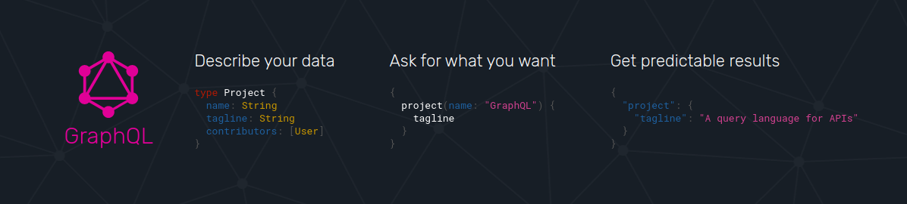

## GraphQL의 개발 배경

- 스마트폰 기기의 사용 증가로 인해 보다 더 효율적인 데이터 로딩이 필요했습니다.
- 고정된 데이터 구조를 반환하는 REST API로 인해 여러 클라이언트의 니즈를 충족하기 어려웠습니다.
- 기존 방식보다 효율적인 방법으로 더 빠른 속도의 개발이 필요했습니다.



## GraphQL이란?

GraphQL이란 클라이언트 사이드 애플리케이션에서 데이터베이스를 쿼리하기 위한 언어로, REST 기반 아키텍처의 대체제로 개발된 것입니다.

서버 사이드에서는 GraphQL이 API에게 어떻게 데이터를 전달할 지 명시하여 더 유연하고, 빠르게 클라이언트와 인터렉션이 가능하고, 정확하게 필요한 데이터만 받을 수 있습니다.

GraphQL 서버는 클라이언트에게 미리 정의된 스키마를 제공함으로써 클라이언트와 서버 사이에서 어떻게 데이터에 접근할지 정의하는 중간자 역할을 합니다.

게다가 GraphQL의 스키마의 기본적인 개념인 types라는 것을 통해 서버에서 가진 데이터들이 어떤 필드를 가지고 있는지, 서버에 어떻게 데이터가 쿼리될 수 있는지 알 수 있습니다.

스키마는 어떻게 쿼리를 만들 수 있는지, 어떤 데이터의 타입이 불러와지는지, 그 타입들간의 관계는 어떻게 되는지 정의할 수 있습니다.

쿼리를 하기 전에 스키마를 가지고 있으면, 클라이언트 단에서는 쿼리를 체크할 수 있어 서버에 쿼리를 보낼 수 있다는 것을 확실히 할 수 있습니다.

이는 사용자가 어떤 결과값을 받을지 예측할 수 있으며, 잘못된 구조나 데이터를 받을 가능성을 줄여줍니다.

스키마를 핵심으로 하는 그래프 모델링에 기반한 GraphQL에서는 세 가지의 작업을 수행할 수 있습니다.

### 데이터를 읽어들이기 위한 Query

```graphql
query getPeopleList {
  allPeople {
    edges {
      node {
        id
        name
      }
    }
  }
}
```

```json
// Query 결과 반환 값

{
  "data": {
    "allPeople": {
      "edges": [
        {
          "node": {
            "id": "cGVvcGxlOjE=",
            "name": "Luke Skywalker"
          }
        },
        {
          "node": {
            "id": "cGVvcGxlOjQ=",
            "name": "Darth Vader"
          }
        },
        {
          "node": {
            "id": "cGVvcGxlOjU=",
            "name": "Leia Organa"
          }
        }
      ]
    }
  }
}
```

위와 같이 필요한 프로퍼티만 요청하여 불필요한 데이터까지 받는 것을 피할 수 있습니다.

### 데이터를 변경하기 위한 Mutation

```graphql
mutation CreateReviewForEpisode($ep: Episode!, $review: ReviewInput!) {
  createReview(episode: $ep, review: $review) {
    stars
    commentary
  }
}
```

```json
{
  "ep": "JEDI",
  "review": {
    "stars": 5,
    "commentary": "This is a great movie!"
  }
}
```

```json
// Mutation 결과 반환 값

{
  "data": {
    "createReview": {
      "stars": 5,
      "commentary": "This is a great movie!"
    }
  }
}
```

다음과 같이 새로운 Review 데이터를 추가할 수 있습니다.

Mutation을 수행하면 새로 추가된 값이 결과 값으로 반환되어 어떤 값이 추가되었는지 확인 가능합니다.

### 실시간으로 데이터를 받을 수 있는 Subscription

Subscription를 통해 WebSocket을 기반으로 클라이언트와 서버 간의 연결을 유지한 채로 실시간으로 데이터를 받을 수 있습니다.

처음 사용자가 Mutation 요청을 보내면, Resolver에서 Pub Event가 실행되고 해당 이벤트를 구독하고 있는 클라이언트에게 이벤트 발생을 알립니다.

## GraphQL와 REST API의 공통점과 차이점

### 공통점

GraphQL과 REST는 모두 데이터를 송수신하기 위한 API를 개발하고, 쿼리를 보냄으로써 JSON 형태의 데이터를 반환받는다는 점에서 공통점을 가집니다.

### 차이점

GraphQL과 REST API의 가장 큰 차이점은 원하는 데이터만 받을 수 있는지 없는지에 관한 것입니다.

GraphQL은 데이터 제어권을 클라이언트로 넘겨줌으로써 하나의 요청으로도 필요한 데이터만 정확하게 가져올 수 있습니다.

반면에 REST API는 각 리소스에서 사용할 수 있는 데이터를 정의하고, 클라이언트에서는 일부분만 필요하더라도 여러 요청을 통해 필요 이상으로 많은 데이터를 불러오는 문제가 있습니다.

그 다음으로는 두 기술 사이의 모델에서 차이점이 존재합니다.

GraphQL은 그래프 형태의 데이터 모델로 구성되지만, REST는 파일로 구성됩니다.

## GraphQL의 장단점

### 장점

1. 마이크로서비스와 같은 복잡한 구조의 서비스에 적합합니다.

   이미 개발되어 있는 레거시 시스템을 GraphQL 서버에서 통합하여 단순하게 원하는 데이터만 쿼리할 수 있게 개발이 가능합니다.

   이는 GraphQL 서버에서 레거시 시스템으로부터 필요한 데이터만 받아 GraphQL 응답 형태로 포장하는 역할을 맡게 되어 시스템의 복잡성을 숨길 수 있습니다.

2. GraphQL은 단일 API Endpoint를 통해 데이터를 가져올 수 있습니다.

   REST는 개별 API Endpoint를 통해 리소스를 가져오기 때문에 필요한 데이터를 가져오기 위해서는 여러 EndPoint에 요청을 보내는 경우도 많습니다.

   또, 이 과정에서 불필요하게 많은 데이터를 요청하는 경우가 발생할 수 있습니다.

   하지만 GraphQL은 단 한 번의 호출을 통해 필요한 데이터를 모두 가져올 수 있습니다.

3. Over-Fetching과 Under-Fetching의 문제가 없습니다.

   REST API는 데이터가 충분하지 않아 다른 요청을 통해 받아오거나 너무 과다한 데이터를 받아오는 경우가 대부분입니다.

   하지만 GraphQL은 단일 요청을 통해 필요한 데이터를 정확하게 받아오기 때문에 위와 같은 문제에 대해 걱정할 필요가 없습니다.

4. 즉각적인 유효성 검사가 가능합니다.

   GraphQL의 Introspection System을 통해 개발자가 쿼리할 수 있는 데이터를 확인할 수 있습니다.

### 단점

1. 복잡한 쿼리로 인해 성능 문제가 발생할 수 있습니다.

   클라이언트가 한 번에 너무 과다한 중첩 필드를 쿼리하면 성능 문제가 발생할 수 있습니다.

   이 경우에는 오히려 REST 방식을 사용하는 것이 서버 유지 관리 측면에서 도움이 될 수 있습니다.

2. 웹 캐싱이 복잡합니다.

   GraphQL은 요청된 내용을 저장할 수 있는 HTTP Caching 방법에 의존하지 않습니다.

3. 기본적으로 파일 업로드가 불가능합니다.

   단순 GraphQL을 통해서는 파일 업로드가 불가능하지만, Apollo와 같은 라이브러리를 통해 구현이 가능하지만 추가적으로 라이브러리 사용 방법에 대해 알고 있어야 합니다.

---

### Source

- GraphQL: Core Features, Architecture, Pros and Cons

  [https://www.altexsoft.com/blog/engineering/graphql-core-features-architecture-pros-and-cons/](https://www.altexsoft.com/blog/engineering/graphql-core-features-architecture-pros-and-cons/)

- GraphQL Official WebSite

  [https://graphql.org/](https://graphql.org/)
