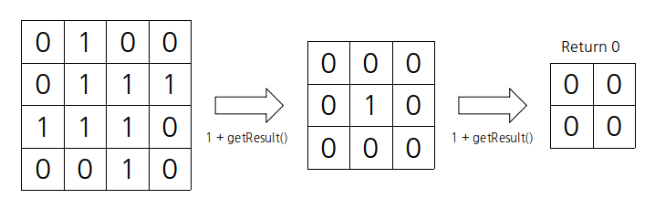
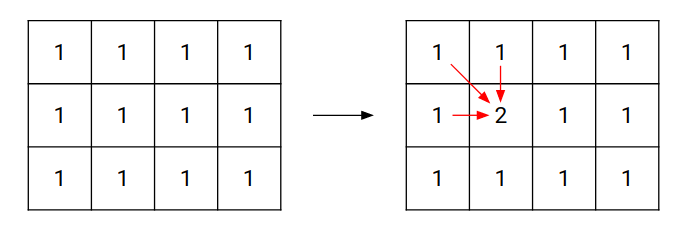
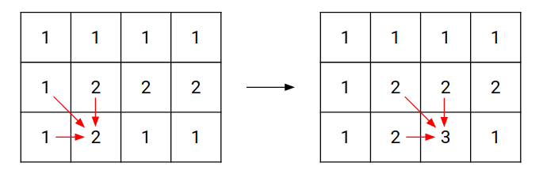
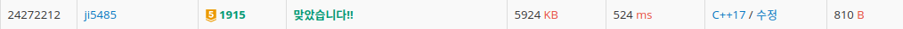
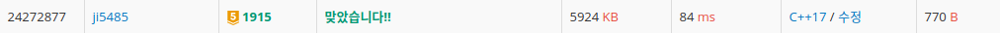

## 최초 풀이 방법

### 처음 AC를 받은 소스 코드

```cpp
#include <iostream>
using namespace std;

void refillArr();
int isEmpty();
int getResult();
int arr[1000][1000], n, m;

int main() {
  scanf("%d %d", &n, &m);

  for (int i = 0; i < n; i++) {
    for (int j = 0; j < m; j++)
      scanf("%1d", &arr[i][j]);
  }

  int size = getResult();
  printf("%d \n", size * size);

  return 0;
}

void refillArr() {
  for (int i = 0; i < n - 1; i++) {
    for (int j = 0; j < m - 1; j++)
      arr[i][j] = arr[i][j] && arr[i + 1][j] && arr[i + 1][j + 1] && arr[i][j + 1];
  }

  n--;
  m--;

  return;
}

int isEmpty() {
  for (int i = 0; i < n; i++) {
    for (int j = 0; j < m; j++) {
      if (arr[i][j] == 1) return 1;
    }
  }

  return 0;
}

int getResult() {
  if (!isEmpty() || n == 0 || m == 0) return 0;
  refillArr();

  return 1 + getResult();
}
```

### 해결 방법

첫 풀이 방법은 다이나믹 프로그래밍 기법을 사용한 것이라고는 볼 수 없는 코드이다.

오히려 단순 재귀 호출 풀이인데, 이 문제를 보고 처음으로 든 생각은 다음과 같다.

1. 처음부터 끝까지 돌면서 자기 자신, 바로 우측 칸, 아래 칸, 우측 대각선 아래 칸이 모두 1일 경우, 해당 자리는 1로 채운다.

   1로 채운 후에는 맨 우측줄과 맨 아랫줄은 더 이상 사용하지 않으므로 가로, 세로 길이를 1씩 줄인다.

2. 해당 범위 내의 숫자가 모두 0이거나, 가로 또는 세로 둘 중 하나의 길이가 0인 경우 재귀를 탈출한다.

   1이 남아있다는 말은 그 지점으로부터 길이가 2인 정사각형이 존재한다는 말이다.

   따라서 모두 0이 될 때 까지 반복한다면 그 반복 횟수로 정사각형의 최대 길이를 알 수 있다.

백준 예시로 과정을 그려보자면,

<br />



<br />

다음과 같이 0이 될 때까지 반복하면 한 변의 최대 길이는 2라는 것을 알 수 있다.

하지만, 이 풀이 방법은 다이나믹 프로그래밍 기법을 사용하지도 않을 뿐더러, 매번 처음부터 끝까지 순회해야 한다는 점에서 시간적으로 매우 비효율적인 방법이다.

만약 사이즈가 더 크거나, 제한 시간이 더 짧았더라면 시간 초과가 발생했을 풀이 방법이다.

---

## 추가 풀이

### 다이나믹 프로그래밍 풀이 방법

먼저 첫 번째 실마리는 정사각형의 내부는 모두 1로 채워져있다는 것이다.

따라서 1행 1열부터 마지막행 마지막열까지 순회하면서 해당 위치로부터 왼쪽 1칸, 위쪽 1칸, 왼쪽 윗 방향 대각선 1칸으로부터 최대 정사각형의 길이를 구하여 해당 위치 값에 추가할 수 있다.

그림으로 나타내면 다음과 같다.

<br />



<br />

계속 순회하면서 이 방법을 적용하면 다음과 같이 최대 정사각형의 길이를 도출할 수 있다.

<br />



<br />

이렇게 그림으로 볼 수 있듯이 해당 자리의 숫자는 그 자리로부터 왼쪽 방향과 윗쪽 방향으로 최대 해당 길이로 정사각형을 만들 수 있다는 뜻이기 때문에 세 자리의 최소값을 해당 자리에 더해주면 된다.

만약 해당 자리가 0인 경우에는 어떠한 경우에도 정사각형이 생길 수 없기 때문에 넘어가주면 된다.

따라서 다음과 같은 점화식을 세울 수 있다.

```cpp
dp[i][j] = dp[i][j] + min(dp[i - 1][j], dp[i - 1][j - 1], dp[i][j - 1]), if dp[i][j] != 0
```

이 과정을 통해 변경한 배열에서 구한 최대값은 주어진 환경에서 만들 수 있는 최대 크기의 정사각형 길이를 뜻하므로 이를 제곱하여 출력하면 된다.

아래는 다이나믹 프로그래밍 풀이 방법으로 바꾼 코드이다.

### 해당 방법으로 바꾼 소스 코드

```cpp
#include <iostream>
#include <cmath>
using namespace std;

int threeMin(int a, int b, int c);
void calcMaxSize();
int arr[1000][1000], n, m;

int main() {
  scanf("%d %d", &n, &m);

  for (int i = 0; i < n; i++) {
    for (int j = 0; j < m; j++)
      scanf("%1d", &arr[i][j]);
  }

  calcMaxSize();

  int maxSize = 0;
  for (int i = 0; i < n; i++) {
    for (int j = 0; j < m; j++)
      maxSize = max(maxSize, arr[i][j]);
  }

  printf("%d \n", maxSize * maxSize);

  return 0;
}

int threeMin(int a, int b, int c) {
  return min(a, min(b, c));
}

void calcMaxSize() {
  for (int i = 1; i < n; i++) {
    for (int j = 1; j < m; j++) {
      if (arr[i][j] != 0) arr[i][j] += threeMin(arr[i - 1][j], arr[i - 1][j - 1], arr[i][j - 1]);
    }
  }

  return;
}
```

### 풀이 결과

채점 결과, 다음과 같이 약 6배 정도의 시간 차이가 발생했다.

위의 결과가 최초로 AC 받았을 때의 코드이고, 다음 코드는 다이나믹 프로그래밍 방법으로 개선한 코드이다.

<br />




