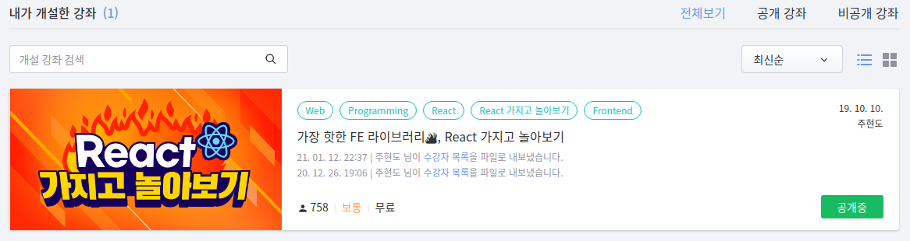

## React 가지고 놀아보기의 첫 시작점

나는 2020년 당시 대학교에 진학하자마자 고등학교때부터 찾아보며 들어가고 싶던 멋쟁이사자처럼이라는 동아리에 가입하여 활동하게 되었다.

그렇게 동아리원으로 활동을 하던 중, 2020년 7월이었는데 대학교 1학년 1학기를 마치고 난 후 친하게 지낸 동아리장이자 같은 과 선배가 2학기 수업을 진행해보는 것은 어떨 것 같냐고 제안했다.

그 당시 멋쟁이사자처럼은 프론트엔드의 필수적인 부분만 배우고, 주로 백엔드 분야에 대해 공부했는데 Django를 사용하여 웹 서버를 구현하는 과정을 배웠다.

또, 최근 기업에서 채용하고 싶어하는 개발자의 요구사항 중에서 React 같은 라이브러리를 활용한 경험을 되게 중요시 여겼기 때문에 경험삼아 체엄하는 것도 되게 좋을 것이라 생각하여 강의를 준비하게 되었다.

## 멋쟁이사자처럼 강의를 준비하면서

처음 강의를 준비하면서 생각한 점은 어떻게 최대한 쉽게 내용을 전달할 수 있을까이다.

고등학교 재학하면서 처음 React를 배울 때, 도저히 이해가 가지 않아 전체 내용을 3~4번 반복하면서 읽을 정도였기 때문에 아무래도 이 부분을 제일 신경쓴 것 같다.

이해할 수 있게 내용을 전달하는 것이 쉽지는 않았지만, 이 강의를 들을 사람들을 위해 처음 React를 공부했던 그 때의 시점으로 바라보며 전체적인 내용을 구상했다.

그리고 나는 그동안 여러 책을 보며 공부를 해왔는데, 전부 다 자잘한 예제만 넣었을 뿐이지 내가 당시 원했던 프로젝트를 개발하며 배우는 방식의 책은 없었던 것 같았다.

그래서 나는 개념에 대한 설명이 충분하게 들어가면서, 간단한 프로젝트 개발을 통해 어떻게 이를 적용하는 지도 설명하고 싶었다.

이 생각을 가지고 나는 강의를 진행하는 동안 작은 프로젝트 2개 정도 만드는 것을 목표로 강의 계획을 세웠다.

## 강의를 준비하며 제일 고민한 점

당연히 첫 번째는 해당 챕터에서 사용할 개념을 어떻게 이해하기 쉽게 전달하느냐이다.

기본적으로 이해하기 쉬운 강의가 머릿속에 내용이 더 잘 들어오고, 이전에 배운 내용과 유기적으로 연결시킬 수 있기 때문에 이 부분을 가장 많이 고민했다.

다음은 예제에서 사용된 문법에 대해 어떻게 자세하게 전달하느냐이다.

ES6에서 사용되는 문법을 많이 도입했기 때문에 이에 대한 설명은 필수적이라고 생각했다.

물론, 당시부터는 해당 문법으로 작성한 예제가 많아 간략하게 설명하거나 아예 생략해도 상관이 없었다.

그래도 알고 쓰는 것과 모르고 쓰는 것의 차이가 되게 크지 않았던가.

그래서 설명을 추가하기로 생각을 했고, 이전의 문법으로 작성했을 때와 새로운 문법으로 작성했을 때를 비교하여 어떻게 코드를 줄일 수 있고, 어떻게 더 효율적으로 작성할 수 있는지 등의 장점을 알려주기로 결정했다.

마지막으로는 어떤 프로젝트를 만들어야 할 것인가이다.

일단 나는 프로젝트를 만들며 React에 대해 배우는 것을 생각하고 있었기 때문에 그에 맞는 난이도를 가진 프로젝트를 생각해야 했다.

하지만 그 프로젝트들은 State와 Props, Hooks, Redux, API 통신 등 앞으로 배울 내용들을 다 적용할 수 있어야 했기 때문에 어떤 프로젝트가 적합할까 계속 고민했었다.

게다가 프로젝트를 2개나 진행하는 것을 목표로 잡았기 때문에 진행 방식이나 수업 기간까지 생각을 해야 하는 상황이어서 제일 머리가 아픈 부분이었다.

이렇게 많은 고민 끝에 내린 결론은, 처음 개념을 배울 때에는 데이터를 숫자 단 하나만 다루는 Counter를 통해 배우고, 그 후에 전화번호부를 통해 조금 더 확장하여 적용할 수 있도록 하자였다.

## 처음 의도와는 다르게 지금은

이 강의를 계획하면서 이렇게 온라인 강의로까지 이어질 줄은 생각도 못 했다.

만약 내가 멋쟁이 사자처럼 강의를 전부 온전히 다 끝냈더라면 이걸 온라인 강의로 만들어야 겠다고 생각도 하지 않았을 것이다.

그런데, 원래 인원이 많지 않았던 동아리였는데 각자의 개인 사정으로 동아리를 탈퇴하는 등 점차 수강 인원이 줄어들기 시작했다.

나중에는 수업을 진행할 수 없을 정도였기 때문에 보다 못한 동아리장 형이 더 이상 진행하기 힘들 것 같다며 나에게 미안한 마음을 표했다.

그래도 처음부터 끝까지 혼자서 강의를 준비하는 것이 흔치 않은 경험이기 때문에 비록 중간에 강의가 취소되었다 하더라도 나에게 있어서는 정말 좋은 경험이었다.

하지만 아무리 좋은 경험이었다지만 아쉬움이 많이 남았었다.

그 동안 내 수업을 들어준 동아리원들을 포함해 더 많은 사람들이 언제든지 강의를 찾아볼 수 있도록 게시하면 어떨까하는 생각이 들었다.

그 생각이 든 후, 찾아본 온라인 교육 플랫폼이 바로 구름이었다.

그 때 당시에 나는 웹 프론트엔드 주니어 개발자로 교내 스타트업에서 활동을 했기 때문에 그나마 자신있던 분야가 프론트엔드, 그 중에서 React 라이브러리였다.

강의를 원활하게 진행하기 위해 교육자에게 지원되는 혜택이 다른 플랫폼에 비해 너무나도 많았기에 의심할 여지 없이 강의 신청을 올렸다.

## React 가지고 놀아보기의 최근 현황

이 강의를 군입대 1달 전까지 계속 내용을 다듬어가며 확인했을 때에는 수강 인원이 300명을 넘어섰었다.

그때 수강 인원을 보고 굉장히 좋아했었는데, 군 입대 후 강의를 완전히 완성한 지 1년째 되던 2021년 1월에 확인해보니 수강 인원이 입대 전 확인했던 수강 인원의 두 배를 훨씬 넘어선 750명이었다.

그 덕분에 구름 에듀 사이트에서 React로 검색 시 뜨는 자동 완성 결과에서 내 강의가 제일 먼저 나타난다.

## 내 인생 첫 강의를 보며

정말 배운 것이 많았던 인생 첫 강의였다.

강의를 준비한다는 게 생각보다 고려해야 할 점이 되게 많았다.

어떻게 해야 쉽게 이해할 수 있도록 전달할 수 있을까, 각 개념은 얼마나 설명해야 하고 분량은 어느 정도로 잡아야 할까, 또 그 안에서 사용되는 문법은 어떤 방식으로 설명해야 할까, 프로젝트는 어떤 것을 만들어야 할까, 소스 코드는 어떻게 다양하면서 깔끔한 방법으로 짤 수 있을까 등

정말 신나게 놀았어야 할 신입생 시절 첫 방학 2개월을 거의 다 쏟아부으며 고민하고, 갈아 치우고, 내용을 구성했지만 그 때 한 나의 행동이 후회된다고 생각한 적은 단 한 번도 없었다.

꽤나 힘들었지만 그만큼 얻어간 것도 많았다고 생각한다.
