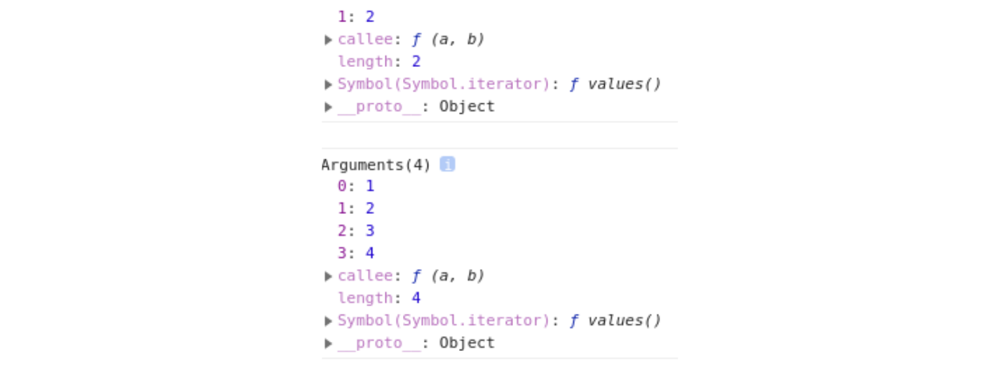

## 함수 객체

함수는 일반 객체처럼 취급되기 때문에 다음과 같은 동작이 가능합니다.

1. 리터럴에 의한 함수 정의

   ```jsx
   function add(a, b) {
     return a + b;
   }
   ```

2. 변수나 배열의 요소, 객체의 프로퍼티 등에 할당 가능

   ```jsx
   // 변수에 할당
   var add = function (a, b) {
     return a + b;
   };

   // 객체 프로퍼티에 할당
   var obj = {
     add: function (a, b) {
       return a + b;
     },
   };
   console.log(obj.add(1, 2));
   ```

3. 함수의 인자로 전달 가능

   ```jsx
   var execute = function (func) {
     func();
   };

   execute(function () {
     console.log('abc');
   });
   ```

4. 함수의 리턴값으로 리턴 가능

   ```jsx
   var returnFunc = function () {
     return function () {
       console.log('abc');
     };
   };

   var func = returnFunc();
   func();
   ```

5. 동적으로 프로퍼티 생성 및 할당 가능

   ```jsx
   function add(a, b) {
     return a + b;
   }

   add.result = add(1, 2);
   console.log(add.result); // 3
   ```

위와 같은 기능이 모두 가능한 객체를 일급 객체라고 하는데, 자바스크립트에서의 함수는 위의 모든 기능이 가능하기 때문에 일급 객체라고 부릅니다.

## 함수 객체의 표준 프로퍼티

함수에는 일반 객체와는 다르게 함수 객체만의 표준 프로퍼티가 정의되어 있습니다.

ECMA Script 명세서에는 모든 함수가 length, prototype 프로퍼티를 가져야 한다고 명시되어 있습니다.

하지만 실제로는 name, caller 프로퍼티 등 더 다양한 프로퍼티를 가지고 있지만 여기에서는 표준 프로퍼티 2가지에 대한 설명만 작성하겠습니다.

### length 프로퍼티

length 프로퍼티는 함수를 작성할 때 정의한 인자의 개수를 나타내는 프로퍼티입니다.

다음 예제를 확인해보며 알아봅시다.

```jsx
var func1 = function (a) {
  return a;
};

var func2 = function (a, b, c) {
  return a + b + c;
};

console.log(func1.length, func2.length); // 1 3
```

위의 예제와 같이 인자 개수가 다른 함수를 선언하여 length 프로퍼티를 출력했을 때, 정의한 인자 개수가 출력되는 것을 확인하실 수 있습니다.

### prototype 프로퍼티

해당 프로퍼티에 대해 주의할 점이 있는데, 함수 표준 프로퍼티인 prototype 프로퍼티와 내부 프로퍼티인 [[Prototype]] 프로퍼티는 차이점이 존재하므로 같은 프로퍼티로 보면 안 됩니다.

표준 프로퍼티인 prototype 프로퍼티는 이 함수가 생성자로 사용될 때 이 함수로 생성된 객체의 부모 역할을 하는 프로토타입 객체를 가리키는 반면, 내부 프로퍼티인 [[Prototype]] 프로퍼티는 단순히 객체 입장에서 자신의 부모 역할을 하는 프로토타입 객체를 가리킨다는 차이점이 존재합니다.

prototype 프로퍼티는 함수가 생성될 때 만들어지고, 이 프로퍼티는 단순히 constructor 프로퍼티만 존재하는 객체를 가리킵니다.

그리고 constructor 프로퍼티는 자신과 연결된 함수를 가리킵니다.

따라서 함수 생성 시, 함수 자신과 prototype 프로퍼티로 연결된 프로토타입 객체를 동시에 생성하고 prototype 프로퍼티와 constructor 프로퍼티를 통해 서로 참조하게 됩니다.

## 함수 호출 시 암묵적으로 전달되는 인자

자바스크립트는 C나 C++같이 엄격하게 문법 체크를 하는 언어가 아니기 때문에 보다 유연하게 활용할 수 있는 언어입니다.

함수 호출 시에도 다른 언어와 다른데, 자바스크립트에서는 함수를 호출할 때에 보다 더 유연한 활용을 위해 암묵적으로 전달하는 인자가 존재합니다.

### arguments 객체

arguments 객체에 대해 알아보기 전, 함수 호출에 대한 자바스크립트와 다른 언어와의 차이점에 대해 알아야합니다.

먼저 C나 C++과 같은 언어의 경우에는 정의한 인자를 올바르게 넘기지 않을 경우 컴파일 오류가 발생하게 됩니다.

하지만 자바스크립트는 인자 개수를 맞추지 않아도 에러가 발생하지 않습니다.

더 적게 인자를 넘긴 경우에는 넘겨지지 않은 인자에 undefined가 할당되고, 더 많이 인자를 넘긴 경우에는 초과된 인자가 무시됩니다.

따라서 이런 자바스크립트의 특징때문에 동적으로 함수 호출 시에 인자 개수를 확인하고, 이에 맞게 처리해야 하는 경우가 존재합니다.

이런 것을 가능하게 만드는 것이 바로 arguments 객체입니다.

arguments 객체는 함수 호출 시 전달되는 암묵적인 인자로, 함수를 호출할 때 넘긴 인자들이 배열 형태로 저장되어 있지만 실제 배열이 아닌 유사 배열 객체입니다.

```jsx
var func = function (a, b) {
  console.dir(arguments);
  return a + b;
};

console.log(func(1, 2)); // 3
console.log(func(1, 2, 3, 4)); // 3
```

다음 예제는 두 수의 합을 구하는 함수를 정의하고, 함수 내부에서 arguments 객체를 출력하는 예제입니다.

아래 사진과 같이 함수에 넘기는 인자에 따라서 arguments 객체의 프로퍼티가 달라지는 것을 확인할 수 있습니다.



유사 배열 객체인 arguments 객체는 총 3개의 프로퍼티로 구성되어 있습니다.

1. 배열 형태로 저장되어 있는 인자
2. length 프로퍼티 : 호출 시 넘긴 인자의 개수
3. callee 프로퍼티 : 현재 실행 중인 함수의 참조값

따라서 자바스크립트에서는 이런 arguments 객체를 통해 인자 개수가 계속해서 변할 수 있는 함수를 구현하거나, 인자 개수에 따라 다른 처리를 필요로 하는 경우를 손쉽게 처리할 수 있습니다.

```jsx
var sum = function () {
  var result = 0;

  for (var i = 0; i < arguments.length; i++) result += arguments[i];

  return result;
};

console.log(sum(1, 2, 3, 4, 5)); // 15
```

### this 인자

this 인자는 여러 가지 호출 패턴에 따라 참조하는 객체가 달라지기 때문에 이해하기 어려운 개념입니다.

여기에서는 어떤 호출 패턴에서는 어떤 객체를 참조하는지 알아보겠습니다.

1. 객체의 메서드를 호출할 때의 this 바인딩

   객체의 프로퍼티가 함수인 경우에는 이 함수를 메서드라고 부릅니다.

   객체 내의 메서드를 호출할 때에는 메서드 내부 코드에서 사용되는 this는 해당 메서드를 호출한 객체로 바인딩됩니다.

   ```jsx
   var obj1 = {
     number: 100,
     printNumber: function () {
       console.log(this.number);
     },
   };

   var obj2 = {
     number: 200,
   };

   obj2.printNumber = obj1.printNumber;

   obj1.printNumber(); // 100
   obj2.printNumber(); // 200
   ```

   앞 코드의 동작과정을 설명해보자면 다음과 같습니다.

   `obj1` 객체를 선언할 때 `printNumber` 라는 메서드를 같이 정의했고, 이 메서드에 대한 참조값을 `obj2.printNumber` 프로퍼티에 할당했습니다.

   따라서 `obj1.printNumber()` 에서는 `obj1` 객체에서 메서드를 호출했기 때문에 100을 출력하고, `obj2.printNumber()` 에서는 `obj2` 객체에서 메서드를 호출했기 때문에 200을 출력합니다.

2. 함수를 호출할 때의 this 바인딩

   함수를 호출할 때에는 함수 내부 코드에서 사용되는 this는 전역 객체에 바인딩됩니다.

   즉, 브라우저에서 자바스크립트를 실행하는 경우에는 window 객체가, Node.js 런타임 환경에서는 global 객체가 전역 객체로서 바인딩됩니다.

   자바스크립트의 모든 전역 변수는 실제로 전역 객체의 프로퍼티이기 때문에 다음 예제와 같이 사용 가능합니다.

   ```jsx
   var number = 100;

   console.log(number); // 100
   console.log(window.number); // 100

   var printNumber = function () {
     console.log(this.number); // this는 전역 객체인 window 객체에 바인딩
   };

   printNumber(); // 100
   ```

   이런 특성은 내부 함수 호출 시에도 동일하게 적용됩니다.

   따라서 다음과 같이 this 바인딩 특성에 대해 제대로 이해하지 못한 상태에서는 잘못된 코드를 작성할 수 있습니다.

   아래의 예제는 this 바인딩 특성을 이해하지 못한 상태에서의 객체 프로퍼티를 변경하는 예제입니다.

   ```jsx
   var number = 100;

   var obj = {
     number: 200,
     func1: function () {
       this.number += 50;
       console.log('메서드 호출 시의 this 바인딩 : ' + this.number);

       func2 = function () {
         this.number += 50;
         console.log('내부 함수 호출 시의 this 바인딩 : ' + this.number);
       };

       func2();
     },
   };

   obj.func1();
   ```

   만약 제가 `obj.number` 프로퍼티의 값을 변경하기 위해 다음과 같은 코드를 작성했다고 가정합시다.

   저희가 의도한대로 동작한다면 출력 결과는 다음과 같습니다.

   ```
   메서드 호출 시의 this 바인딩 : 250
   내부 함수 호출 시의 this 바인딩 : 300
   ```

   하지만 실제 코드 실행 결과는 의도와는 다르게 다음과 같이 출력됩니다.

   ```
   메서드 호출 시의 this 바인딩 : 250
   내부 함수 호출 시의 this 바인딩 : 150
   ```

   이렇게 출력되는 이유는 내부 함수 호출 패턴을 정의하지 않아서 그런건데, 내부 함수도 결국 함수이기 때문에 일반적인 함수 호출 패턴에 따라 내부 코드에서 사용되는 this는 전역 객체에 참조됩니다.

   따라서 내부 함수에서 50을 더해준 것은 객체 프로퍼티 값을 더해준 것이 아닌, 전역 객체 프로퍼티 값에 더해준 것이 됩니다.

   그럼 이를 해결하기 위해서는 어떻게 코드를 고쳐야 할까요?

   간단하게 부모 함수의 this를 내부 함수에서 접근 가능한 다른 변수에 저장하여 이를 참조하면 됩니다.

   즉, 다음과 같이 코드를 작성하면 되는 것입니다.

   ```jsx
   var number = 100;

   var obj = {
     number: 200,
     func1: function () {
       var that = this;

       this.number += 50;
       console.log('메서드 호출 시의 this 바인딩 : ' + this.number);

       func2 = function () {
         that.number += 50;
         console.log('내부 함수 호출 시의 this 바인딩 : ' + that.number);
       };

       func2();
     },
   };

   obj.func1();
   ```

3. 생성자 함수를 호출할 때의 this 바인딩

   생성자 함수는 자바스크립트의 객체를 생성하는 역할을 하는 함수인데, 기존 함수에 new 연산자를 붙여 호출하는 방식을 통해 동작합니다.

   이렇게 new 연산자를 통한 생성자 함수 호출의 경우에는 일반적인 함수 호출과는 다른 방식으로 this가 바인딩됩니다.

   아래는 생성자 함수의 동작 방식입니다.

   1. 빈 객체가 생성되고, 이 객체에 this가 바인딩됩니다.

      엄밀하게 말하자면 빈 객체는 아니고, 프로토타입 객체와 연결된 내부 프로퍼티가 존재합니다.

      생성자 함수가 정의한 빈 객체에는 자신을 생성한 생성자 함수의 prototype 프로퍼티가 가리키는 객체를 자신의 프로토타입 객체로 지정합니다.

   2. 코드 내부에서 this를 통해 객체 프로퍼티가 생성됩니다.
   3. 생성된 객체를 리턴합니다.

      특별하게 리턴 코드가 없는 경우에는 this로 바인딩된 새로 생성한 객체가 리턴됩니다.

      하지만 다른 객체를 반환하는 경우에는 this로 바인딩된 객체가 아닌 해당 객체가 리턴됩니다.

   따라서 다음과 같이 생성자 함수의 정의 및 사용이 가능합니다.

   ```jsx
   var Person = function (name, age) {
     this.name = name;
     this.age = age;
   };

   var person1 = new Person('Hyun', 22);
   ```

   이렇게 new 연산자를 통한 생성자 함수 호출 시에는 위와 같이 동작하는데, 만약 new 연산자 없이 생성자 함수를 호출하는 경우에는 어떻게 동작할까요?

   new 연산자 없이 생성자 함수를 호출하는 것은 결국 일반 함수를 호출하는 것과 다름이 없기 때문에 일반적인 함수 호출 패턴을 따릅니다.

   따라서 this는 전역 객체에 바인딩되고, 뒤의 함수 리턴 부분에서 알아보겠지만 별도의 리턴 코드가 없기 때문에 undefined가 반환되어 생성한 객체는 undefined가 할당됩니다.

   ```jsx
   var person2 = Person('Hyun', 22);

   console.log(person2); // undefined

   console.log(window.name); // Hyun
   console.log(age); // 22
   ```

   이와 같이 일반 함수와 생성자 함수의 구분이 없는 자바스크립트의 특성 때문에 다음과 같은 코드 패턴을 사용하기도 합니다.

   ```jsx
   var Person = function (name, age) {
     // 인스턴스 생성을 강제화하는 부분으로 의도와 다른 함수 호출을 방지한다
     if (!(this instanceof arguments.callee)) return new Person(name, age);

     this.name = name;
     this.age = age;
   };
   ```

4. call과 apply 메서드를 이용한 명시적인 this 바인딩

   자바스크립트에서는 내부적인 this 바인딩 외에도 특정 객체에 명시적으로 this를 바인딩시키는 메서드를 제공하는데, 이런 역할을 하는 메서드가 바로 call과 apply 메서드입니다.

   두 메서드는 모든 함수의 부모 객체인 `Function.prototype` 객체의 메서드이므로 어떤 함수에서든지 두 메서드를 호출할 수 있습니다.

   먼저 두 메서드의 사용 방법은 다음과 같습니다.

   ```jsx
   Function.call(thisArg, arg1, arg2, arg3, ...);
   Function.apply(thisArg, [arg1, arg2, arg3, ...]);
   ```

   두 메서드를 사용하는데 있어 중요한 점은 메서드 호출의 주체는 함수이고, 단순히 this를 특정 객체에 바인딩할 뿐이지 결국 본질적인 기능은 함수를 호출한다는 것입니다.

   따라서 Person이라는 함수가 존재하며, `Person.apply()` 와 같이 호출한다면 결국 Person 함수를 호출한다는 것입니다.

   ```jsx
   var Person = function (name, age) {
     this.name = name;
     this.age = age;
   };

   var person3 = {};

   Person.apply(person3, ['Hyun', 22]);
   // Person.call(person3, 'Hyun', 22);

   console.dir(person3);
   ```

   이렇게 두 메서드는 this를 원하는 값으로 명시적으로 매핑하여 특정 함수나 메서드를 호출할 수 있다는 장점이 존재합니다.

   대표적인 용도는 arguments 객체와 같은 유사 배열 객체에서 배열 메서드를 사용하는 경우가 있는데, 아래 예제와 같이 사용이 가능합니다.

   ```jsx
   var func = function () {
     // arguments 객체는 실제 배열이 아닌 유사 배열 객체이므로 배열 메서드 사용 불가
     // arguments.forEach(function (arg) { console.log(arg); });

     // 배열에서 사용 가능한 forEach문을 유사 배열 객체에서 사용하는 코드
     Array.prototype.forEach.call(arguments, function (arg) {
       console.log(arg);
     });
   };

   func(1, 2, 3, 4);
   ```

## 함수 리턴

자바스크립트의 함수는 항상 리턴값을 반환하는데, 다음과 같은 규칙으로 특정 값을 반환합니다.

1. 일반 함수나 메서드에서 리턴값을 지정하지 않은 경우

   undefined 값이 반환됩니다.

2. 생성자 함수에서 리턴값을 지정하지 않을 경우

   this로 바인딩된 새로 생성된 객체가 반환됩니다.

   단, 다른 특정 객체를 리턴하는 경우에는 리턴문에서 명시적으로 넘긴 객체나 배열이 반환됩니다.

   하지만 기본 타입 중, 불린, 숫자, 문자열의 경우에는 이러한 리턴문을 무시하고 this로 바인딩된 새로 생성한 객체가 반환됩니다.

   그 외의 기본 타입인 undefined, null, Symbol의 경우에는 해당 값을 반환합니다.

---

## Source

- 인사이드 자바스크립트 도서
