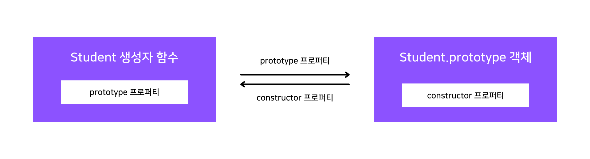
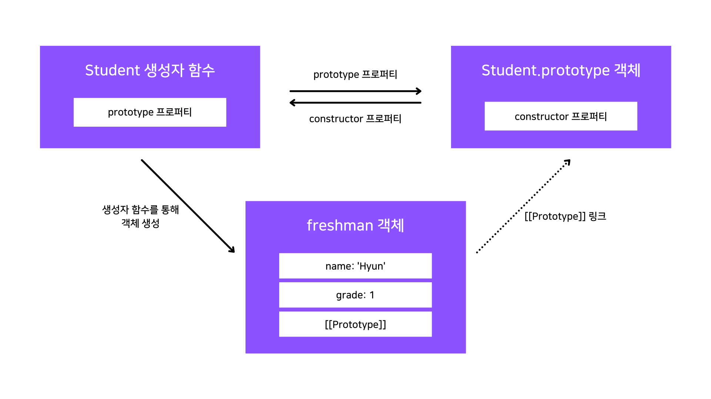
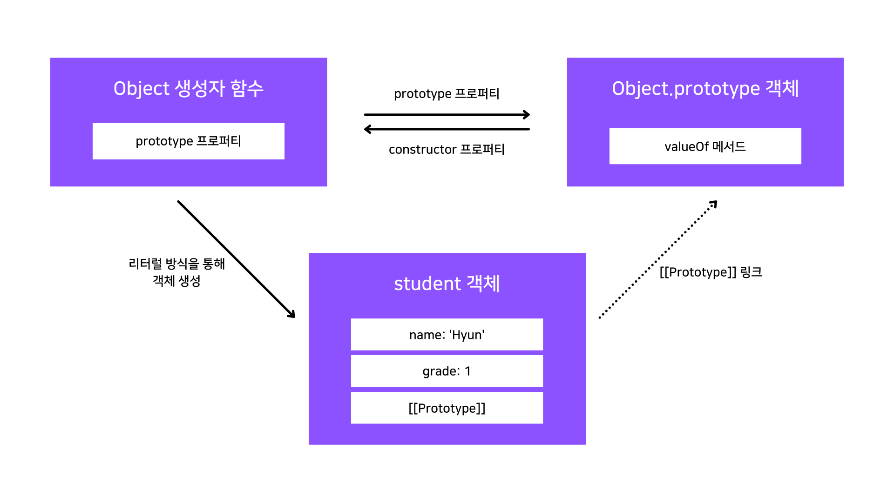
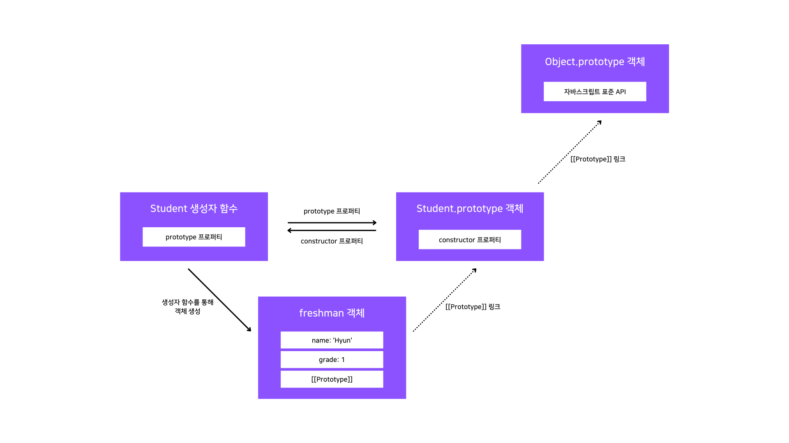

## 프로토타입에 대해 쉽게 혼동할 수 있는 개념

### [[Prototype]] 링크

자바스크립트에서의 모든 객체는 자신의 부모인 프로토타입 객체를 가리키는 참조 링크 형태의 숨겨진 프로퍼티가 존재합니다.

ECMA Script에서는 이러한 링크를 암묵적 프로토타입 링크라고 부르는데, 자바스크립트는 이러한 정보를 모든 객체의 [[Prototype]] 프로퍼티에 저장됩니다.

### [[Prototype]] 링크와 prototype 프로퍼티

자바스크립트를 주스택으로 개발하는 저는 처음에 이 내용을 보고 두 개념이 서로 같은 개념을 가리키지만, 이름만 다른 것이라고 생각했었습니다.

이렇게 상당수의 초급 또는 주니어 자바스크립트 개발자가 처음 프로토타입 체이닝에 대해 배울 때 혼동되는 내용이 제목에 드러나 있는 두 개념의 차이점일 것입니다.

이에 대해서는 앞서 작성한 [함수 개념 정리 포스트](https://ji5485.github.io/post/2021-01-31/javascript-core-concept-summary-function-2/#prototype-%ED%94%84%EB%A1%9C%ED%8D%BC%ED%8B%B0)에 간략하게 적어놨는데, 이 포스트를 먼저 읽고 오시는 것을 추천드립니다.

해당 내용은 자바스크립트의 객체 생성 규칙을 요약한 것입니다.

저 포스트에서는 프로토타입 체이닝에 대해 알고 있지 않은 상황이라서 저렇게 간략하게 적어놓았지만, 여기서는 객체 생성 규칙을 자세하게 알아보며 두 개념의 차이점에 대해 알아봅시다.

### 자바스크립트의 객체 생성 규칙

객체가 생성될 때 자바스크립트는 다음과 같이 동작하는데, 완전히 핵심만 담아놓은 문장이기 때문에 꼭 알아두셔야 합니다.

> 자바스크립트에서 모든 객체는 자신을 생성한 생성자 함수의 prototype 프로퍼티가 가리키는 프로토타입 객체를 자신의 부모 객체로 설정하는 [[Prototype]] 링크로 연결한다.

이렇게 들어보기만 하면 이게 무슨 뜻인지 확 와닿지는 않을 수도 있습니다.

그럼 이제 위의 문장을 하나하나 풀어 확인해봅시다.

이를 위해 아래와 같은 예시를 하나 들어봅시다.

```jsx
var Student = function (name, grade) {
  this.name = name;
  this.grade = grade;
};

var freshman = new Student('Hyun', 1);
```

저희는 [JavaScript 핵심 개념 - 함수#2 (Function) 포스트](https://ji5485.github.io/post/2021-01-31/javascript-core-concept-summary-function-2/#prototype-%ED%94%84%EB%A1%9C%ED%8D%BC%ED%8B%B0)를 통해 함수를 생성하는 때에 prototype 프로퍼티로 자기 자신과 링크되는 프로토타입 객체를 생성한다고 배웠습니다.

따라서 Student 생성자 함수를 정의함으로써 Student.prototype 객체도 같이 생성되고, 해당 객체는 Student 생성자 함수의 prototype 프로퍼티를 통해 접근이 가능합니다.

이와 같은 과정때문에 생성자 함수를 정의하면 다음과 같은 관계가 형성됩니다.

<br />



<br />

이 상태에서 Student 생성자 함수로 새 객체를 생성하면 어떻게 될까요?

여기서 위에 작성해놓은 핵심 문장이 적용됩니다.

[[Prototype]] 링크는 자신을 생성한 생성자 함수의 prototype 프로퍼티를 통해 연결된 프로토타입 객체를 가리키는 암묵적 링크라고 했습니다.

그럼 결국 Student 생성자 함수를 통해 만든 객체는 Student.prototype 객체를 [[Prototype]] 링크를 통해 연결되기 때문에 결국 prototype 프로퍼티와 [[Prototype]] 링크는 같은 객체를 가리키게 됩니다.

이제 다시 위에서 링크된 함수 포스트를 확인해봅시다.

해당 포스트에서는 [[Prototype]] 링크는 단순히 객체의 입장에서 자신의 부모 역할을 하는 프로토타입 객체를 가리킨다고 했습니다.

따라서 위의 내용을 모두 취합해보면 객체를 생성하는 것은 생성자 함수의 몫이지만, 생성된 객체의 실제 부모 역할을 하는 것은 생성자 함수의 prototype 프로퍼티가 가리키는 프로토타입 객체라는 것을 알 수 있습니다.

이 과정에 따라서 다음과 같은 관계가 형성됩니다.

<br />



<br />

## 프로토타입 체이닝

### 프로토타입 체이닝이란?

프로토타입 체이닝이란 객체에서 자기 자신의 프로퍼티 뿐만이 아니라, 자신의 부모 역할을 하는 프로토타입 객체의 프로퍼티도 자신의 프로퍼티처럼 사용할 수 있게 하는 것입니다.

다음 예제를 살펴봅시다.

```jsx
var student = {
  name: 'Hyun',
  grade: 1,
};

console.log(student.name); // Hyun
console.log(student.valueOf()); // { name: 'Hyun', grade: 1 }
```

여기서는 2가지의 프로퍼티에 접근을 했습니다.

그런데 첫 번째는 해당 객체에 존재하는 프로퍼티이기 때문에 당연하게 출력이 가능하지만, 두 번째 프로퍼티는 존재하지도 않는데 결과가 정상적으로 출력이 됩니다.

이를 가능하게 해주는 것이 바로 프로토타입 체이닝인데, valueOf() 메서드는 해당 객체의 원시값을 반환해주는 표준 API입니다.

그럼 이 과정이 어떻게 이루어지는지 자세하게 살펴봅시다.

### 객체 리터럴 방식으로 생성한 객체의 프로토타입 체이닝

리터럴 방식으로 생성된 객체는 실제로 Object 생성자 함수를 통해 객체가 생성됩니다.

따라서 위에서 설명한 자바스크립트의 객체 생성 규칙을 그대로 따라갑니다.

그럼 결국 아래와 같이 관계가 형성됩니다.

<br />



<br />

다시 프로토타입 체이닝의 개념으로 돌아와보면 특정 객체의 프로퍼티에 접근하는 경우, 만약 자기 자신에게 해당 프로퍼티가 존재하지 않는다면 [[Prototype]] 링크로 연결된 프로토타입 객체에서 해당 프로퍼티를 검색하게 됩니다.

따라서 첫 번째로 name 프로퍼티를 출력했을 때에는 student 객체에 해당 프로퍼티가 존재하기 때문에 그대로 출력을 했지만, 두 번째로 valueOf 메서드를 호출했을 때에는 student 객체에 해당 프로퍼티가 존재하지 않아 [[Prototype]] 링크를 타고 Object.prototype 객체에서 해당 프로퍼티를 찾습니다.

위에서 적어놓은대로 valueOf 메서드는 자바스크립트 표준 API로, Object.prototype 객체에 존재하기 때문에 이를 호출하게 됩니다.

### 생성자 함수로 생성한 객체의 프로토타입 체이닝

이 방식은 위에서 설명한 객체 리터럴 방식으로 생성한 객체의 프로토타입 체이닝과는 약간 다르게 동작하지만, 자바스크립트의 객체 생성 규칙을 그대로 따라갑니다.

즉, 생성자 함수를 통해 생성된 객체는 생성자 함수의 prototype 프로퍼티가 가리키는 프로토타입 객체를 자신의 부모 객체로 지정합니다.

위의 자바스크립트 객체 생성 규칙을 설명하며 사용했던 예제를 그대로 가져와봅시다.

```jsx
var Student = function (name, grade) {
  this.name = name;
  this.grade = grade;
};

var freshman = new Student('Hyun', 1);
```

이렇게 생성된 freshman 객체는 프로토타입 체이닝을 통해 Student.prototype 객체까지 접근이 가능하지만, 프로토타입 체이닝은 여기서 끝나지 않습니다.

결국 Student.prototype 객체도 자바스크립트 객체이므로 Object.prototype 객체를 [[Prototype]] 링크로 연결합니다.

따라서 freshman 객체는 Object.prototype 객체까지 프로토타입 체이닝을 통해 접근할 수 있습니다.

그럼 다음과 같은 관계가 형성됩니다.

<br />



<br />

---

## Source

- 인사이드 자바스크립트 도서
