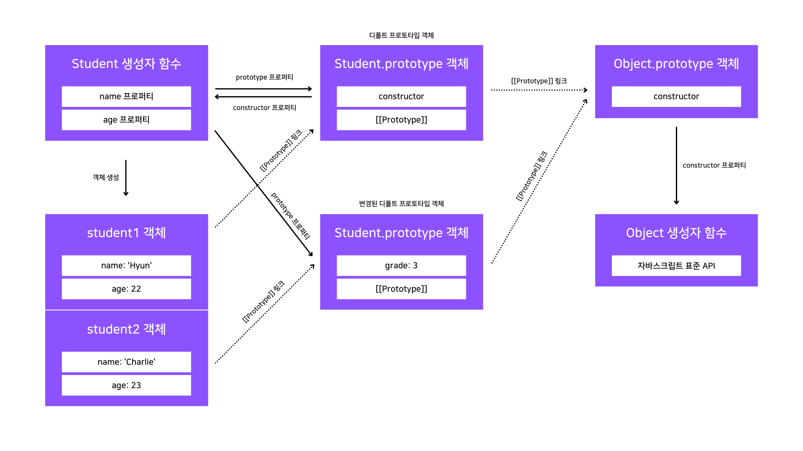

## 프로토타입 객체도 자바스크립트 객체

### 프로토타입 객체의 프로퍼티 변경

기본적으로 함수가 생성될 때 같이 생성되는 프로토타입 객체는 constructor 프로퍼티만을 가진 객체이지만, 프로토타입 객체 역시 자바스크립트에서는 일반 객체와 다를 것이 없습니다.

따라서 일반 객체와 동일하게 프로퍼티를 동적으로 제어할 수 있는데, 이렇게 변경된 프로퍼티는 실시간으로 프로토타입 체이닝에 반영됩니다.

```jsx
var Student = function (name, age) {
  this.name = name;
  this.age = age;
};

var student = new Student('Hyun', 22);

// Uncaught TypeError: student.print is not a function
// student.print();

Student.prototype.print = function () {
  console.log(this.name + ', ' + this.age);
};

student.print(); // Hyun, 22
```

### 프로토타입 객체에서의 this 바인딩

만약 프로토타입 객체 메서드에서 this를 사용하면 어디에 바인딩이 될까요?

이는 객체 메서드 호출 시의 this 바인딩 규칙을 그대로 따라갑니다.

즉, 호출한 객체에 this가 바인딩됩니다.

```jsx
var Student = function (name, age) {
  this.name = name;
  this.age = age;
};

var student = new Student('Hyun', 22);

Student.prototype.print = function () {
  console.log(this.name + ', ' + this.age);
};

student.print(); // Hyun, 22

// Student.prototype 객체에 name과 age 프로퍼티 추가
Student.prototype.name = 'Charlie';
Student.prototype.age = 23;

Student.prototype.print(); // Charlie, 23
```

### 기본 데이터 타입의 확장

이전 포스트에서 확인했듯이 모든 객체의 프로토타입 체이닝 종착지는 Object.prototype 객체입니다.

따라서 모든 객체에서 호출 가능한 표준 API들은 Object.prototype에 정의되어 있습니다.

이와 동일한 방식으로 문자열, 숫자, 불리언 타입 등에서 사용되는 표준 메서드는 각 타입의 프로토타입 객체인 String.prototype, Number.prototype, Boolean.prototype 객체에 정의되어 있습니다.

ECMA Script 명세서에 따르면 각 타입별로 제공되어야 하는 메서드들은 각각의 프로토타입 객체 내에 정의해야 한다고 작성되어 있습니다.

그리고 자바스크립트에서는 각 타입별 표준 프로토타입 객체에 프로퍼티 변경이 가능하기 때문에 사용자 정의 메서드 추가가 가능합니다.

따라서 다음과 같은 활용이 가능합니다.

```jsx
Number.prototype.isOdd = function () {
  return this % 2 === 1;
};

var num = 3;

console.log(num.isOdd()); // true
```

## 그 외의 프로토타입 체이닝이 가진 특징

### 디폴트 프로토타입 객체 변경 가능

디폴트 프로토타입 객체는 함수가 생성될 때 같이 생기고, 해당 함수의 prototype 프로퍼티를 통해 접근이 가능합니다.

따라서 이 프로퍼티를 통해 디폴트 프로토타입 객체를 다른 객체로 변경할 수 있습니다.

하지만 생성자 함수의 프로토타입 객체가 변경된 경우, 그 이전에 생성한 객체들은 변경되기 전의 프로토타입 객체와의 연결을 그대로 유지한다는 것에 주의해야합니다.

다음 예제를 통해 자세하게 알아봅시다.

```jsx
// 1
var Student = function (name, age) {
  this.name = name;
  this.age = age;
};

var student1 = new Student('Hyun', 22);

// 2
console.log(Student.prototype.constructor); // f (name, age) { ... }
console.log(student1.grade); // undefined

// 3
Student.prototype = {
  grade: 3,
};

console.log(Student.prototype.constructor); // f Object()

// 4
var student2 = new Student('Charlie', 23);

console.log(student1.grade); // undefined
console.log(student2.grade); // 3
console.log(student1.constructor); // f (name, age) { ... }
console.log(student2.constructor); // f Object()
```

1. Student 생성자 함수의 정의와 객체 생성

   해당 부분에서는 Student 생성자 함수를 정의하고, student1라는 객체를 생성했습니다.

2. Student.prototype.constructor 프로퍼티와 student1.grade 프로퍼티 출력

   여기에서는 Student 생성자 함수의 prototype 프로퍼티로 연결된 객체의 constructor 프로퍼티와 student1 객체의 grade 프로퍼티를 출력했는데, 전자는 Student 생성자 함수가 출력되었지만 후자는 undefined가 출력되었습니다.

   전자의 경우에는 Student.prototype 객체는 constructor 프로퍼티를 가진 객체인데, constructor 프로퍼티를 통해 생성자 함수를 참조하고 있으므로 Student 생성자 함수가 출력된 것입니다.

   후자의 경우에는 프로토타입 체이닝을 통해 student1 객체 내부 또는 연결된 객체를 모두 탐색했으나 grade라는 프로퍼티가 존재하지 않아 undefined가 출력되었습니다.

3. 디폴트 프로토타입 객체 변경 및 constructor 프로퍼티 출력

   Student.prototype 객체가 일반 객체로 변경되었습니다.

   따라서 이 시점부터 생성자 함수를 통해 생성되는 모든 객체는 해당 객체를 프로토타입 객체로 연결합니다.

   그리고 Student.prototype.constructor 프로퍼티를 출력했는데, Student.prototype 객체는 다른 일반 객체로 변경되어 constructor 프로퍼티가 존재하지 않습니다.

   따라서 프로토타입 체이닝으로 Object.prototype 객체 내의 constructor 프로퍼티에 연결된 Object 생성자 함수가 출력되었습니다.

4. 디폴트 프로토타입 객체 변경 후 생성자 함수로 객체 생성 및 여러 프로퍼티 출력

   여기에서 생성된 student2 객체는 변경된 프로토타입 객체와 [[Prototype]] 링크를 통해 연결됩니다.

   따라서 student1 객체에는 grade 프로퍼티가 존재하지 않아 undefined를 출력하는 반면, student2 객체는 프로토타입 체이닝을 통해 student2.prototype.grade 프로퍼티 값인 3을 출력합니다.

   또, student1.constructor 프로퍼티는 프로토타입 체이닝으로 연결된 Student.prototype 객체 내의 constructor 프로퍼티를 출력하기 때문에 Student 생성자 함수가 출력되지만, student2.constructor 프로퍼티는 변경된 프로토타입 객체 내에 해당 프로퍼티가 존재하지 않아 더 상위 단계에 연결된 Object.prototype.constructor 프로퍼티를 출력하기 때문에 Object 생성자 함수가 출력됩니다.

위의 모든 과정을 그림으로 나타내면 다음과 같습니다.

<br />



<br />

### 프로퍼티를 읽을 때에만 프로토타입 체이닝이 동작

어떤 객체에서 특정 프로퍼티를 읽는 과정에서 해당 프로퍼티가 그 객체에 없는 경우에는 프로토타입 체이닝이 발생한다고 위에서 계속해서 상기했습니다.

이렇게 프로퍼티를 읽는 경우에는 프로토타입 체이닝이 동작하지만, 프로퍼티를 쓰는 경우에는 프로토타입 체이닝이 발생하지 않습니다.

이는 해당 객체에 동적으로 프로퍼티를 추가하기 때문에 프로토타입 체이닝이 발생하지 않는다는 것은 당연한 이야기입니다.

---

## Source

- 인사이드 자바스크립트 도서
