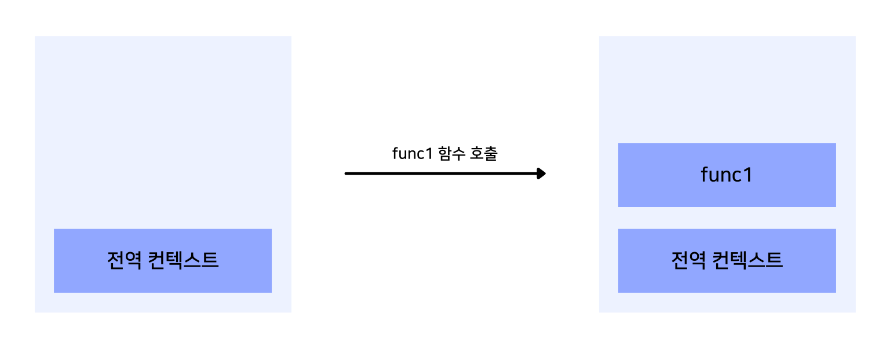
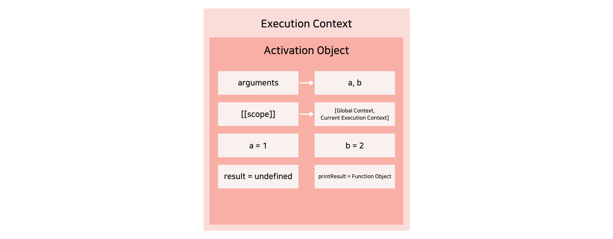
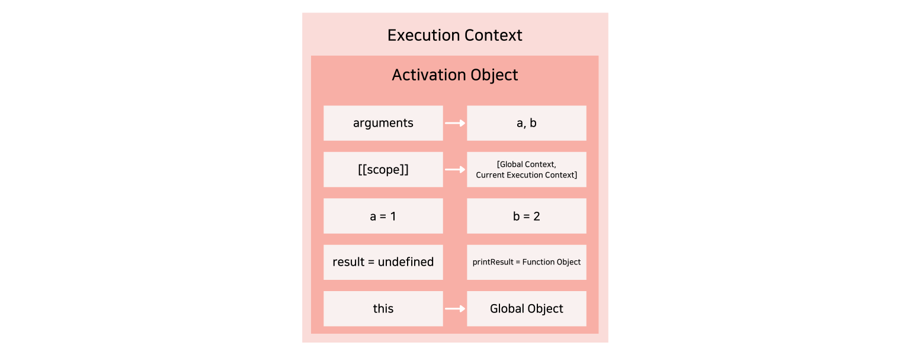

## 실행 컨텍스트란?

### 실행 컨텍스트의 정의

자바스크립트에서 실행 컨텍스트는 스코프 체이닝, 호이스팅, 클로저 등 다양한 핵심적인 내용들을 이해하기 위해서는 필수적으로 알아야 하는 개념입니다.

먼저 실행 컨텍스트의 정의에 대해 알아봅시다.

ECMAScript에서 정의한 실행 컨텍스트는 **실행 가능한 코드를 형상화하고 구분하는 추상적인 개념**을 의미합니다.

즉, 다양한 변수나 함수와 같은 실행에 필요한 여러 정보를 담은 하나의 코드 블록에 해당되는 것이죠.

그럼 어떤 상황에서 실행 컨텍스트가 생성되는 것일까요?

### 실행 컨텍스트가 생성되는 3가지 경우

실행 컨텍스트가 생성되는 경우의 대부분은 함수 호출의 경우입니다.

하지만 그 외에도 2가지 경우가 더 존재하는데, 아래와 같은 상황에서 실행 컨텍스트가 생성됩니다.

1. 함수 내부 코드
2. 전역 코드
3. eval 함수로 호출된 코드

따라서 자바스크립트 엔진은 위의 경우에 실행 컨텍스트를 생성하고, 새로 생성된 실행 컨텍스트에 다양한 정보를 저장하게 됩니다.

### 실행 컨텍스트 동작 방식

위에서 살펴본 3가지 상황에서 생성되는 실행 컨텍스트는 아래와 같은 동작 방식을 가지고 있습니다.

1. 현재 실행되는 컨텍스트에서 이 실행 컨텍스트와 관련 없는 코드가 실행됨
2. 새로운 실행 컨텍스트가 생성되어 스택에 저장됨
3. 제어권이 새로 생성된 실행 컨텍스트로 이동

간단한 예시를 들어보자면 전역 코드에서 함수 실행 코드를 만나면 그에 대한 새로운 실행 컨텍스트가 생성되고, 제어권이 그 함수로 이동된다는 말입니다.

따라서 자바스크립트 엔진은 다음 사진과 같이 동작될 것입니다.

<br />



<br />

## 실행 컨텍스트에서의 중요 개념

실행 컨텍스트의 생성 과정에 대해 알기 전에 되게 빈번하게 등장하는 중요 개념인 변수 객체와 스코프 체인에 대해 알아봅시다.

### 변수 객체

먼저 변수 객체에 대해 알아보려고 하는데, 간단하게 말하면 실행에 필요한 **여러 정보를 저장하는 객체**를 의미합니다.

따라서 사용하기 위한 변수나 함수, 파라미터 등을 저장하여 특정 값을 사용하는 경우에 자바스크립트 엔진은 제일 먼저 해당 컨텍스트의 변수 객체를 탐색하게 됩니다.

실행 컨텍스트는 3가지 경우에 의해 생성된다고 했었는데, 그 중에서 전역 코드를 제외한 2가지 경우에서는 변수 객체로서 **활성 객체(Activation Object)**를 참조하게 됩니다.

활성 객체는 함수 내부에 정의된 변수 또는 내부 함수에 대한 정보에 파라미터 정보까지 같이 저장합니다.

하지만 활성 객체와는 다르게 전역 컨텍스트가 변수 객체로서 참조하는 **전역 객체(Global Object)**는 파라미터 정보가 따로 존재하지 않습니다.

### 스코프 체인

우선 여기에서 사용되는 용어인 스코프는 변수의 유효 범위를 나타내는데 사용됩니다.

따라서 뒤에 체인이라는 말이 붙었으니 결국 변수의 유효 범위가 체인과 같이 이어져 있다는 뜻으로 이해할 수 있는데, 이와 유사한 프로토타입 체인과 거의 비슷한 방식입니다.

프로토타입 체인은 접근하려는 프로퍼티 또는 메서드를 호출한 객체에서부터 [[Prototype]] 내부 링크로 연결된 객체를 따라 탐색하기 위한 개념이었습니다.

스코프 체인도 프로토타입 체인 동작 방식과 유사하게 적용됩니다.

해당 스코프에서 특정 값을 참조하려고 할 때, 리스트의 형태로 스코프 체인이 저장된 [[Scope]] 내부 링크를 통해 자기 자신으로부터 전역 범위까지 차례로 탐색하는 것입니다.

아래와 같이 당연시 여기며 작성했던 코드 속에서 이런 원리가 숨어있었던 것이죠.

```jsx
var number = 10;

var printNumber = function () {
  console.log(number);
};

printNumber(); // 10
```

마지막으로 자바스크립트는 **렉시컬 스코프(Lexical Scope) 방식**을 따릅니다.

즉, 함수를 어디서 호출하느냐가 아닌 **함수를 어디에 선언했느냐**에 따라 결정되기 때문에 어떻게 스코프 체인이 생성되는지 알기 위해서는 각 함수 객체가 처음 생성될 때의 실행 컨텍스트가 무엇인지를 반드시 판단할 수 있어야 합니다.

## 실행 컨텍스트의 생성 과정

이제 본격적으로 실행 컨텍스트가 어떤 과정으로 생성되는지 알아봅시다.

시작하기 전에 간단하게 두 값을 더하는 하나의 함수를 정의해봅시다.

```jsx
var add = function (a, b) {
  var result = a + b;

  function printResult() {
    console.log(result);
  }

  printResult();
};

add(1, 2); // 3
```

이렇게 정의한 add 함수를 실행했을 때, 자바스크립트 엔진은 어떤 방식으로 실행 컨텍스트를 생성할까요?

여기에서 자세하게 실행 컨텍스트의 생성 과정을 알아보겠습니다.

마지막으로 함수를 호출했을 때 생성되는 방식과 전역 코드를 통해 생성되는 방식의 차이점은 변수 객체 종류에 따른 arguments 객체의 유무라는 점을 참고해주세요.

### 활성 객체 생성

저희는 전역 코드에서 add 함수를 호출했습니다.

그럼 전역 컨텍스트 코드와 관계 없는 add 함수 내부 코드가 실행될 것입니다.

따라서 자바스크립트 엔진은 add 함수에 대한 **실행 컨텍스트를 생성**하고, 가장 먼저 실행에 필요한 변수나 함수 등과 같은 여러 정보를 담기 위한 객체인 **활성 객체(Activation Object)를 생성**합니다.

여기에서 다루는 활성 객체의 경우는 함수 호출로 인해 생성된 실행 컨텍스트이고, 만약 전역 코드에 의해 생성된 실행 컨텍스트의 경우에는 **전역 객체(Global Object)를 생성**한다는 것을 알아두세요.

활성 객체와 전역 객체는 위에서 언급했듯이 arguments 객체가 있는지 없는지에 대한 차이점만 존재할 뿐이지 사실상 두 객체는 변수 객체로 같은 객체입니다.

<br />


<br />

### arguments 객체 생성

다음으로는 **arguments 객체가 생성**됩니다.

add 함수에서는 a와 b라는 매개변수를 받는데, 자바스크립트 엔진은 arguments 프로퍼티를 통해 매개변수를 포함한 다양한 정보가 들어있는 arguments 객체를 참조합니다.

<br />


<br />

### 스코프 체인 생성

이어서 **현재 실행 컨텍스트의 유효 범위를 나타내는 스코프 체인을 생성**합니다.

이 실행 컨텍스트는 상위 실행 컨텍스트의 [[scope]] 프로퍼티를 참조하여 자기 자신을 추가한 새로운 스코프 체인을 생성합니다.

만약 전역 컨텍스트의 경우에는 참조할 상위 컨텍스트가 없기 때문에 자기 자신을 나타내는 전역 컨텍스트의 변수 객체만을 가진 스코프 체인을 생성하게 됩니다.

그럼 위에서와 같이 add 함수를 호출한 경우에는 어떻게 될까요?

위에서 서술한 스코프 체인 생성 방식에 따라 상위 컨텍스트인 전역 컨텍스트의 [[scope]] 프로퍼티를 복사한 후, 새로 생성된 실행 컨텍스트의 변수 객체를 스코프 체인 제일 앞에 추가합니다.

따라서 **새롭게 형성되는 스코프 체인은 상위 컨텍스트의 스코프 체인에 현재 실행 컨텍스트의 변수 객체를 합친 것**이 됩니다.

<br />


<br />

### 변수 생성

여기에서는 현재 실행 컨텍스트 내의 지역 변수가 아래 순서대로 생성됩니다.

1. 함수로 인해 생성된 실행 컨텍스트의 경우, 함수 인자 각각 프로퍼티가 생성되고, 값이 할당된다.
2. 함수 선언문으로 작성된 함수 객체 프로퍼티가 생성되고, 생성된 함수 객체로 값이 할당된다.
3. 지역 변수 프로퍼티(함수 표현식 포함)가 생성되고, undefined 값이 할당된다.

가장 먼저 함수 인자인 `a`와 `b`의 값이 각각 호출시 넘겨받은 값으로 설정됩니다.

만약 값이 넘겨지지 않았다면 undefined 값이 할당됩니다.

그리고, 위의 add 함수에서는 변수 `result`와 `printResult` 함수가 정의되어있는데, 자바스크립트 엔진은 이 두 프로퍼티를 변수 객체에 저장합니다.

하지만 유의해야 할 점은 변수 또는 내부 함수의 **생성과 초기화 시점은 다르다**는 것입니다.

이 말은 즉, 실행 컨텍스트 내의 지역 변수가 변수 객체에 저장되어도 해당 값의 표현식이 실행되기 전까지는 값이 초기화되지 않는다는 것입니다.

그러나 `printResult` 함수는 함수 선언문 방식으로 작성했기 때문에 생성과 동시에 초기화가 이루어지는 **함수 호이스팅** 현상이 발생합니다.

만약 변수에 함수 객체를 저장하는 함수 표현식 방식으로 작성했다면, 일반 변수와 동일하게 표현식이 실행되기 전까지는 함수 객체가 할당되지 않습니다.

이와 같은 특징은 다음 글인 실행 컨텍스트로 알아보는 함수 호이스팅 게시글에서 다뤄보겠습니다.

마지막으로 변수 `result`에는 `undefined` 값이 할당됩니다.

이 또한 변수 선언 이전에 그 값에 접근가능하기 때문에 **변수 호이스팅** 현상이 발생한다고 볼 수 있습니다.

표현식의 실행은 변수 객체 생성 작업이 모두 완료된 후에 이루어집니다.

<br />



<br />

### this 바인딩

여기에서는 **this 키워드가 참조할 값이 할당**됩니다.

일반적인 this 바인딩 규칙에 따라 그 값이 정해지므로, 함수 호출 시의 this 바인딩 규칙에 따라서 전역 객체가 할당됩니다.

만약 전역 컨텍스트와 같이 this가 참조하는 객체가 존재하지 않는다면 전역 객체가 할당됩니다.

<br />



<br />

### 코드 실행

이렇게 실행 컨텍스트 및 변수 객체 생성이 모두 끝나게되면, 내부 코드에 존재하는 **표현식의 실행**이 이루어지게 됩니다.

따라서 함수 표현식 방식으로 선언한 내부 함수 또는 여러 지역 변수의 초기화 및 연산 작업이나 다른 함수 실행 작업이 이루어집니다.

<br />


<br />

---

## Source

- 인사이드 자바스크립트 도서

- 실행 컨텍스트와 자바스크립트의 동작 원리

  [https://poiemaweb.com/js-execution-context](https://poiemaweb.com/js-execution-context)
