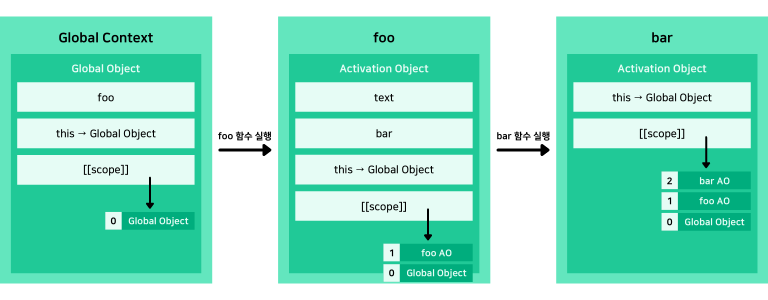

## 클로저를 알아보기 전에, 실행 컨텍스트가 뭐였지?

아래의 코드로 실행 컨텍스트의 생성 과정을 표현하면 어떻게 나올까요?

정답을 보기 전에 한 번이라도 생각해본 다음에 답을 확인해보세요.

```jsx
function foo() {
  var text = 'Hello';

  function bar() {
    console.log(text);
  }

  bar();
}

foo(); // Hello
```

얼핏 보기에 코드 구조는 그렇게 어렵지 않아보입니다.

가장 먼저, 전역 단계에서 전역 컨텍스트가 생성되면서 foo 함수에 대한 함수 객체 값을 저장할 것입니다.

그 다음 foo 함수가 실행되면 새로운 실행 컨텍스트가 생성될 것이고, 내부에 정의된 text 변수와 bar 함수 객체의 값을 변수 객체에 저장하게 되겠죠.

마지막으로 bar 함수가 실행되면서 또 다른 실행 컨텍스트가 생성되고, text를 출력하는 코드를 실행하게 됩니다.

하지만 bar 함수에 text 값이 존재하지 않기 때문에 스코프 체인을 따라 foo 함수 내부의 text 변수를 출력하게 될 것입니다.

아래의 그림은 위의 과정을 그림으로 나타낸 것입니다.

<br />



<br />

더 정확하게 하기 위해서는 foo 실행 컨텍스트와 bar 실행 컨텍스트에 arguments 객체도 추가해야하나, 함수에 넘긴 인자값이 존재하지 않으므로 생략했습니다.

## 본격적으로 클로저에 대해 알아보자

위와 같이 간단한 상황에서는 쉽게 실행 컨텍스트의 생성 과정을 나타낼 수 있지만 만약 아래와 같이 코드가 변경된다면 어떻게 실행 컨텍스트 생성 과정이 바뀔까요?

```jsx
function foo() {
  var text = 'Hello';

  function bar() {
    console.log(text);
  }

  return bar;
}

var func = foo();
func(); // ??
```

조금 헷갈릴 수 있는 부분이 추가되었습니다.

이제는 foo 함수 내에서 bar 함수를 출력하는 것이 아니라 반환하여 전역 단계에서 해당 함수를 실행합니다.

전역 단계에서 함수를 실행시키기 때문에 text 변수를 찾지 못하고 오류를 출력하게 될까요?

먼저 변화된 실행 컨텍스트 생성 과정을 알아봅시다.

<br />


<br />

달라진 부분이 보이시나요?

전역 실행 컨텍스트에서 func라는 이름으로 반환받은 bar 함수를 실행시켰습니다.

이 말은 곧 **foo 실행 컨텍스트가 사라진 후에 bar 실행 컨텍스트가 생성**된다는 것인데, bar 함수의 스코프 체인은 **여전히 foo 함수의 활성 객체를 참조**하고 있습니다.

이렇게 **반환된 내부 함수가 이미 생명 주기가 끝난 외부 함수의 변수를 참조하는 함수**를 클로저라고 합니다.

그리고 클로저에 해당하는 bar 함수가 참조하는 text와 같은 변수를 자유 변수라고 합니다.

이와 같이 클로저는 **함수를 일급 객체로 취급**하는 자바스크립트에서 흔히 사용되는 핵심 개념입니다.

그러나 이런 특징은 자바스크립트에만 국한된 개념이 아니라 LISP나 Clojure, Haskell 등과 같은 함수형 프로그래밍 언어의 특징이기 때문에 다른 함수형 프로그래밍 언어를 익히기 위해서는 필히 익혀야 합니다.

## 다양한 클로저의 활용 예시

이렇게 매력적인 기능을 가진 클로저를 잘 활용한다는 것은 엄청난 이점을 가져다줄 수 있습니다.

하지만 생명 주기가 끝난 외부 함수의 렉시컬 환경을 기억해야하므로 메모리 측면에서 어느정도 손해볼 수 있기 때문에 다양한 개발 경험을 쌓아야 합니다.

그럼 이제 클로저를 어떻게 활용할 수 있는지 알아봅시다.

### 함수의 캡슐화

```jsx
var generateString = (function () {
  var templateStr = ['Hello, ', '', '. Welcome!'];

  return function (name) {
    templateStr[1] = name;
    return templateStr.join('');
  };
})();

var str = generateString('Hyun');
console.log(str); // Hello, Hyun. Welcome!
```

위의 예제에서는 `generateString` 변수에 익명 함수를 즉시 실행시켜 `templateStr` 변수를 참조하는 클로저 함수를 반환했습니다.

만약 문장 템플릿을 전역 변수로 정의했다면, 이는 외부에 노출되어 중간에 값이 변경되거나 동일한 이름을 가진 변수를 생성해 오류가 생길 가능성이 존재합니다.

따라서 이런 상황에 대비해 외부에서 접근할 수 없도록 위와 같이 클로저 함수를 활용할 수 있습니다.

### Private Fields 제공

이는 위의 예제에서 더 확장된 개념인데, 기본적으로 자바스크립트에서는 Private Fields를 제공하지 않지만 제공하는 것처럼 보이게하는 예제입니다.

물론 ES2019 이후부터는 Private Class Fields 문법이 추가되어 `#` 을 통해 정의가 가능하지만, 이전 버전의 경우에서는 클로저 함수를 통해 Private Property와 Method를 제공하는 흉내를 낼 수 있습니다.

아래 예제 코드를 확인해봅시다.

```jsx
function Counter() {
  // Private Property
  var number = 0;

  // Private Method
  function changeNumberBy(num) {
    number += num;
  }

  // Public Method
  return {
    increment: function () {
      changeNumberBy(1);
    },
    decrement: function () {
      changeNumberBy(-1);
    },
    currentValue: function () {
      return number;
    },
  };
}

var counter = Counter();

console.log(counter.currentValue()); // 0
counter.increment();
console.log(counter.currentValue()); // 1
counter.decrement();
counter.decrement();
console.log(counter.currentValue()); // -1
```

위에서는 `Counter`라는 함수를 통해 `number` 변수를 프라이빗하게 관리할 수 있도록 한 예제입니다.

이렇게 클로저를 활용하면 `counter.number`로는 값에 접근할 수 없기 때문에 마치 Private Fields를 설정한 것처럼 구현할 수 있습니다.

마찬가지로 외부에서는 `changeNumberBy` 함수에 접근할 수 없습니다.

## 클로저 활용 시 간과할 수 있는 점

위와 같이 잘 사용한다면 정말 강력한 기능이 될 수 있는 클로저를 사용할 때에 간과할 수 있는 사항입니다.

1. 클로저가 참조하는 자유 변수의 값은 항상 변할 수 있습니다.

   위의 클로저 활용 예시 중, Private Fields를 제공하도록 구현한 예제를 확인해보세요.

   `counter.increment` 함수나 `counter.decrement` 함수를 호출할 때마다 자유 변수의 값이 계속해서 변경되니 주의해야 합니다.

2. 여러 클로저 함수 객체가 하나의 자유 변수를 참조할 수 있습니다.

   마찬가지로 동일한 예제를 확인해보세요.

   `counter.increment` 함수와 `counter.decrement` 함수 모두 하나의 자유 변수인 `number` 를 참조하기 때문에 각각의 함수가 호출될 때마다 동일한 변수의 값이 변경됩니다.

3. 루프 안에서 클로저 함수를 활용할 경우에는 의도와 다르게 동작할 수 있습니다.

   아래의 예시는 클로저의 잘못된 사용 예제에서 항상 등장하는 코드입니다.

   ```jsx
   for (var i = 1; i <= 3; i++) {
     setTimeout(function () {
       console.log(i);
     }, i * 1000);
   }
   ```

   만약 1, 2, 3이 1초 간격으로 출력되도록 의도하여 작성한 코드라면 아직 클로저에 대해 제대로 모르고 있다는 개발자일 것입니다.
   `setTimeout` 함수의 인자로 들어가는 익명 함수에서 참조하는 변수 `i` 는 자유 변수입니다.

   하지만, 모든 `setTimeout` 구문이 실행되고 나서 자유 변수 `i`의 값은 4가 되기 때문에 모두 4를 출력하게 됩니다.

   따라서 `i`의 값을 복사한 값을 출력하도록 변경해야 하는데, 이를 위해 아래 코드와 같이 즉시 실행 함수를 활용할 수 있습니다.

   ```jsx
   for (var i = 1; i <= 3; i++) {
     (function (val) {
       setTimeout(function () {
         console.log(val);
       }, val * 1000);
     })(i);
   }
   ```

---

## Source

- 인사이드 자바스크립트 도서

- PoiemaWeb - 클로저

  [https://poiemaweb.com/js-closure](https://poiemaweb.com/js-closure)

- Mozilla - 클로저

  [https://developer.mozilla.org/ko/docs/Web/JavaScript/Closures](https://developer.mozilla.org/ko/docs/Web/JavaScript/Closures)
