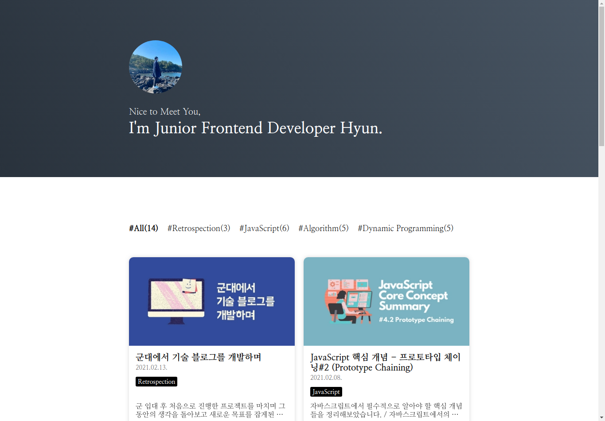
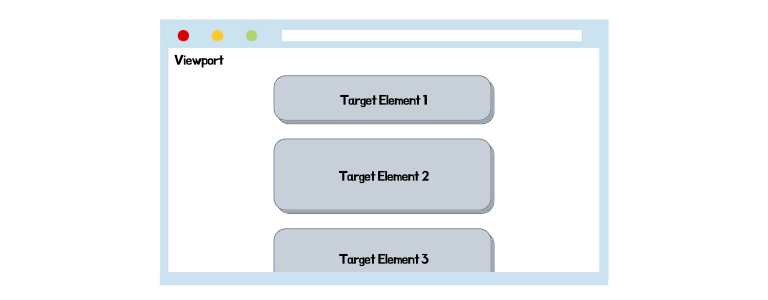

### 서론



<br />

이번에 [Gatsby 프레임워크를 사용해 블로그를 개발하는 강의](https://edu.goorm.io/lecture/25881/%EB%88%84%EA%B5%AC%EB%82%98-%EB%B8%94%EB%A1%9C%EA%B7%B8-%EA%B0%9C%EB%B0%9C-%ED%95%A0-%EC%88%98-%EC%9E%88%EB%8B%A4-react-%EA%B8%B0%EB%B0%98-gatsby%EB%A1%9C-%EA%B8%B0%EC%88%A0-%EB%B8%94%EB%A1%9C%EA%B7%B8-%EA%B0%9C%EB%B0%9C%ED%95%98%EA%B8%B0)를 업로드했습니다.

제가 전에 개발했던 블로그는 여러 콘텐츠를 보여주기 위해 페이지네이션 방법을 사용했었지만, 이번에는 조금 다른 방식으로 개발하고 싶기도 했고 예전에 한 번 구현해봤던 인피니티 스크롤 개발 방식을 다시 상기하고 싶었습니다.

그렇게 예전에 작업했던 프로젝트를 찾아보며 어떻게 구현했는지 다시 알아보다가, Intersection Observer API를 사용한 방법도 존재한다는 것을 알게되어 바로 예제 블로그에 적용해봤습니다.

그랬더니 꽤 복잡했던 구현부가 간단해졌을 뿐더러 인피니티 스크롤이 아닌 다른 작업에서도 충분히 활용할 수 있다고 생각했기에 이렇게 관련 글을 작성해봅니다.

### Intersection Observer API란 무엇일까?

해당 API에 대해 알아보기 전에 우선 Intersection Observer API라는 이름 속에 들어있는 Intersection이라는 단어의 뜻부터 생각해봅시다.

Intersection은 교차점, 교집합, 교차로 등의 뜻을 가지고 있습니다.

다양한 의미로 사용될 수 있는 단어이지만, 모든 단어에는 하나같이 "교차한다"라는 의미를 가진 부분이 합쳐져있습니다.

그럼 뒤에 관측자라는 의미를 가진 단어인 Observer가 붙었으므로 Intersection Observer API은 "교차"하는 것을 "관측"하기 위해 사용되는 API라는 것을 알 수 있겠죠.

그럼 어떤 것들이 교차하는 지점을 관측한다는 것일까요?

<br />



<br />

Intersection Observer API는 관측할 Target Element와 Viewport와의 교차 영역을 감시합니다.

게다가 동일한 Intersection Observer 객체로 여러 Target Element를 감시할 수 있습니다.

그럼 이를 쉽게 말하면 어떤 역할을 한다고 볼 수 있을까요?

간단하게 타겟 요소가 화면에 노출되는지 여부를 감시하는 API라고 생각하면 됩니다.

타겟 요소가 화면에 노출이 된다는 것은 해당 요소와 Viewport 간에 교차 영역이 생긴다는 의미가 되기 때문입니다.

### Intersection Observer API 사용 방법

그럼 Intersection Observer API는 어떻게 사용할까요?

아래 코드는 위에서 언급한 강의에 포함되어 있는 예시 코드를 덧붙인 것입니다.

```jsx
// 타겟 요소 관측 시, 실행될 콜백 함수
const callback = (entries, observer) => {
  console.log('Hi');
};

// Observer 선언
const observer = new IntersectionObserver(callback, options);

// 타겟 요소 관측 시작
observer.observe(TargetElement);

// 타겟 요소 관측 중단
observer.unobserve(TargetElement);

// 모든 요소 관측 중단
observer.disconnect();

// 관측 중인 모든 요소를 배열 형태로 반환
observer.takeRecords();
```

Intersection Observer 객체는 처음 생성될 때 타겟 요소 관측 시에 실행할 콜백 함수와, 옵션 객체를 파라미터로 받습니다.

콜백 함수는 필수적으로 넘겨줘야 하지만, 옵션 객체는 선택 사항으로 넘기지 않을 경우에는 기본값으로 적용됩니다.

하단 목록은 Intersection Observer 객체에서 사용 가능한 옵션 목록입니다.

1. root (default: null, Viewport)

   타겟 요소와의 교차 영역을 정의하기 위한 상위 요소 프로퍼티입니다.

   만약 값을 넣지 않거나 null인 경우에는 기본적으로 브라우저의 Viewport가 root로 지정됩니다.

2. rootMargin (default: 0px 0px 0px 0px)

   root 요소에 적용되는 margin 값을 정의하기 위한 프로퍼티입니다.

   지정한 값 만큼 교차 영역이 계산되는 루트의 범위가 축소하게 됩니다.

3. thresholds (default: 0)

   콜백 함수를 실행시키기 위한 루트 영역과 타겟 요소와의 교차 영역 비율을 지정하는 프로퍼티입니다.

   0.0과 1.0 사이의 값을 지정하며, 만약 값이 0.0이라면 타겟 요소가 교차 영역에 진입했을 때, 0.5라면 타겟 요소의 절반이 교차 영역에 들어왔을 때, 1.0이라면 타겟 요소가 완전히 교차 영역에 들어왔을 때 콜백 함수가 실행됩니다.

그럼 이제 Intersection Observer 객체에서 사용 가능한 메서드를 알아봅시다.

아래 목록은 Intersection Observer 객체 내 메서드 4가지에 대한 설명입니다.

1. observe (Parameter: Target Element)

   파라미터로 넘긴 타겟 요소에 대한 관측을 시작합니다.

   동일한 옵저버 객체로 여러 번 호출을 통해 다양한 타겟 요소의 관측이 가능합니다.

2. unobserve (Parameter: Target Element)

   타겟 요소에 대한 관측을 중지합니다.

3. disconnect (Parameter: X)

   모든 타겟 요소에 대한 관측을 중지합니다.

4. takeRecords (Parameter: X)

   현재 관측 중인 모든 타겟 요소들을 배열 형태로 반환합니다.

### Intersection Observer API를 통한 인피니티 스크롤 예제

그럼 어떻게 Intersection Observer API를 통해 인피니티 스크롤을 구현할 수 있을까요?

그렇게 어렵지 않습니다.

쉽게 화면에 띄워진 콘텐츠 중, 맨 마지막 요소를 관측하면 됩니다.

만약 관측되었다면 실행되는 콜백 함수 내에서 해당 요소에 대한 관측을 중지하고, 새로운 콘텐츠를 리스트에 추가한 다음, 다시 마지막 콘텐츠의 관측을 시작하면 되는 것이죠.

이러한 과정의 반복을 통해 인피니티 스크롤이 구현됩니다.

아래 코드는 해당 방식을 그대로 구현한 것으로 위에서 언급한 강의에서 사용되는 인피니티 스크롤 훅 코드를 간단한 형태로 변형한 것입니다.

```tsx
import { MutableRefObject, useState, useEffect, useRef, useMemo } from 'react';
import { PostType } from 'components/Main/PostList';

export type useInfiniteScrollType = {
  containerRef: MutableRefObject<HTMLDivElement | null>;
  postList: PostType[];
};

const NUMBER_OF_ITEMS_PER_PAGE = 10;

const useInfiniteScroll = function (posts: PostType[]): useInfiniteScrollType {
  // 콘텐츠가 들어갈 목록에 해당하는 ref 속성
  const containerRef: MutableRefObject<HTMLDivElement | null> = useRef<HTMLDivElement>(null);

  // 콘텐츠를 10개 단위로 보여주기 위해 사용되는 값
  const [count, setCount] = useState<number>(1);

  // Intersection Observer 객체
  // 추가설명 1
  const observer: IntersectionObserver = new IntersectionObserver((entries, observer) => {
    if (!entries[0].isIntersecting) return;

    setCount((value) => value + 1);
    observer.disconnect();
  });

  // 콘텐츠 목록에서 맨 마지막 콘텐츠를 관측하기 위한 구현부
  // 추가설명 2
  useEffect(() => {
    if (
      NUMBER_OF_ITEMS_PER_PAGE * count >= posts.length ||
      containerRef.current === null ||
      containerRef.current.children.length === 0
    )
      return;

    observer.observe(containerRef.current.children[containerRef.current.children.length - 1]);
  }, [count]);

  // 추가설명 3
  return {
    containerRef,
    postList: posts.slice(0, count * NUMBER_OF_ITEMS_PER_PAGE),
  };
};

export default useInfiniteScroll;
```

위의 코드에서 설명 주석을 달아놓았습니다.

그 외에도 추가적인 설명이 필요한 부분은 추가설명이라는 주석을 달아놓았는데, 아래 그 부분에 대한 설명을 작성해놓았습니다.

1. 추가설명 1에 대한 부분

   Intersection Observer 객체를 선언한 부분입니다.

   타겟 요소가 관측되면 count 값을 1만큼 증가시키고, 해당 요소에 대한 관측을 중단하는 기능을 가진 콜백 함수를 파라미터로 넘겼습니다.

   따라서 맨 마지막 콘텐츠가 화면에 보이면 count 값이 1 증가하고, 해당 콘텐츠의 관측이 중단됩니다.

2. 추가설명 2에 대한 부분

   위의 코드와 주석에 따르면 count 값이 1만큼 증가했다는 것은 콘텐츠를 10개 더 목록에 띄워주었다는 의미를 가지게 됩니다.

   따라서 새로 추가된 콘텐츠 중, 맨 마지막 콘텐츠를 다시 옵저버 객체로 관측해야 합니다.

   이를 위해 useEffect 훅에 count 값을 의존성 배열로 전달하여 해당 값이 변경될 때마다 콘텐츠 목록에 해당하는 ref 값을 통해 맨 마지막 콘텐츠를 가져와 옵저버 객체의 observe 메서드 파라미터로 넘겨 관측을 시작합니다.

3. 추가설명 3에 대한 부분

   콘텐츠 목록은 10개 단위로 콘텐츠를 띄워줍니다.

   따라서 useInfiniteScroll 훅으로 받은 인자값인 전체 포스트 배열에서 단위 개수에 count 값을 곱한 만큼만 목록에 띄워줄 수 있도록 객체에 담아 반환해줍니다.

---

### Source

- Mozilla - Intersection Observer API

  [https://developer.mozilla.org/ko/docs/Web/API/IntersectionObserver](https://developer.mozilla.org/ko/docs/Web/API/IntersectionObserver)
