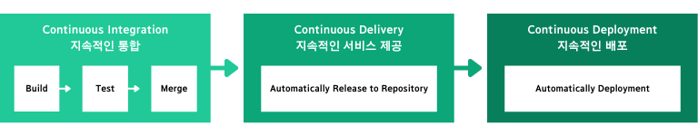

### CI(지속적 통합)/CD(지속적 배포)란 무엇일까?

우선, [RedHat에서 정의한 CI/CD](https://www.redhat.com/ko/topics/devops/what-is-ci-cd)의 개념은 애플리케이션 개발 단계를 자동화하여 애플리케이션을 보다 **짧은 주기**로 고객에게 제공하는 방법입니다.

CI/CD는 최근 DevOps가 트렌드로 떠오르면서 어디에서나 볼 수 있는 용어가 되었죠.

이 용어가 무슨 뜻인지 알아보기 전, 한 상황을 예시로 들어보겠습니다.

 

하나의 조직에서 애플리케이션을 개발했는데, 이 애플리케이션의 규모가 상당하다고 생각해봅시다.

그럼 단순히 개발을 하고, 테스트를 진행하며, 빌드를 한 후, 배포를 하는데만 시간이 꽤나 오래걸립니다.

게다가 이 애플리케이션은 한 사람이 관리하는 것이 아닌, 몇십명으로 구성된 하나의 조직이 관리합니다.

따라서 이 조직은 애플리케이션의 수정본을 하나로 합치는 것부터 배포까지 걸리는 시간이 오래 걸려 긴 배포 주기를 가지게 되겠죠.

이렇게 되면 사용자의 피드백을 빠르게 반영할 수 없을 뿐더러, 배포 과정 속에서 문제가 발생할 가능성도 높습니다.

 

이런 문제 상황을 개선하기 위해서 등장한 단어가 바로 CI/CD입니다.

애플리케이션 코드 병합부터 테스트, 배포까지의 라이프사이클 전체에 걸쳐 자동화를 이루어 보다 더 짧은 주기로 고객들에게 애플리케이션을 제공할 수 있는 것입니다.

위와 같은 뜻을 가지고 있는 CI/CD는 지속적인 통합 (Continuous Integration), 지속적인 서비스 제공 (Continuous Delivery), 지속적인 배포 (Continuous Deployment)로 구성되어 있습니다.

 

### CI/CD 파이프라인 구축 목적

현재 Line DevOps 팀에서 구축한 CI/CD 프로세스 속에서의 애플리케이션 배포 과정은 아래와 같습니다.

1. 개발자는 소스 코드를 수정하고, 코드 컨벤션을 준수했는지, 코드가 잘 작동하는지 Pull Request를 보내 자동으로 확인합니다.
2. 변경된 소스 코드에 대해 코드 리뷰를 진행합니다.
3. 코드 리뷰가 끝나면 PR Merge 작업이 수행됩니다.
4. 배포 가능한 소스 코드를 주기적으로 빌드하여 테스트 버전을 생성한 후, 여러 모바일 장치에서 다양한 테스트를 진행합니다.
5. 테스트 과정에서 발생한 오류를 수정하여 스토어에 배포합니다.

위와 같은 작업을 한 사람이 수행해도 다양한 Human Error를 야기할 가능성이 높은데, 여러 사람들과 연계하여 매끄럽게 처리하기 위해서는 팀 내부적으로 엄청난 노력이 필요합니다.

따라서 이런 작업을 자동화하여 **배포 주기 단축 및 불편함을 최소화**하는 것이 CI/CD 파이프라인 구축의 목적입니다.

### 지속적인 통합 (Continuous Integration)

지속적인 통합, CI(Continuous Integration)란 자동화된 빌드 및 테스트가 수행된 후, 개발자가 코드 변경 사항을 중앙 리포지토리에 정기적으로 병합하는 DevOps 소프트웨어 개발 방식입니다.

이 단계에서는 버전 관리를 통한 코드 병합, 빌드, 테스트, 오류 보고를 자동화하여 반복적인 작업을 줄이고, 발생한 문제에 대해 빠르게 처리가 가능하여 더 좋은 품질의 소프트웨어를 개발할 수 있습니다.

### 지속적인 서비스 제공 (Continuous Delivery)

지속적인 서비스 제공, CD(Continuous Delivery)는 반복적인 작업을 자동화한 CI 과정을 거친 소스코드를 레포지토리에 자동으로 반영하는 단계를 의미합니다.

이 단계에서 바로 프로덕션 단계로 배포하는 지속적인 배포 단계로 확장이 가능하지만, 따로 테스트 환경에 배포하여 추가적인 여러 사용자 차원에서 테스트를 검증할 수 있는 단계입니다.

### 지속적인 배포 (Continuous Deployment)

지속적인 배포, CD(Continuous Deployment)는 CI/CD의 마지막 단계로 모든 테스트를 거친 코드를 레포지토리에 자동으로 반영하는 지속적인 서비스 제공 단계의 확장된 형태입니다.

이 단계에서는 애플리케이션을 프로덕션 단계로 자동으로 배포하는 작업을 자동화하여, 개발자가 변경 사항을 적용한 후 짧은 시간 이내에 사용자는 새로운 버전의 애플리케이션을 사용할 수 있습니다.

### CI/CD 파이프라인 개선 전략

CI/CD는 단순히 반복 작업의 자동화를 통한 배포 주기의 단축을 위해서 사용할 수 있는 것은 아닙니다.

이를 어떻게 활용하고, 개선하느냐에 따라 **서비스의 품질이 엄청나게 향상**될 수도 있는 것이죠.

위에서 Line의 DevOps 팀에서 구축한 CI/CD 프로세스 속에서의 애플리케이션 배포 과정을 예시로 들었습니다.

현재 해당 조직에서는 서비스의 품질도 향상시키기 위해 지속적으로 CI/CD 프로세스를 개선하고 있는데, 어떻게 작업이 이루어지고 있을까요?

 

DevOps 팀은 가장 먼저 주변 개발자들과 의사소통 경로를 형성하여 피드백을 얻고, 자연스럽게 자동화 업무 개선 작업에 관심을 가지게하여 개선이 가능한 부분을 찾아내는 것부터 시작했습니다.

당시 Line 애플리케이션 개발 과정에서 배포되는 패키지의 크기가 갑작스럽게 커지는 문제가 발생했기 때문에 DevOps팀은 이 부분에 대해 빠르게 탐지할 수 있는 체계를 마련하고자 했습니다.

따라서 CI/CD 과정 중에서 생성되는 다양한 데이터 중에서 서비스 개선에 사용할 수 있으며, 시각화가 가능한 데이터를 추린 뒤, 데이터 시각화 방법에 대해 고민했습니다.

이 과정에서 새로 시스템을 구축하기 위해 아래 기준을 마련하여 개발 스택을 찾아보았습니다.

- 빠르게 구축할 수 있고 문제가 발생했을 때 참고할 만한 레퍼런스가 많은가?
- 데이터를 유연하게 수집할 수 있는가?
- 설정을 손쉽게 변경할 수 있는가?
- 알림 기능이 있는가?
- 다양한 차트를 사용할 수 있고 관련 생태계가 구축되어 있는가?
- 시스템을 처음 접하는 동료와도 손쉽게 시작할 수 있는가?

이렇게 결정한 개발 스택은 데이터 수집, 저장, 조회를 위해 사용되는 오픈 소스인 ELK Stack과 데이터 시각화 오픈 소스인 Grafana였습니다.

그 후, OS 플랫폼, 빌드 번호 및 Job URL, 패키지명, 버전 정보, 패키지 크기 정보 데이터를 활용해 Jenkins를 이용하여 배포할 패키지를 제작했습니다.

따라서 위의 데이터는 Jenkins 내에서 패키지를 만드는 작업이 종료되는 때에 ELK Stack에 전달됩니다.

그렇게 DevOps 팀은 새로운 시스템을 구축하여 개발 단계별 전체적인 추이를 확인할 수 있도록 하였고, 처음 시스템 구축 목적이었던 패키지 크기 급증 문제에 대해 알림을 받아 사전에 인지할 수 있도록 했습니다.

---

### Source

- RedHat - CI/CD(지속적 통합/지속적 제공): 개념, 방법, 장점, 구현 과정

  [https://www.redhat.com/ko/topics/devops/what-is-ci-cd](https://www.redhat.com/ko/topics/devops/what-is-ci-cd)

- Line Engineering - 데이터 기반으로 지속적인 CI/CD 개선 환경 만들기

  [https://engineering.linecorp.com/ko/blog/build-a-continuous-cicd-environment-based-on-data/](https://engineering.linecorp.com/ko/blog/build-a-continuous-cicd-environment-based-on-data/)
