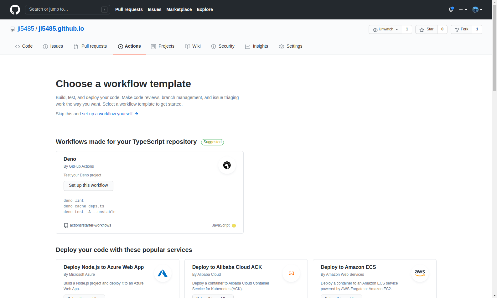
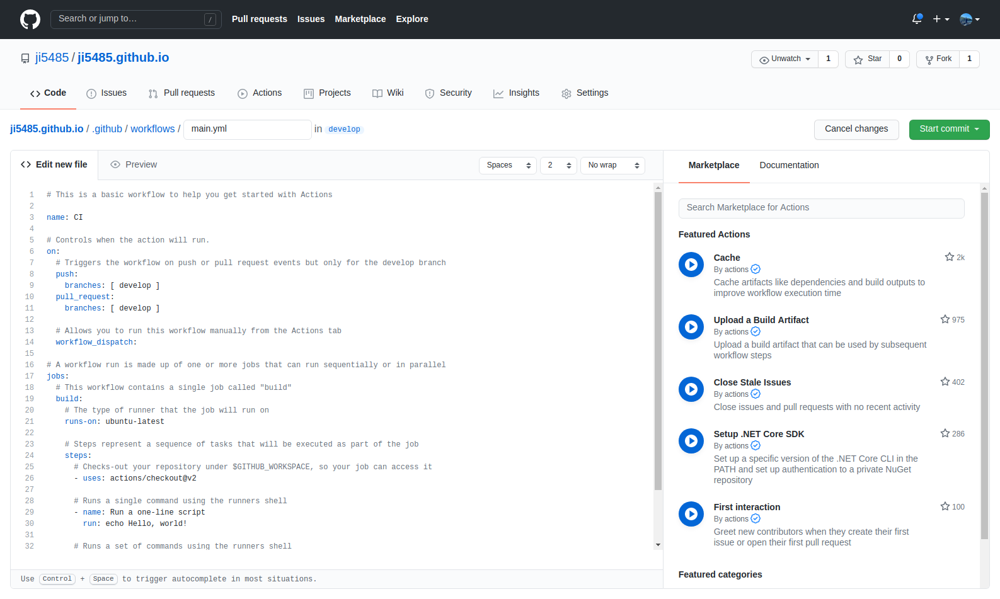
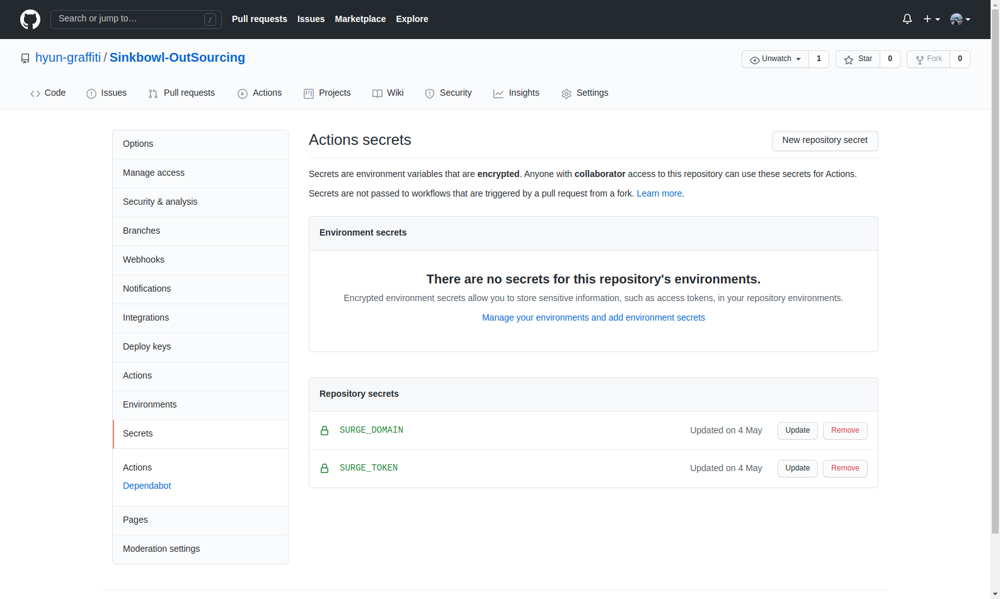
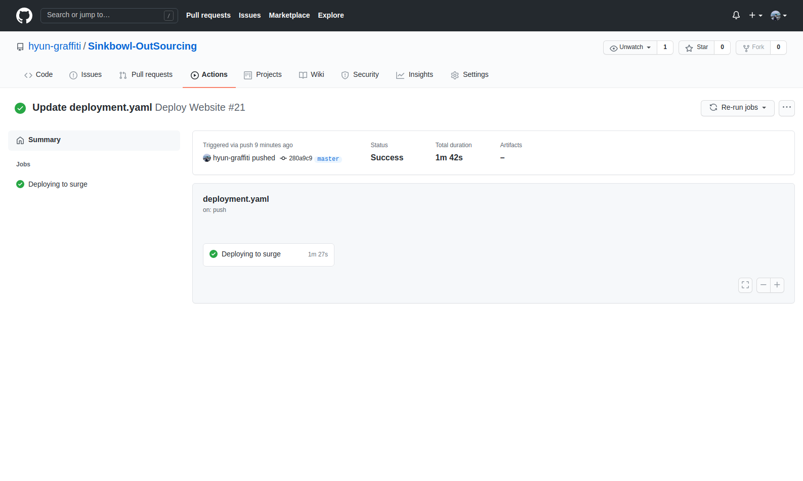
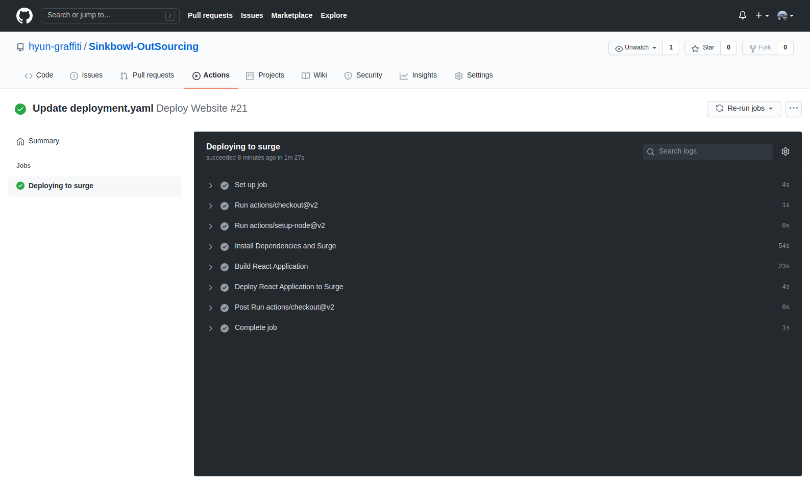

### Github Actions란?

Github Actions이란 소프트웨어 개발 라이프사이클 안에서 Pull Request, Push 등의 이벤트 발생에 따라 자동화된 작업을 진행할 수 있게 해주는 기능입니다.

그럼 자동화된 작업이 필요한 경우에는 어떤 것들이 존재할까요? 하단의 리스트를 확인해주세요.

1. CI/CD

   이 글의 작성 목적이자 Github Actions을 활용하는 가장 대표적인 예시 중 하나입니다.

   로컬 레포지토리에서 원격 레포지토리로 푸쉬하고 난 후, Github Actions에서는 이벤트 발생에 따라 자동으로 빌드 및 배포하는 스크립트를 실행시켜주는 것입니다.

   애플리케이션의 규모가 클수록 빌드, 배포 시간이 오래걸리는데 이를 자동화시켜놓으면 해당 시간을 낭비하지 않을 수 있겠죠.

2. Testing

   팀 프로젝트를 진행하다가 Pull Request를 보내면 자동으로 테스트를 진행하는 것또한 Github Actions으로 구현할 수 있습니다.

   따라서 테스트 성공 여부에 따라서 자동으로 PR을 Open 및 Close 할 수 있습니다.

3. Cron Job

   Github Actions를 통해 특정 시간대에 스크립트를 반복 실행하도록 구현할 수 있습니다.

   매일 특정 시간이 되면 크롤링 작업을 진행한다는 등의 예시가 존재합니다.

### Github Actions의 구성 요소

Github Actions을 활용하기 위해 알아야 할 구성 요소가 존재합니다.

각 구성 요소는 Workflow, Event, Job, Step, Action, Runner로, 각각 어떤 역할을 하는지 알아봅시다.

1. Workflow

   Workflow란 레포지토리에 추가할 수 있는 일련의 자동화된 커맨드 집합입니다.

   하나 이상의 Job으로 구성되어 있으며, Push나 PR과 같은 이벤트에 의해 실행될 수도 있고 특정 시간대에 실행될 수도 있습니다.

   빌드, 테스트, 배포 등 각각의 역할에 맞는 Workflow를 추가할 수 있고, `.github/workflows` 디렉토리에 YAML 형태로 저장합니다.

2. Event

   Event란 Workflow를 실행시키는 Push, Pull Request, Commit 등의 특정 행동을 의미합니다.

   그리고 위의 특정 행동이 아닌, [Repository Dispatch Webhook](https://docs.github.com/en/rest/reference/repos#create-a-repository-dispatch-event)을 사용하면 Github 외부에서 발생한 이벤트에 의해서도 Workflow를 실행시킬 수 있습니다.

   Event 종류에 대해 더 알고 싶다면 [Github Actions 공식 문서](https://docs.github.com/en/actions/reference/events-that-trigger-workflows)를 확인해주세요.

3. Job

   Job이란 동일한 Runner에서 실행되는 여러 Step의 집합을 의미합니다.

   기본적으로 하나의 Workflow 내의 여러 Job은 독립적으로 실행되지만, 필요에 따라 의존 관계를 설정하여 순서를 지정해줄 수 있습니다.

   예시로 테스트를 수행하는 Job과 빌드 작업을 수행하는 Job이 하나의 Workflow에 존재한다고 생각해봅시다.

   여기서 테스트 Job은 반드시 빌드 Job 이후에 수행되어야 하는데, 여기서 의존 관계를 설정해 빌드 Job이 성공적으로 끝나야 테스트 Job을 수행할 수 있도록 지정할 수 있습니다.

   따라서 만약 빌드가 실패할 시에는 테스트 Job도 실행되지 않겠죠.

4. Step

   Step이란 커맨드를 실행할 수 있는 각각의 Task를 의미하는데, Shell 커맨드가 될 수도 있고, 하나의 Action이 될 수도 있습니다.

   하나의 Job 내에서 각각의 Step은 다양한 Task로 인해 생성된 데이터를 공유할 수 있습니다.

5. Action

   Action이란 Job을 만들기 위해 Step을 결합한 독립적인 커맨드로, 재사용이 가능한 Workflow의 가장 작은 단위의 블럭입니다.

   직접 만든 Action을 사용하거나 Github Community에 의해 생성된 Action을 불러와 사용할 수 있습니다.

6. Runner

   Runner란 Github Actions Workflow 내에 있는 Job을 실행시키기 위한 애플리케이션입니다.

   Runner Application은 Github에서 호스팅하는 가상 환경 또는 직접 호스팅하는 가상 환경에서 실행 가능하며, Github에서 호스팅하는 가상 인스턴스의 경우에는 메모리 및 용량 제한이 존재합니다.

### Workflow 생성 및 Workflow 파일 알아보기

Workflow는 `.github/workflows` 디렉토리 내에 `.yml` 파일을 생성해도 되지만, Repository의 Actions 탭에서 자동으로 템플릿을 만들어주는 기능을 이용하는 것이 좋습니다.

<br />



<br />

하단의 다양한 용도별 템플릿을 사용하는 것도 좋지만 여기에서는 Github에서 제공하는 가장 기본적인 템플릿을 사용해보겠습니다.

상단의 set up a workflow yourself 버튼을 클릭해보세요.

그럼 하단과 같이 workflow 파일을 수정할 수 있는 코드 에디터가 나타날 것입니다.

<br />



<br />

이렇게 생성된 `main.yml` 파일의 전체 코드는 아래와 같습니다.

각 코드의 역할은 주석을 통해 작성했으니 확인해보세요.

```yaml
# Repository의 Actions 탭에 나타날 Workflow 이름으로 필수 옵션은 아닙니다.
name: CI

# Workflow를 실행시키기 위한 Event 목록입니다.
on:
  # 하단 코드에 따라 develop 브랜치에 Push 또는 Pull Request 이벤트가 발생한 경우에 Workflow가 실행됩니다.
  # 만약 브랜치 구분 없이 이벤트를 지정하고 싶을 경우에는 단순히 아래와 같이 작성도 가능합니다.
  # on: [push, pull_request]
  push:
    branches: [develop]
  pull_request:
    branches: [develop]

  # 해당 옵션을 통해 사용자가 직접 Actions 탭에서 Workflow를 실행시킬 수 있습니다.
  # 여기에서는 추가적으로 더 설명하지는 않겠습니다.
  workflow_dispatch:

# 해당 Workflow의 하나 이상의 Job 목록입니다.
jobs:
  # Job 이름으로, build라는 이름으로 Job이 표시됩니다.
  build:
    # Runner가 실행되는 환경을 정의하는 부분입니다.
    runs-on: ubuntu-latest

    # build Job 내의 step 목록입니다.
    steps:
      # uses 키워드를 통해 Action을 불러올 수 있습니다.
      # 여기에서는 해당 레포지토리로 check-out하여 레포지토리에 접근할 수 있는 Action을 불러왔습니다.
      - uses: actions/checkout@v2

      # 여기서 실행되는 커맨드에 대한 설명으로, Workflow에 표시됩니다.
      - name: Run a one-line script
        run: echo Hello, world!

      # 이렇게 하나의 커맨드가 아닌 여러 커맨드도 실행 가능합니다.
      - name: Run a multi-line script
        run: |
          echo Add other actions to build,
          echo test, and deploy your project.
```

### React 프로젝트 Surge.sh에 배포하기 위한 준비

Surge.sh란 정적 파일을 호스팅해주는 서비스로, 간단한 소개 또는 설명 페이지 등을 올리는 데 적합한 무료 서비스입니다.

해당 서비스를 Github Actions에서 사용하기 위해서는 **Token**과 **Domain** 값이 필요합니다.

그러기 위해 Surge 라이브러리를 Global로 설치한 후, 루트 디렉토리에서 `surge` 커맨드를 입력해 계정을 생성해주세요.

그러면 계정 생성과 동시에 프로젝트가 바로 배포될텐데, 여기에 표시되는 도메인을 따로 복사해주세요.

이해가 되지 않는다면 [다음 동영상](https://www.youtube.com/watch?v=-EjdMvYPSVU&t=95s)을 확인한 다음, 첫 `surge` 커맨드를 입력하는 과정까지만 따라해주세요.

그 다음, `surge token` 커맨드를 통해 해당 계정의 token 값을 받아와 따로 복사해주세요.

이제 Token, Domain 값을 Github Actions에서 사용하기 위해 Secrets을 추가해줍시다.

해당 Repository의 Settings 탭 내에 Secrets 메뉴에 들어가면 아래 사진과 같이 Secret 값을 추가할 수 있는 화면이 나옵니다.

<br />



<br />

저는 현재 `SURGE_DOMAIN` 과 `SURGE_TOKEN` 이라는 이름으로 Secret 값을 추가해줬습니다.

아까 복사한 도메인 값은 `SURGE_DOMAIN`이라는 이름으로, 토큰 값은 `SURGE_TOKEN`이라는 이름으로 추가해주세요.

그럼 이제 Workflow 파일을 만들어봅시다.

그리고 본격적으로 코드를 작성하기 전, 간단하게 틀부터 만들어보겠습니다.

하단의 코드를 새롭게 생성한 Workflow 파일에 복사/붙여넣기 해주세요.

```yaml
name: Automatically Deployment

on: [push]

jobs:
  deployment:
    runs-on: ubuntu-latest

    # 해당 Job의 이름을 아래와 같이 설정하여 Actions 탭에서 확인할 수 있게 설정합니다.
    name: Deploying to surge

    steps:
      # 해당 레포지토리로 check-out하는 Action을 불러왔습니다.
      - uses: actions/checkout@v2
```

### 배포 Workflow 파일 작성하기

이제 본격적으로 workflow 파일을 작성해봅시다.

우선 해당 레포지토리로 Check-Out하는 부분까지는 완료된 상태입니다.

그럼 여기에서 배포하기 위해서는 무엇을 더 해야할까요?

기본적으로 여기에서 생성한 Workflow를 실행하기 위한 Runner는 어떤 언어를 사용하고 있는지 모릅니다.

따라서 Runner Application에 Node 환경을 세팅해주어야 합니다.

아래와 같이 코드를 수정해주세요.

```yaml
name: Automatically Deployment

on: [push]

jobs:
  deployment:
    runs-on: ubuntu-latest

    # 해당 Job의 이름을 아래와 같이 설정하여 Actions 탭에서 확인할 수 있게 설정합니다.
    name: Deploying to surge

    steps:
      # 해당 레포지토리로 check-out하는 Action을 불러왔습니다.
      - uses: actions/checkout@v2

      # Node 환경을 설정하여 npm 커맨드를 사용할 수 있도록 하는 Action을 불러옵니다.
      # 여기에서는 14 버전을 사용하고 있습니다.
      - uses: actions/setup-node@v2
        with:
          node-version: '14'
```

그럼 이제 해당 프로젝트에서 사용하는 라이브러리를 받아와야 합니다.

그리고 Surge.sh에 배포하기 위해 surge 라이브러리도 설치해주어야 합니다.

아래와 같이 코드를 수정해주세요.

```yaml
name: Automatically Deployment

on: [push]

jobs:
  deployment:
    runs-on: ubuntu-latest

    # 해당 Job의 이름을 아래와 같이 설정하여 Actions 탭에서 확인할 수 있게 설정합니다.
    name: Deploying to surge

    steps:
      # 해당 레포지토리로 check-out하는 Action을 불러왔습니다.
      - uses: actions/checkout@v2

      # Node 환경을 설정하여 npm 커맨드를 사용할 수 있도록 하는 Action을 불러옵니다.
      # 여기에서는 14 버전을 사용하고 있습니다.
      - uses: actions/setup-node@v2
        with:
          node-version: '14'

      # 해당 프로젝트에서 사용하는 모든 라이브러리와 Surge를 설치합니다.
      - name: Install Dependencies and Surge
        run: |
          npm install
          npm install surge --global
```

Surge.sh는 빌드된 파일을 호스팅하기 때문에 React 프로젝트를 빌드해야 합니다.

따라서 아래와 같이 빌드 커맨드를 추가해주어야 합니다.

```yaml
name: Automatically Deployment

on: [push]

jobs:
  deployment:
    runs-on: ubuntu-latest

    # 해당 Job의 이름을 아래와 같이 설정하여 Actions 탭에서 확인할 수 있게 설정합니다.
    name: Deploying to surge

    steps:
      # 해당 레포지토리로 check-out하는 Action을 불러왔습니다.
      - uses: actions/checkout@v2

      # Node 환경을 설정하여 npm 커맨드를 사용할 수 있도록 하는 Action을 불러옵니다.
      # 여기에서는 14 버전을 사용하고 있습니다.
      - uses: actions/setup-node@v2
        with:
          node-version: '14'

      # 해당 프로젝트에서 사용하는 모든 라이브러리와 Surge를 설치합니다.
      - name: Install Dependencies and Surge
        run: |
          npm install
          npm install surge --global

      # React 프로젝트를 빌드합니다.
      - name: Build React Application
        run: npm run build
```

이제 마지막으로 빌드된 파일을 Surge에 배포하면 됩니다.

배포 스크립트는 Surge의 설명을 따라 작성한 것으로, 아래와 같이 작성하시면 됩니다.

```yaml
name: Automatically Deployment

on: [push]

jobs:
  deployment:
    runs-on: ubuntu-latest

    # 해당 Job의 이름을 아래와 같이 설정하여 Actions 탭에서 확인할 수 있게 설정합니다.
    name: Deploying to surge

    steps:
      # 해당 레포지토리로 check-out하는 Action을 불러왔습니다.
      - uses: actions/checkout@v2

      # Node 환경을 설정하여 npm 커맨드를 사용할 수 있도록 하는 Action을 불러옵니다.
      # 여기에서는 14 버전을 사용하고 있습니다.
      - uses: actions/setup-node@v2
        with:
          node-version: '14'

      # 해당 프로젝트에서 사용하는 모든 라이브러리와 Surge를 설치합니다.
      - name: Install Dependencies and Surge
        run: |
          npm install
          npm install surge --global

      # React 프로젝트를 빌드합니다.
      - name: Build React Application
        run: npm run build

      # Surge에 빌드된 파일을 배포합니다.
      - name: Deploy React Application to Surge
        run: surge ./build ${{ secrets.SURGE_DOMAIN }} --token ${{ secrets.SURGE_TOKEN }}
```

이제 해당 파일을 레포지토리에 추가해봅시다.

그럼 등록된 Workflow가 실행될텐데 아래와 같이 Actions 탭에서 해당 과정이 오류 없이 잘 실행되는지 확인해보세요.

<br />





---

### Source

- Github Actions Documentation

  [https://docs.github.com/en/actions](https://docs.github.com/en/actions)
