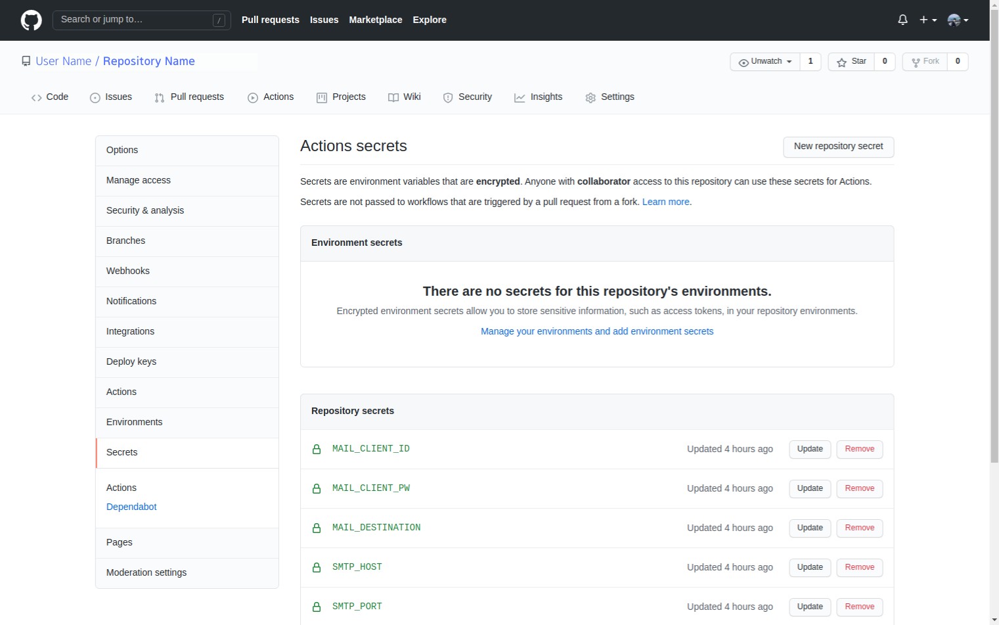
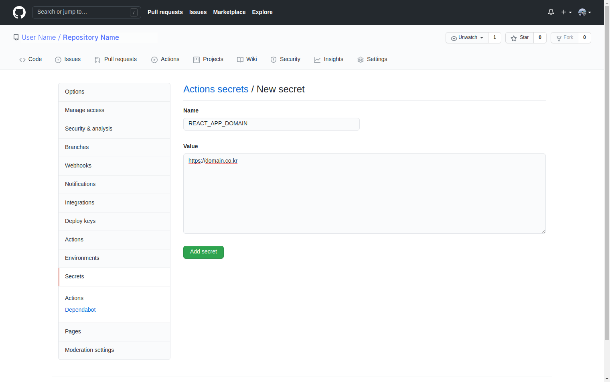

### 이 방법이 필요한 때는 언제일까?

결론부터 말하자면 소스코드를 **Github Actions을 통해 Push 이벤트가 발생**하면 Surge나 Netlify 등의 **호스팅 서비스에 배포하는 Action이 트리거하기 위한 경우**에 필요합니다.

위에서 언급한 호스팅 서비스 외의 개인 서버에도 배포하기 위해서 이 방법이 필요할 수도 있습니다.

`process.env.[환경 변수 이름]` 으로 접근 가능한 환경 변수는 일반적으로 루트 디렉토리에 `.env` 등의 파일로 저장을 합니다.

이런 환경 변수는 단순히 도메인 주소나 서버 포트 넘버, 디버그 상태와 같은 서버 관련 정보일 수도 있지만, 데이터베이스 계정 정보, 각종 오픈 API의 KEY 값 등 **민감한 정보**일 가능성이 존재합니다.

물론 프론트엔드에서의 `create-react-app` 라이브러리 같은 경우에는 빌드 파일에 프로덕션 단계에서 사용하는 환경 변수를 모두 포함하기 때문에 아예 민감한 정보는 환경 변수로 추가하면 안되지만, 다른 경우에서는 충분히 민감한 정보를 환경 변수로 추가해서 사용할 수 있습니다.

```
# 아래와 같은 정보는 탈취되면 악용될 수 있습니다.
REACT_APP_KAKAO_API_KEY=...
REACT_APP_NAVER_API_KEY=...
```

이런 환경 변수가 Github와 같은 원격 소스코드 저장소에 저장되기라도 한다면 어떻게 될까요?

누구든지 이런 민감한 개인 정보를 볼 수 있고, 만약 악의를 가진 사람이라면 언제든지 악용할 수 있습니다.

그래서 저희는 대부분 `.gitignore` 라는 파일을 통해 이런 **환경 변수 파일을 제외**하도록 설정합니다.

아래 코드는 `create-react-app` 을 통해 React 애플리케이션을 생성했을 때, 같이 만들어지는 `.gitignore` 파일의 일부분을 가져온 것입니다.

```
...

# misc
.DS_Store
.env.local
.env.development.local
.env.test.local
.env.production.local

...
```

결국 이 파일에 의해 환경 변수는 로컬 개발 환경에서만 사용이 가능하고, 배포 시에는 `.env` 파일 없이 배포되기 때문에 환경 변수를 사용할 수 없습니다.

**보안 문제로 환경 변수 파일을 Github에 업로드할 수는 없지만, 배포를 하려면 환경 변수 파일이 업로드되어야 하기 마련이죠.**

이런 상황에서는 어떻게 문제를 해결할 수 있을까요?

### Github Actions의 Secrets

Github Repository의 Actions Secrets은 환경 변수를 암호화해서 저장할 수 있는 기능입니다.

해당 기능은 Actions를 트리거할 때, 환경 변수를 가져오기 위해 사용할 수 있습니다.

그럼 로컬 개발 환경에서는 `.env` 파일을 통해 환경 변수에 접근하고, Github Actions에서 배포할 때에는 Actions Secrets을 통해 환경 변수에 접근할 수 있지 않을까요?

<br />



<br />

그래서 저희는 `.env` 파일에 존재하는 환경 변수 중, 프로덕션 단계에서 필요한 변수를 Actions Secrets에 추가하고 Action이 트리거 될 때 자동으로 프로덕션 환경을 위한 환경 변수 파일을 생성해주도록 하겠습니다.

### Action에서 Secrets으로 환경 변수 파일 생성하기

[지난 포스트](https://ji5485.github.io/post/2021-06-06/build-ci-cd-pipeline-using-github-actions/)에서는 React 애플리케이션을 어떻게 Github Actions로 Surge 배포하는지 알아보았었습니다.

배포할 플랫폼은 어디든지 상관 없기 때문에 여기에서는 해당 예시를 그대로 가져와 사용해보겠습니다.

```yaml
name: Automatically Deployment

on: [push]

jobs:
  deployment:
    runs-on: ubuntu-latest

    # 해당 Job의 이름을 아래와 같이 설정하여 Actions 탭에서 확인할 수 있게 설정합니다.
    name: Deploying to surge

    steps:
      # 해당 레포지토리로 check-out하는 Action을 불러왔습니다.
      - uses: actions/checkout@v2

      # Node 환경을 설정하여 npm 커맨드를 사용할 수 있도록 하는 Action을 불러옵니다.
      # 여기에서는 14 버전을 사용하고 있습니다.
      - uses: actions/setup-node@v2
        with:
          node-version: '14'

      # 해당 프로젝트에서 사용하는 모든 라이브러리와 Surge를 설치합니다.
      - name: Install Dependencies and Surge
        run: |
          npm install
          npm install surge --global

      # React 프로젝트를 빌드합니다.
      - name: Build React Application
        run: npm run build

      # Surge에 빌드된 파일을 배포합니다.
      - name: Deploy React Application to Surge
        run: surge ./build ${{ secrets.SURGE_DOMAIN }} --token ${{ secrets.SURGE_TOKEN }}
```

위의 코드는 지난 포스트에서 작성했던 Action 코드입니다.

먼저 저희에게 다음과 같은 환경 변수가 있다고 가정해봅시다.

```
# .env 파일에 저장된 환경 변수
REACT_APP_DOMAIN=https://domain.co.kr
REACT_APP_DEBUG=false
```

저희는 위의 환경 변수를 프로젝트의 라이브러리를 설치하기 전에 추가해보겠습니다.

그러기 위해서 Github Repository의 Secrets으로 위의 환경 변수를 추가해줘야 합니다.

아래 사진과 같이 두 개의 Secret을 생성해준 다음, Action 파일을 수정해보겠습니다.

<br />



<br />

환경 변수를 추가해주었으니 이제 Action 파일을 수정해봅시다.

이를 위해 `uses: actions/setup-node@v2` 와 `name: Install Dependencies and Surge` 사이에 환경 변수를 생성하는 Step을 추가해줘야 합니다.

따라서 아래와 같이 YAML 파일을 변경해주세요.

```yaml
name: Automatically Deployment

on: [push]

jobs:
  deployment:
    runs-on: ubuntu-latest

    # 해당 Job의 이름을 아래와 같이 설정하여 Actions 탭에서 확인할 수 있게 설정합니다.
    name: Deploying to surge

    steps:
      # 해당 레포지토리로 check-out하는 Action을 불러왔습니다.
      - uses: actions/checkout@v2

      # Node 환경을 설정하여 npm 커맨드를 사용할 수 있도록 하는 Action을 불러옵니다.
      # 여기에서는 14 버전을 사용하고 있습니다.
      - uses: actions/setup-node@v2
        with:
          node-version: '14'

      # Github Repository Secrets를 통해 환경 변수 파일을 생성합니다.
      - name: Generate Environment Variables File for Production
        run:

      # 해당 프로젝트에서 사용하는 모든 라이브러리와 Surge를 설치합니다.
      - name: Install Dependencies and Surge
        run: |
          npm install
          npm install surge --global

      # React 프로젝트를 빌드합니다.
      - name: Build React Application
        run: npm run build

      # Surge에 빌드된 파일을 배포합니다.
      - name: Deploy React Application to Surge
        run: surge ./build ${{ secrets.SURGE_DOMAIN }} --token ${{ secrets.SURGE_TOKEN }}
```

다음 단계로 진행하기 위해서는 간단한 리눅스 명령어의 사용법을 알아야 합니다.

여기서 사용할 명령어는 `echo` 인데요, 해당 명령어는 콘솔 창에 인수로 받은 문자열을 출력하는 아주 단순한 명령어입니다.

하지만 옵션을 추가하면 인수로 받은 문자열을 콘솔 창이 아닌 파일에 저장할 수 있습니다.

아래의 커맨드는 문자열을 `test.txt` 파일에 저장하는 커맨드입니다.

```bash
echo "Hello, World!" >> test.txt
```

만약 `test.txt` 파일이 존재하지 않는다면, 파일을 생성한 후 문자열을 입력하게 됩니다.

저희는 이 명령어를 통해 Generate Environment Variables File for Production 단계에서 환경 변수 파일을 생성해보겠습니다.

```yaml
name: Automatically Deployment

on: [push]

jobs:
  deployment:
    runs-on: ubuntu-latest

    # 해당 Job의 이름을 아래와 같이 설정하여 Actions 탭에서 확인할 수 있게 설정합니다.
    name: Deploying to surge

    steps:
      # 해당 레포지토리로 check-out하는 Action을 불러왔습니다.
      - uses: actions/checkout@v2

      # Node 환경을 설정하여 npm 커맨드를 사용할 수 있도록 하는 Action을 불러옵니다.
      # 여기에서는 14 버전을 사용하고 있습니다.
      - uses: actions/setup-node@v2
        with:
          node-version: '14'

      # Github Repository Secrets를 통해 환경 변수 파일을 생성합니다.
      - name: Generate Environment Variables File for Production
        run: |
          echo "REACT_APP_DOMAIN=$REACT_APP_DOMAIN" >> .env.production
          echo "REACT_APP_DEBUG=$REACT_APP_DEBUG" >> .env.production
        env:
          REACT_APP_DOMAIN: ${{ secrets.REACT_APP_DOMAIN }}
          REACT_APP_DEBUG: ${{ secrets.REACT_APP_DEBUG }}

      # 해당 프로젝트에서 사용하는 모든 라이브러리와 Surge를 설치합니다.
      - name: Install Dependencies and Surge
        run: |
          npm install
          npm install surge --global

      # React 프로젝트를 빌드합니다.
      - name: Build React Application
        run: npm run build

      # Surge에 빌드된 파일을 배포합니다.
      - name: Deploy React Application to Surge
        run: surge ./build ${{ secrets.SURGE_DOMAIN }} --token ${{ secrets.SURGE_TOKEN }}
```

기본적으로 echo 명령어를 통해 변수를 출력하려면 변수명 앞에 `$`를 붙여줘야 하는데, 만약 다음과 같이 `env` 옵션을 설정하지 않는다면 Runner는 해당 변수를 찾지 못해 올바르게 환경 변수를 설정할 수 없습니다.

따라서 해당 옵션을 통해 어떤 변수에 어떤 값이 들어갈지 설정해줘야 합니다.

이렇게 `.env` 파일의 업로드 없이, 환경 변수를 설정한 상태에서 배포가 가능합니다.
