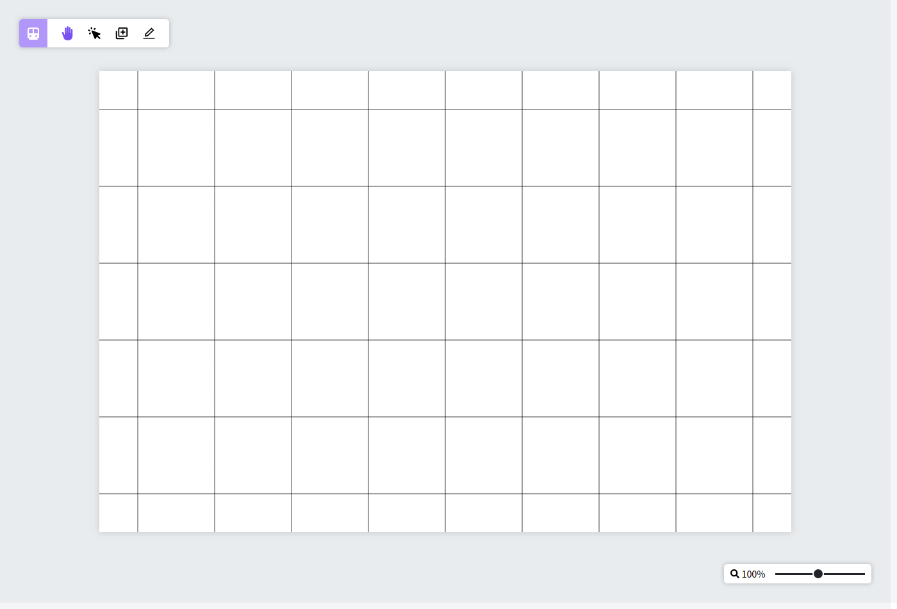
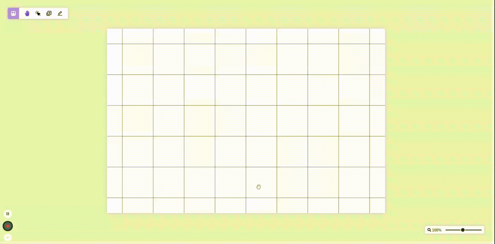
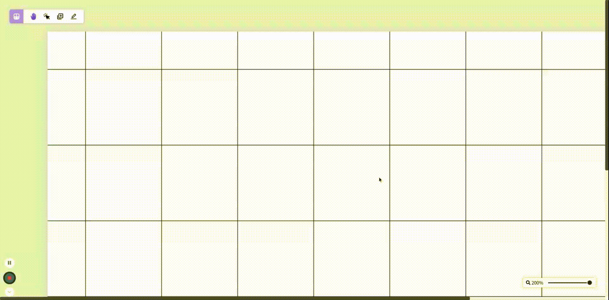
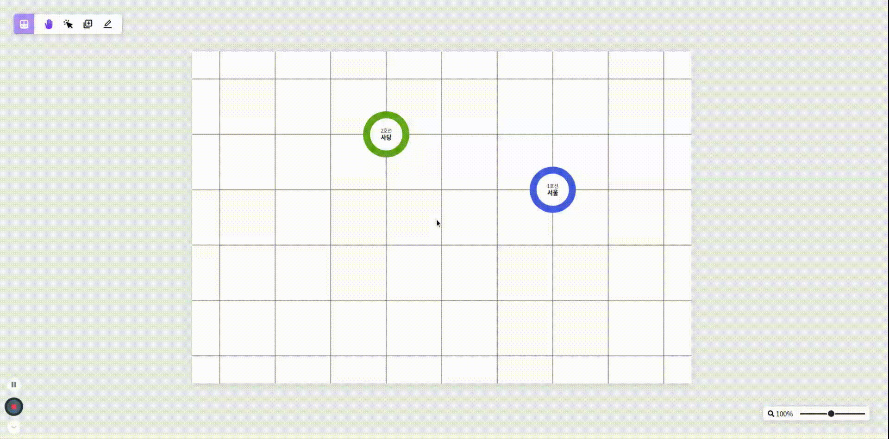
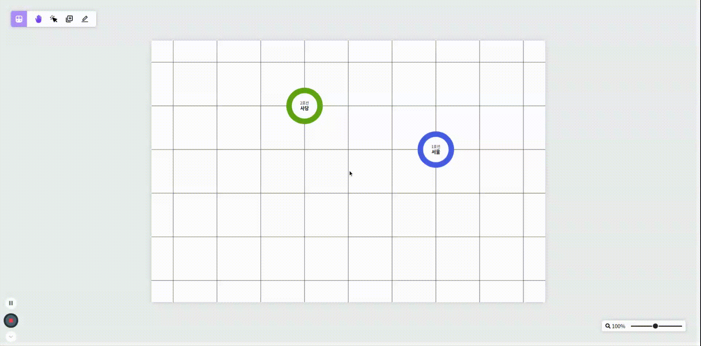
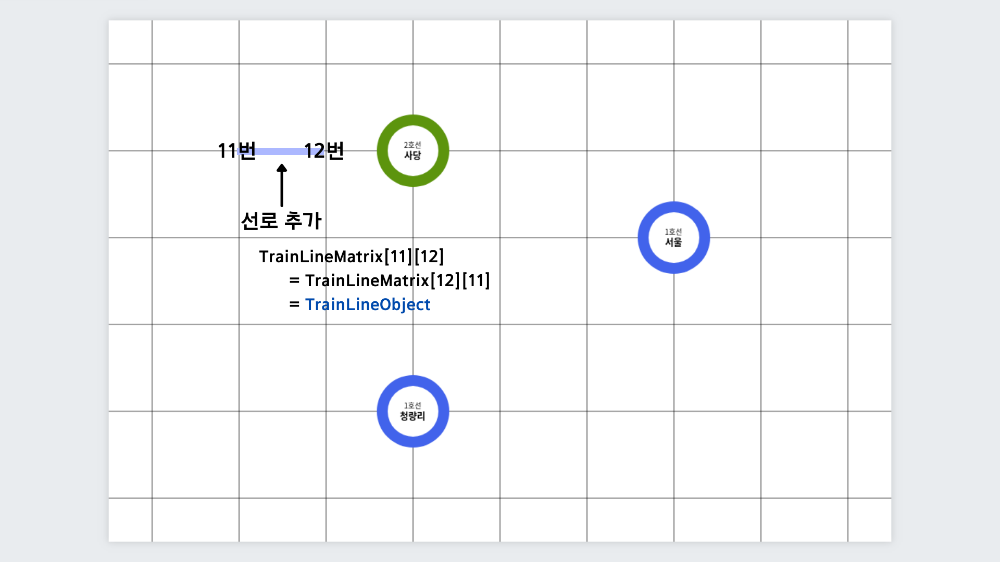
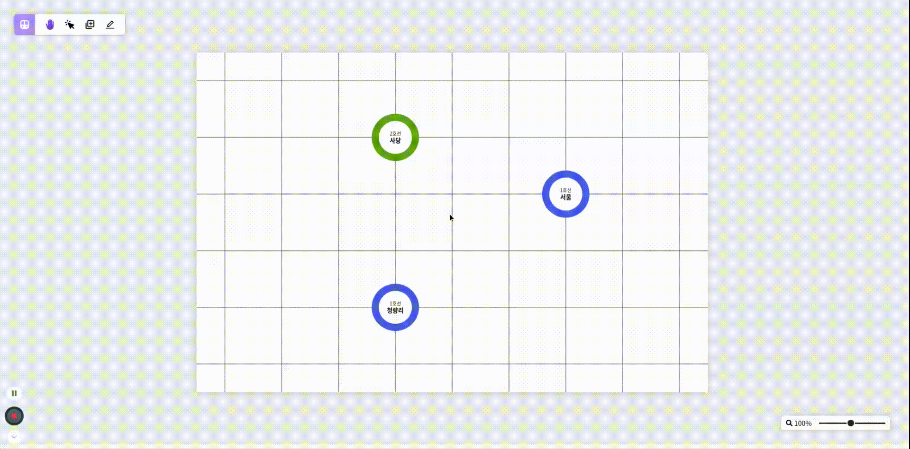
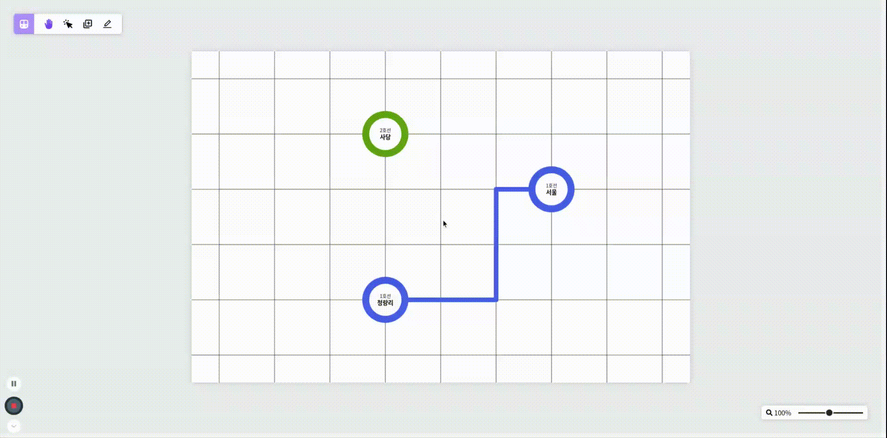
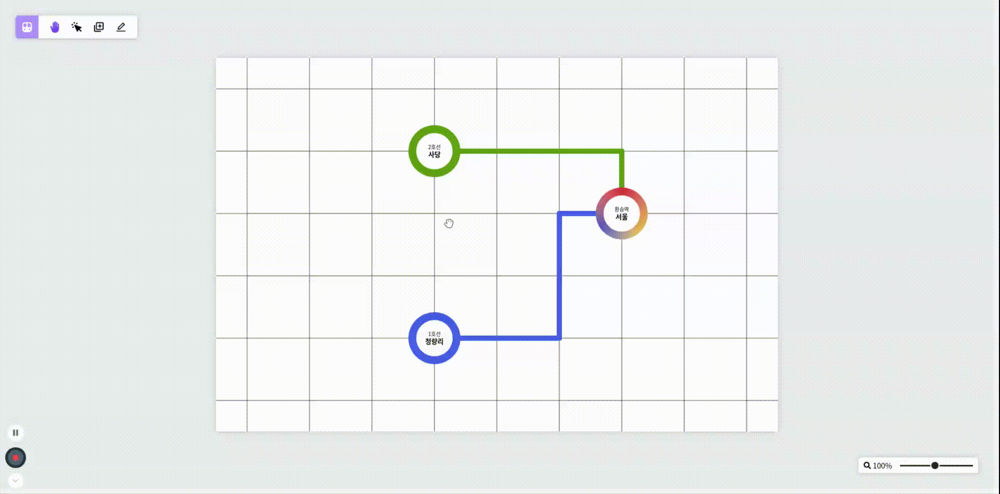

### 이젠 진짜 사이드 프로젝트를 만들어봐야겠다.

난 React를 다룬기 시작한지 꽤 됐음에도 아직까지 React로 만든 사이드 프로젝트가 없다.

분명히 대학교 1학년 때 교내 스타트업에서 프론트엔드 개발자로 활동하고, React를 주제로 낸 온라인 강의도 있는데 진행했던 사이드 프로젝트가 하나도 없다는 것이 계속 마음 속에서 걸려왔지만 그렇게 사이드 프로젝트 해야겠다를 마음 속에서 계속 반복만 할 뿐 실제로 하지는 못했다.

그렇게 어연 2년이 지나고, 군대에 입대해 나의 개인 블로그와 Gatsby 블로그 만들기 온라인 강의를 만들고 나서야 사이드 프로젝트를 시작하게 되었다.

### Train Map Visualizer를 만들게 된 계기

나는 거의 매일 사이버지식정보방에서 연등 시간을 보내고 5분이 남은 시점에서는 항상 Velog를 들여다보곤 하는데, 눈에 들어온 것이 바로 **우아한테크코스 프론트엔드 과정에서 진행하는 지하철 노선도 애플케이션 리뷰 글**이었다.

평소에도 우아한테크코스를 듣고 싶은 마음이 커서 자주 찾아보곤 하는데, 지하철 노선도 미션 후기 글을 본 이후에는 저 미션에 꽂혀 계속해서 리뷰 글을 찾아보곤 했었다.

하지만 아직까지는 사이드 프로젝트 주제로 삼고싶다는 생각이 들지 않았지만, 우연히 보게 된 유튜브 동영상을 통해 지하철 노선도를 주제로 정하게됐다.

그 동영상은 무려 페이스북과 구글에서 소프트웨어 엔지니어로 근무한 경력이 있는 해외 개발자의 사이드 프로젝트인 [Pathfinding Visualizer 리뷰](https://www.youtube.com/watch?v=n4t_-NjY_Sg&t=0s)였다.

### 이 정도는 해야 구글이나 페이스북에 가는건가?

아직 주니어 개발자라 개발 분야에 대한 견해가 그리 깊지 않은지라 처음에 보고서는 이 정도는 해야지 구글이나 페이스북 같은 글로벌 기업에 갈 수 있는 건가 싶었다.

사이드 프로젝트를 한 번도 해보지 않는 나로서는 그야말로 충격 그 자체였다.

하지만 그때의 난 충격을 받은 동시에 이런 복잡한 사이드 프로젝트를 만들어 보고 싶은 마음도 생겼다.

그렇게 **지하철 노선도를 직접 만들어볼 수 있는 애플리케이션**을 사이드 프로젝트로 개발해보자는 생각을 가지게 되었다.

### 이 프로젝트의 핵심 기술, Recoil

우아한테크코스 프론트엔드 과정에서 진행했던 지하철 노선도 애플리케이션 개발은 백엔드 과정을 수강하는 크루와 함께하는 미션이었다.

물론 이 생각이 옳은 것인지는 잘 모르겠지만 프론트엔드 크루원들은 데이터 저장 및 처리보다 UI 처리에 더 많은 비중을 두고 개발을 진행할 수 있었다고 생각한다. (물론 프론트엔드에서도 상태 관리가 중요하다)

하지만 나는 백엔드 없이 프론트엔드로만 사이드 프로젝트를 진행하는 것이기 때문에 지하철 노선도 데이터를 모두 프론트엔드 상에서 관리해야만 했다.

그렇게 나에게는 **데이터 저장 및 처리 부분도 중요한 문제**여서 상태 관리 라이브러리가 거의 필수적이었는데, 평소 Recoil을 활용해보고 싶다는 생각이 들었어서 이 프로젝트에서 활용하기로 결정했다.

### Train Map Visualizer의 레이아웃

 

 

애플리케이션을 실행하면 위의 화면이 나오는데, 각종 모드를 활성화할 수 있는 위젯과 노선도를 확대할 수 있는 위젯이 각각 좌측 상단, 우측 하단에 존재한다.

그리고 화면 중앙에는 이 프로젝트의 핵심 기능인 사용자가 직접 지하철 역과 선로를 추가할 수 있는 노선도가 존재하는데, 아직까지는 기능이 많지 않아 레이아웃이 간단하다.

### 첫 번째 기능, 노선도 확대/축소 및 이동

 

 

가장 먼저 구현한 기능은 **노선도를 확대/축소 하는 기능**으로, 시작 직후 2~3일 정도의 연등 시간을 투자해 만든 기능이지만 아직까지 완성하지 못했다.

단순히 확대, 축소를 하는 기능을 구현했지만, 내가 원하는 것은 현재 보이는 화면 정중앙을 기준으로 확대/축소 되는 것이다.

하지만 그게 마음처럼 되지 않아 해당 기능의 개발은 마지막으로 미뤄둔 후, 다른 부분을 개발하고 있다.

처음에는 transform의 기준을 정중앙으로 잡으면 해결이 되겠거니 싶어서 `transform-origin` 속성을 수정해주었지만, 기준이 어디던지 엘리먼트의 높이가 높아져 스크롤이 생기면 윗부분의 위치가 고정되었다.

그래서 스크롤이 생긴 후에 엘리먼트의 크기에 따라 직접 스크롤 위치를 조정해줘야 하나 해서 그렇게도 해봤지만 천천히 확대/축소 했을 때 노선도가 많이 떨리길래 시간을 더 지체할 수 없어 일단 넘어갔다.

 

 

다음으로는 확대된 노선도를 마우스 드래그를 통해 이동할 수 있는 기능인데, 해당 모드는 좌측 상단 위젯의 손바닥 모양 아이콘을 클릭했을 때 활성화된다.

이 기능은 사진이나 일러스트 편집 프로그램에서 많이 볼 수 있는 기능으로 아무런 액션을 취하지 않을 때, 기본적으로 활성화되는 모드이다.

### 두 번째 기능, 지하철역 추가

 

 

다음으로는 **지하철 역을 추가하는 기능**을 작업했는데, 좌측 상단 위젯에서 역을 추가할 수 있는 세 번째 아이콘을 클릭하게 되면 위와 같이 다른 위젯이 나타난다.

이 위젯에서는 호선을 선택 및 추가할 수 있고, 역의 이름을 지정해줄 수 있다.

그렇게 추가하기 버튼을 눌러 사용자는 **원하는 위치에 역을 추가**할 수 있다.

만약 모든 정보를 입력받지 않거나 중복되는 역이 존재한다면 추가하기 버튼이 활성화되지 않아 역을 추가할 수 없다.

 

 

위와 같이 중복되는 역이 존재하거나 역 이름을 한글 2~5글자로 지정해야 한다는 조건에 부합하지 않는다면 지하철 역 이름을 입력받는 부분 아래에 **오류 메시지**가 나타난다.

 

 

추가하기 버튼을 누른 후, 사용자가 역을 추가할 수 있는 단계에서 하단에 버튼 2개가 나타나는 것을 볼 수 있을 것이다.

각각 **입력받은 정보를 수정하는 버튼**, **지하철역 추가 기능을 취소하는 버튼**으로 위와 같이 지하철역을 추가하려다가 정보를 수정하거나 아예 취소할 수 있다.

### 세 번째 기능, 지하철 선로 그리기

지하철 선로 그리기 기능은 정말 많은 고민과 시간, 노력이 들어간 기능이다.

기능 구현도 어려웠을 뿐더러 데이터 저장 및 처리 부분에서도 꽤나 애를 먹어 갈아 엎기를 반복했던 기능이다.

간단하게 설명하자면 노선도를 저장하기 위해 2중 배열을 선언하고, 추가한 선로를 **그래프 인접 행렬 방식으로 저장**했다.

각 노드는 노드 넘버를 가지고 있어서 아래 사진과 같이 노드 넘버를 통해 선로 객체를 저장하게 되는 것이다.

 

 

물론 실제로 선로를 추가할 때에는 지하철 역이 존재하는 노드에서만 시작하지만, 예시를 들기 위해서 위와 같이 그려놨다.

이렇게 개발해야 추후에 구현하려는 길찾기 기능도 코드를 갈아엎지 않고서 개발할 수 있을 것 같다고 생각했다.

 

 

좌측 상단 위젯의 맨 마지막 아이콘을 클릭하게 되면 **선로 그리기 모드가 활성화**되는데, 이 때 사용자는 선로를 그리기 시작할 역을 클릭해 차례대로 그려나가면 된다.

사용자가 클릭한 역의 호선 색을 가져와 해당 호선 색으로 선로를 그려나갈 수 있고, 환승역에서 시작하는 경우는 별도로 사진을 첨부했으니 아래에서 확인하면 된다.

사용자가 역을 클릭해 그리기 시작하면, 해당 노드를 기준으로 커서의 위치에 따라 네 방향으로 그릴 수 있고, 현재 그리는 선로가 겹치거나 노선도 바깥으로 이탈할 수 없다.

 

 

위의 경우는 2호선인 사당역에서 1호선인 서울역으로 선로를 그리는 경우인데, 선로를 그리게 되면 서울역은 1호선과 2호선이 교차하는 환승역이 되므로 UI 상에서도 변화를 주었다.

원래 호선 이름이 표시되는 곳에 환승역이라는 문구가 나타나며, 역의 색깔도 실제로 사용하는 환승역 색과 비슷하게 변경된다.

 

 

지하철 역을 추가할 때와 마찬가지로 선로를 그릴 때에도 하단에 두 개의 버튼이 나타난다.

먼저 첫 번째 버튼은 이전으로 돌아가는 버튼으로, 지금까지 그린 선로의 위치를 스택 형태로 저장해 가장 위의 요소를 꺼내 해당 위치 노선을 지운다.

두 번째 버튼은 위에서 설명한 스택에 쌓인 모든 아이템을 조회해 지금까지 그려온 선로를 모두 지우는 버튼이다.

선로를 지우는 과정은 그리 어렵지 않았지만, 그리기 위치를 되돌리는 부분을 구현하는 것이 꽤나 어려웠다.

 

 

위에서는 1호선을 선택해 선로를 그리다가 취소 버튼을 누른 후, 2호선을 선택해 선로를 그렸다.

이 장면이 위에서 설명한 환승역에서 선로를 그리기 시작하는 경우로, 최소 2개 이상의 호선을 가지고 있는 환승역에서 호선을 그리기 시작할 때에는 위와 같이 호선을 선택할 수 있는 위젯이 나타난다.

그러고 원하는 호선을 선택하면 사용자는 선택한 호선으로 선로를 그릴 수 있다.

### 지금까지 작업한 결과물을 보고

이 기능은 대략 50일치의 사지방 연등을 갈아넣은 결과물로, 생각보다 사이드 프로젝트 개발이 순조롭게 이루어지고 있다고 생각한다.

물론 아직까지는 개발해야 할 기능이 많이 남았지만, 최대 고비는 넘어갔다고 생각한다.

사이드 프로젝트를 처음 시작할 무렵에는 정말 막막하게 느껴지고, 생각처럼 잘 개발되지도 않았다.

하지만 며칠간 삽질을 하며 시간을 보내며 감을 되찾아 지금은 탄력을 붙여 프로젝트를 진행하고 있다.

지금은 사용자가 추가한 지하철 역 또는 선로를 선택해 정보를 변경하거나 지우는 기능을 구현하고 있는데, 얼른 이 기능을 개발하고 길찾기 기능을 구현하고 싶다.
