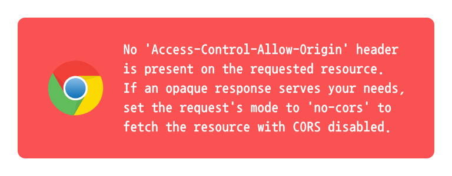
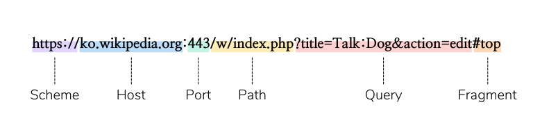
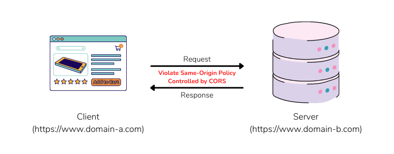

## CORS는 왜 이렇게 우리를 괴롭힐까?



<br />

웹 애플리케이션을 개발하다 보면 한 번쯤은 만나봤을 법한 CORS(교차 출처 리소스 공유)는 실제 개발 환경에서도 자주 만날뿐만 아니라 단골 면접 문제이기도 해서 여러 웹 개발자들을 괴롭히고는 합니다.

저도 혼자 프로젝트를 진행한다거나 다른 백엔드 개발자와 협업을 하면서도 CORS 에러를 많이 접해봤는데요, 그럴때마다 이게 왜 발생하는지 이유는 찾지 않고 단순 해결 방법만 찾아보곤 했었습니다.

그래서인지 아직도 CORS에 대해서 정확하게 모르고 있어 이번 게시글을 통해 이게 왜 발생하고, 정확하게 어떻게 해결할 수 있는지 정리해보려고 합니다.

### CORS란 무엇일까?

교차 출처 리소스 공유, Cross-Origin Resource Sharing(CORS)이란 **교차 출처**라는 단어에 맞게 하나의 출처에서 실행 중인 웹 어플리케이션이 다른 출처의 자원에 접근할 수 있는 권한을 부여하도록 브라우저에 알려주는 체제라고 합니다.

CORS는 시스템 수준에서 타 도메인 간의 자원 호출을 승인 또는 차단할 지 결정하기 때문에 브라우저와 서버 간의 안전한 교차 출처 요청 및 데이터 전송을 지원하죠.

그러나 일반적으로 서버와 통신하기 위한 API는 **동일 출처 정책(Same-Origin Policy)**을 따르기 때문에 대부분의 경우 브라우저에서는 보안상의 이유로 교차 출처 HTTP 요청을 제한합니다.

그래서 현재 개발하고 있는 프론트엔드 단에서 분리된 백엔드 서버와 통신하는 과정에서 해당 서버는 동일 출처 정책을 따르기 때문에 CORS 에러가 발생하는 것입니다.

그런데 여기서 교차 출처, 동일 출처와 같이 계속해서 출처(Origin)에 관한 이야기가 나오는데 출처라는 단어는 무엇을 의미할까요?

### 출처(Origin)란 무엇일까?

출처에 대해 알아보기 전에, 먼저 URL의 구성요소에 대해 알아야 합니다.

흔하게 볼 수 있는 URL은 아래와 같이 Scheme, Host, Port, Path, Query, Fragment로 구성되어 있죠.

<br />



<br />

기본적으로 URL에는 Scheme, Host, Port가 포함되어 있어야 하지만, HTTPS 프로토콜의 기본 포트 번호가 정해져있기 때문에 Port는 생략이 가능합니다.

이 외에 Path, Query, Fragment는 필수 요소가 아닌 부가적으로 추가될 수 있는 요소입니다.

그래서 위에서 말한 출처가 의미하는 것은 **필수 구성 요소인 Scheme, Host, Port로 구성된 URL**을 말하는 것으로, 세 가지 구성 요소가 일치하는 경우 동일한 출처를 가진다고 볼 수 있습니다.

### 동일 출처 정책(Same-Origin Policy)이란?

위에서 출처의 의미를 알아보았는데, 그럼 CORS를 설명할 때 등장한 동일 출처 정책(Same-Origin Policy)라는 것은 무엇을 의미할까요?

단어의 뜻 그대로 **동일한 출처에서의 리소스만 상호 작용이 가능하다는 것을 의미하는 정책**을 뜻합니다.

즉, `https://www.domain-1.com` 에서는 `https://www.domain-1.com/style.css` 와 같이 출처가 동일한 리소스만 상호 작용이 가능하다는 것입니다.

따라서 해당 출처에서 `https://www.domain-2.com/style.css` 와 상호 작용하는 것은 동일 출처 정책을 위반하는 것이라고 볼 수 있죠.

이런 정책 때문에 기본적으로 웹 애플리케이션은 자신과 출처가 동일한 리소스만 호출할 수 있습니다.

## 그럼 어떻게 교차 출처 리소스에 접근할 수 있을까?

프론트엔드 단에서 서버와 통신하기 위해 사용하는 Fetch API나 XMLHttpRequest는 **동일 출처 정책에 기반하여 작동**하기 때문에 타 출처의 리소스를 호출할 수 없습니다.

하지만 이런 제약과는 다르게 웹 생태계에서는 서로 다른 출처에서 리소스를 가져와서 사용하는 것을 흔하게 볼 수 있습니다.

이런 경우는 모두 동일 출처 정책을 위반하는 행위이지만, **CORS 정책을 지켜 리소스 요청을 보냄**으로써 예외적으로 타 출처 리소스에 접근하는 경우입니다.

<br />



<br />

## CORS의 3가지 동작 방식

### 1. Simple Request

해당 요청은 단순히 다른 출처의 리소스를 호출할 때 사용하는 요청입니다.

이 요청을 나타내기 위한 별도의 용어가 없어 MDN에서는 Simple Request라고 표현하고 있습니다.

요청 과정은 아래와 같습니다.

1. https://domain-a.com에서 https://domain-b.com의 컨텐츠를 호출하기 위해 브라우저는 domain-b 서버에게 요청을 보냅니다.

   이 때, 브라우저에는 아래와 같이 리소스를 요청한 출처를 명시해놓은 `Origin` 헤더를 같이 보냅니다.

   ```jsx
   Origin: https://domain-a.com
   ```

2. 서버는 해당 요청에 대한 응답과 함께 헤더에 `Access-Control-Allow-Origin` 값을 같이 보냅니다.

   ```jsx
   Access-Control-Allow-Origin: *
   ```

   위와 같은 경우는 모든 출처에 대해 접근을 허용한다는 의미를 가집니다.

   하지만 특정 도메인에 대해 접근을 제한하고 싶다면 `Access-Control-Allow-Origin` 헤더 값을 해당 도메인 값으로 설정해야 합니다.

이와 같이 요청 과정이 간단하지만, 아래와 같은 조건을 충족해야만 요청이 가능합니다.

1. 요청 메서드가 GET, HEAD, POST 중 하나
2. 수동으로 설정할 수 있는 헤더 중에서는 `Aceept`, `Accept-Language`, `Content-Language`, `Content-Type` 헤더만 사용 가능
3. `Content-Type` 헤더는 `application/x-www-form-urlencoded`, `multipart/form-data`, `text/plain` 값만 허용
4. `XMLHttpRequest.upload` 를 통해서만 이벤트 리스너를 등록
5. `ReadableStream` 객체 미사용

이와 같은 까다로운 조건때문에 사용자 인증을 위한 `Authorization` 헤더나 `Content-Type` 헤더 값이 `application/json` 로 설정되어 있는 대부분의 경우에서 Simple Request를 사용하기 어렵습니다.

### 2. Preflighted Request

Preflighted Request는 실제로 개발하다보면 많이 마주치는 요청 방식입니다.

해당 요청은 Simple Request와는 다르게, OPTIONS 메서드를 통해 다른 출처의 리소스로 예비 요청을 보내 실제 요청을 전송하기에 안전한지 판별합니다.

요청 과정은 아래와 같습니다.

1. https://domain-a.com에서 https://domain-b.com를 신뢰할 수 있는지 판별하기 위해 브라우저는 domain-b 서버에게 Preflight Request를 보냅니다.

   Simple Request와 같이 요청을 보낸 도메인 값을 가진 `Origin` 헤더가 존재하며, `Access-Control-Request-Method` 헤더를 통해 실제 요청을 보낼 때 어떤 메서드를 사용할 지를 같이 명시합니다.

   ```jsx
   OPTIONS https://domain-b.com/style.css

   ...

   Origin: https://domain-a.com
   Access-Control-Request-Method: POST
   ```

2. 서버는 해당 요청에 대한 응답으로 Preflight Response를 보냅니다.

   동일하게 `Access-Control-Allow-Origin` 헤더 값이 `*`가 아니라면 요청받은 출처가 포함되어 있어야 합니다.

3. 브라우저는 CORS 정책 위반 여부를 검사하고, 만약 위반하지 않았다면 본 요청을 보냅니다.

### 3. Credentialed Request

기본적으로 XMLHttpRequest나 Fetch API에서는 인증 정보를 같이 보내지 않습니다.

하지만 Credentialed Request를 통해서는 인증 정보나 Cookie와 같은 정보를 같이 보낼 수 있습니다.

이를 통해 더욱 보안성이 강화된 상호 작용이 가능합니다.

1. https://domain-a.com에서 https://domain-b.com의 컨텐츠를 호출하기 위해 브라우저는 쿠키값과 함께 domain-b 서버에게 요청을 보냅니다.

   쿠키와 같은 인증 정보를 함께 담아 보내기 위해서는 프론트엔드 단에서 `credentials` 옵션을 설정해주어야 합니다.

2. 위에서 살펴본 요청 과정과 동일하지만, Credentialed Request의 경우에는 `Access-Control-Allow-Credentials: true` 헤더를 같이 전송합니다.

   단, Credentialed Request에 응답할 경우에는 `Access-Control-Allow-Origin` 헤더는 와일드카드를 사용하면 안 되고, 반드시 특정 도메인을 지정해야만 합니다.

3. 응답을 받은 브라우저에서는 `Access-Control-Allow-Credentials` 헤더의 값이 `true` 인 응답만 받습니다.

   여기서 `Access-Control-Allow-Origin` 헤더 값이 `*` 인 경우에는 응답을 받지 않습니다.

## CORS 정책 위반으로 인한 오류 해결 방법

### Access-Control-Allow-Origin 헤더 값 설정하기

해당 방법은 CORS 정책 위반으로 발생하는 오류를 해결하기 위한 대표적인 방법으로, 서버에서 `Access-Control-Allow-Origin` 헤더에 알맞은 값을 설정하는 것입니다.

편의를 위해 모든 출처에서의 접근을 허용하는 `*` 값으로 설정할 수도 있지만, 보안을 위해서는 정확하게 출처를 명시해주는 것이 좋습니다.

### Proxy Server 설정하기

대부분의 경우 개발 환경에서 마주하는 오류이다 보니 `Access-Control-Allow-Origin` 헤더 값을 `http://localhost:3000` 으로 설정할 수도 있지만, 출처가 동일한 모든 개발 환경에서 리소스 접근이 가능하기 때문에 보안이 매우 취약해집니다.

이런 경우를 위해 클라이언트 단에서 직접 Proxy 서버를 세팅해 CORS 정책 위반으로 인한 오류를 피할 수 있습니다.

기본적으로 React의 경우, 대부분 create-react-app 라이브러리를 통해 애플리케이션을 세팅합니다.

해당 라이브러리는 proxy 기능을 제공하는데, 그 값을 package.json 파일에서 설정하면 React Dev Server는 Proxy Server의 역할을 하여 CORS 정책을 준수하는 것처럼 상호 작용이 가능하죠.

```json
{
  ...,
  "proxy": "https://localhost:8000",
}
```

이런 React 애플리케이션이 아니더라도 http-proxy-middleware 등의 Proxy 라이브러리를 사용하면 손쉽게 Proxy 서버 세팅이 가능합니다.

대부분의 웹 애플리케이션은 Webpack, RollUp, Parcel 등의 번들러를 통해 개발 환경이 구성되어 있는데, 이런 번들러는 손쉽게 Proxy 서버를 세팅하도록 도와주고 있습니다.

```json
{
  "/api": {
    "target": "http://localhost:8000/",
    "pathRewrite": {
      "^/api": ""
    }
  }
}
```

물론 위와 같은 번들러는 대부분 http-proxy-middleware 라이브러리를 사용해 Proxy 기능을 제공하죠.

따라서 보일러플레이트가 아닌 직접 구성한 개발 환경에서도 손쉽게 Proxy Server 세팅이 가능합니다.

---

## Source

- 교차 출처 리소스 공유 (CORS) - MDN

  [https://developer.mozilla.org/ko/docs/Web/HTTP/CORS](https://developer.mozilla.org/ko/docs/Web/HTTP/CORS)

- CORS는 왜 이렇게 우리를 힘들게 하는걸까?

  [https://evan-moon.github.io/2020/05/21/about-cors/](https://evan-moon.github.io/2020/05/21/about-cors/)
