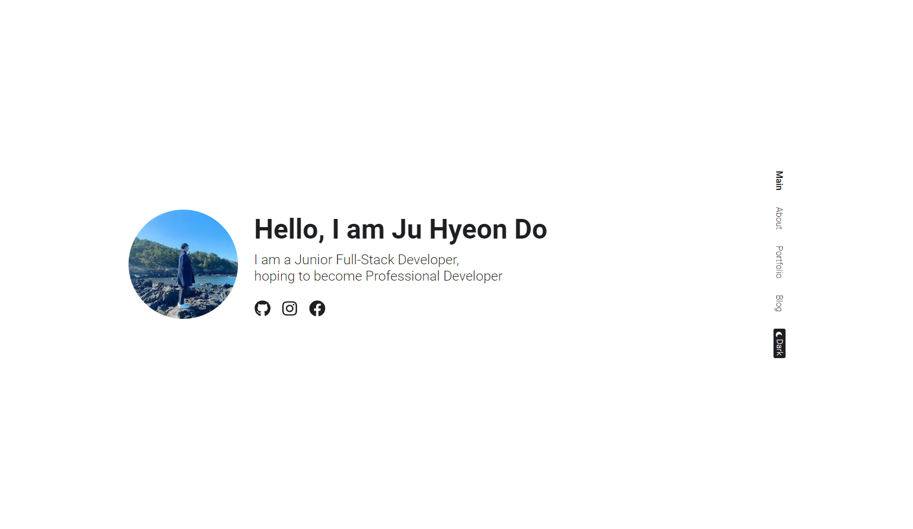
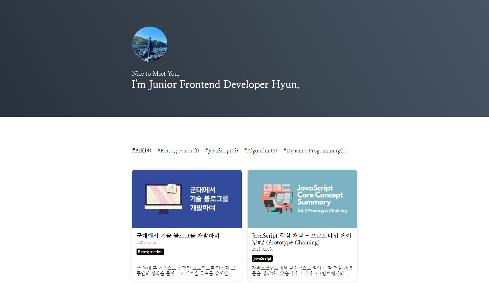
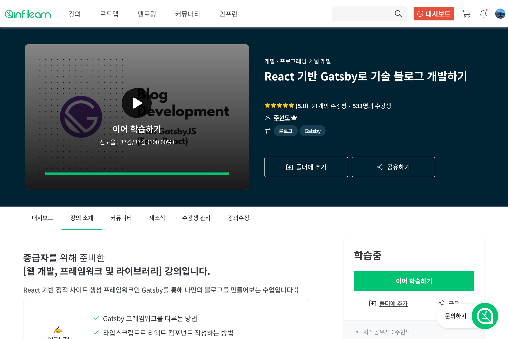
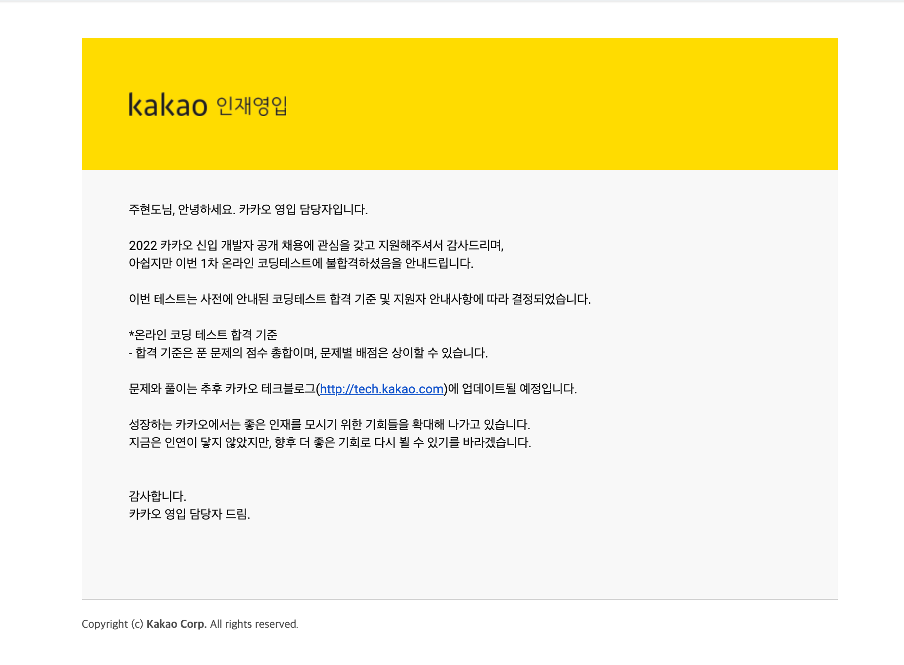
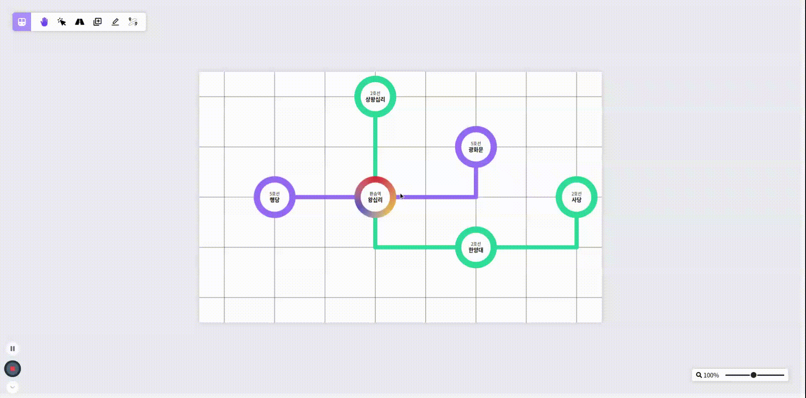

### 너무나도 길었던 군생활이 끝나다.

2020년 3월 9일, 공군으로 입대해 마침내 2021년 10월 2일에 길었던 군생활의 마침표를 찍게 되었습니다.

사실은 올해 12월 8일 정식으로 전역하게 되지만, 코로나 상황으로 인해 10월 2일 조기 전역을 하게 되었네요.

여기에서는 공군인이자 주니어 프론트엔드 개발자로서 573일 동안 군대에서 지내며 무엇을 했는지 다시 되짚어보고, 다음 글에서 전역 이후의 목표와 군생활 동안의 느낀점을 적어보려고 합니다.

### 정신없던 일병 시절을 보내고

2019년 5월이 되고난 후에 자대 배치를 받게 되었는데, 당시 일병이었던 저는 주로 각종 부서 업무 및 생활관에서의 일상에 적응하기 위해 시간을 보냈던 것 같습니다.

원래대로였다면 군생활에 적응이 되고 나서 프로그래밍 공부를 시작했을텐데, 자대 배치 전에 자신의 특기에 대한 교육을 받는 특기 학교에서 수능을 준비하자고 생각이 바뀌어 첫 휴가 때 필요한 책을 구매하고 공부를 시작하게 됐습니다.

하지만 일과 이후 시간, 연등 시간, 주말 등 남는 시간에는 최대한 공부를 하려고 노력했는데, 고작 3개월을 가지 못하고 포기해버렸죠.

당시에는 거의 격주로 있었던 새벽 업무와 잦은 야근 및 주말 출근으로 인해 체력적으로 많이 지쳐있었던 것도 있었는데, 무엇보다도 수능에 대한 갈망과 절박함이 그렇게 크지 않았기에 수능 공부가 손에 너무 잡히지 않았었습니다.

그래서 그냥 과감하게 때려치고 바로 프로그래밍 공부를 다시 시작해보자고 결심했죠.

그 결심 후, 처음으로 만든 것이 바로 지금의 제 블로그입니다.

### 군대에서 진행한 첫 번째 프로젝트, 블로그 개발

일병 중간을 넘긴 8월, 처음으로 시작한 것이 바로 React 복습을 위한 블로그 개발이었습니다.

마지막으로 코딩을 했던 때가 입대 전인 2월이기 때문에 초기 세팅부터 제대로 기억이 나질 않았지만, 생각보다 감이 금방 잡혀 시작한 지 5달 안에 블로그 개발과 블로그에 들어갈 포트폴리오 콘텐츠 구성까지 마무리했습니다.

 

> 최대한 심플한 컨셉으로 가져가자는 생각을 가지고 개발한 블로그 메인 페이지입니다.

당시 React 복습을 위해 정적 사이트 생성 프레임워크인 Gatsby를 사용했었는데, 저에게 정말 깊은 인상을 남겨준 프레임워크라 여기서 공부를 끝마치기는 아쉬웠습니다.

그래서 React를 주제로 온라인 강의를 제작했던 경험을 바탕으로 다시 한 번 강의를 제작해보자고 결심했습니다.

### 군대에서 준비하는 온라인 강의

사실 블로그 개발 자체는 오래 걸리지 않았지만, 그 안에 들어갈 포트폴리오 콘텐츠를 구성하는 데 오랜 시간이 걸렸습니다.

그래서 실질적으로 블로그 개발이 끝난 12월 초, 일과 후 개인 정비 시간에는 포트폴리오 내용 구성을 하고 연등 시간에는 온라인 강의를 준비했습니다.

그런데 처음 온라인 강의를 준비했을 때에는 한 번에 오랜 시간을 가지고 작성했는데, 군대에서의 연등 시간은 1시간 반으로 제한되어 있었기에 글쓰기 흐름을 타기가 쉽지가 않았습니다.

더군다나 해당 강의에서 사용하기 위한 예제 블로그도 개발해야 했던 상황인지라 생각보다 할 것이 많았죠.

처음 온라인 강의 런칭 목표 날짜가 3월이었는데, 목표를 맞추기 위해서는 쉴 틈 없이 빠르게 개발과 내용 구성을 끝내야 했습니다.

그래서 1달 반 안에 예제 블로그를 개발하고서 빠르게 내용 구성을 시작했습니다.

 

> 전 되게 심플한 스타일을 좋아하나봐요..

개발 자체는 오래 걸리지 않았습니다.

하지만 강의 개발을 위해 웹 개발 시에 다양하게 활용할 수 있는 개념을 추가하기 위해 여러 고민을 하느라 생각보다 시간이 지체되었습니다.

그 과정이 없었더라면 더 빨리 강의를 런칭할 수 있었겠지만, 제가 생각하기에는 개발만큼이나 중요한 개념이라 생각합니다.

실제로도 그 부분을 통해 도움을 보신 수강생분들도 여럿 봤기 때문에 개발 외적인 부분도 준비한 것에 대해 정말 다행이라고 생각합니다.

하지만 이렇게 스퍼트를 올리는 것도 한계가 찾아왔고, 그렇게 2개월이 지나가버렸습니다.

### 쉴 틈 없이 달리던 중 맞이한 바깥 공기

휴가가 많다는 공군에 왔지만 코로나로 인해 휴가를 못 나간 지 140일이 되던 차에 통제가 풀려 바로 휴가를 나가게 되었습니다.

장기 휴가 실시 지침으로 인해 14일을 나오게 되어 휴식 기간을 가지게 되었죠.

조금 쉬다 보니 다시 강의 준비에 대한 의욕이 생기기 시작하기도 했고, 어차피 자택 대기 원칙으로 인해 집에만 있다보니 남은 일주일 동안은 거의 강의 준비에 매달린 것 같습니다.

이 기간 동안 하루에 3~4챕터씩 만들면서 거의 강의 3분의 1을 완성한 것 같네요.

모든 강의 준비를 마치고 군부대 복귀 후에 2주 격리를 하게 되었는데, 강의 런칭을 격리 기간에 보게 되었습니다.

 

> 업로드 날짜인 10월 5일 기준으로 인프런과 구름 에듀 두 플랫폼 수강생 합이 760명이 넘네요

### 자바스크립트 기반 다지기, 그리고 알고리즘 공부

이제 와서 확인해보니까 생각보다 올해 초에 한 것들이 많았다는 게 느껴지네요....

블로그 콘텐츠 구성과 Gatsby 온라인 강의를 준비하던 때인 올해 1월부터 자바크립트와 알고리즘 공부도 같이 병행했었습니다.

자바스크립트에 대한 기초 지식이 많이 부족하다고 생각해 당시 자기계발지원금으로 신청한 인사이드 자바스크립트라는 책으로 자바스크립트의 개념을 차근차근 쌓아갔습니다.

또 이 개념을 기록으로 남기기 위해 내용을 요약하여 블로그에 포스팅하기도 했죠.

그렇게 총 9편의 포스트가 업로드되었고, 이를 통해 기초를 다시 다듬을 수 있어 너무나도 좋은 경험이었던 것 같습니다.

자바스크립트 공부가 끝나고 나서는 알고리즘 문제 풀이를 시작했던 것 같네요.

군대에 있는 동안 다양한 기업에서 실시하는 코딩 테스트를 참여해보자는 생각을 가지고 열심히 문제를 풀었던 것 같습니다.

그 때에는 같이 알고리즘을 공부하던 동기의 책을 빌려 최대한 공부를 했었는데, 어렵다고 유명한 종만북으로 처음 알고리즘을 공부하니까 책 후반 가서는 도저히 문제를 풀 수 없었습니다.

그래서 책을 반복을 하는 동시에 백준 문제 풀이를 시작해 꾸준히 알고리즘 공부를 진행했습니다.

대략 5월까지 집중적으로 공부하여 삼성 SCPC, 카카오, 와디즈 등 다양한 기업의 코딩 테스트를 응시했습니다.

하지만 결과는 역시나 처참했죠....

 

> 3.5솔로 마무리한 카카오 코딩테스트 결과입니다... 예상은 했지만 직접 보니 공부 열심히 해야겠다 싶네요

생각만큼 문제를 많이 풀어보지 않았고, 다양한 알고리즘을 알고 있었던 것이 아니었기에 좋은 점수를 받지는 못했습니다.

당연히 결과가 좋지 않을 것이라고는 예상을 했는데, 직접 눈으로 보니 알고리즘 공부는 정말 꾸준히 해야겠다는 생각이 머리에 박히는 것 같네요.

### 군대에서의 마지막 프로젝트

마지막은 스스로 내가 프로젝트를 어디까지, 어느 수준까지 개발할 수 있는지 궁금한 마음에 진행했던 사이드 프로젝트입니다.

우아한테크코스 프론드엔드 과정 중 지하철 노선도 애플리케이션에서 영감을 받아 진행한 Train Map Visualizer는 사용자가 직접 노선도를 구현하고, 시뮬레이션할 수 있도록 하는 프로젝트입니다.

백엔드 없이 오로지 프론트엔드 만으로 데이터 처리 및 가공과 UI를 모두 담당했기에 꽤나 복잡한 프로젝트라고 생각되지만, 오히려 그 부분이 저를 더 자극시켜주는 것 같았습니다.

개발 난이도가 높은 부분을 마주할 때마다 이걸 어떻게 해결해야할지 아이패드로 정리해가며 생각하고, 심지어 연등이 끝나고 침대에 누워 생각하는 과정이 싫고 지겹다고 느껴지지 않았다는 점에서 되게 성공적이라고 생각됩니다.

물론 기획한 내용의 상당 부분을 군대 내에서 진행했지만 아직까지 이 프로젝트의 개발은 현재진행형입니다.

 

> 더 많은 기능이 있지만 사이드 프로젝트 관련해서는 따로 포스트가 올라갈 예정입니다.

### 573일 동안의 성과

이렇게 글로써 그동안 진행했던 것을 나열해보니 대략 군대에서 지낸 1년 반이라는 시간 동안에 이뤄낸 것들이 참 많다고 생각됩니다.

블로그 개발부터 시작해 온라인 강의 런칭, 언어 기초 및 알고리즘 기반 다지기, 사이드 프로젝트까지 알차게 한 것 같네요.

하지만 그보다도 오랜 시간동안 꽤나 제한적인 환경에서 꾸준히 자기계발을 했다는 것이 정말 자랑스럽다는 생각이 듭니다.

물론 강도높은 업무와 끊임없는 자기계발을 병행하는 것이 힘들어 중간중간 번아웃이 왔던 때도 꽤나 있었습니다.

그러나 지친 몸과 마음 속에서도 지지 않았던 프로그래밍에 대한 흥미와 애착으로 잘 극복해 이런 성과를 피워낸 것 같습니다.

이렇게 저는 마침내 군생활을 마무리하고 다시 사회로 나아가기 위한 준비를 시작합니다.

무탈하게 군생활을 마무리했다는 것에 정말 감사하고 다른 국군 장병들 모두 화이팅하셨으면 좋겠습니다. :)
