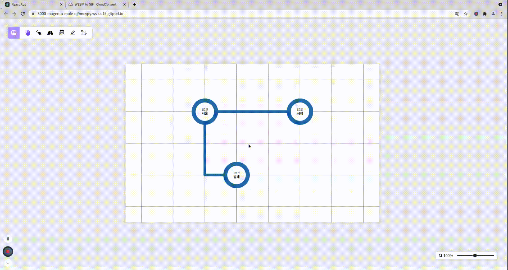
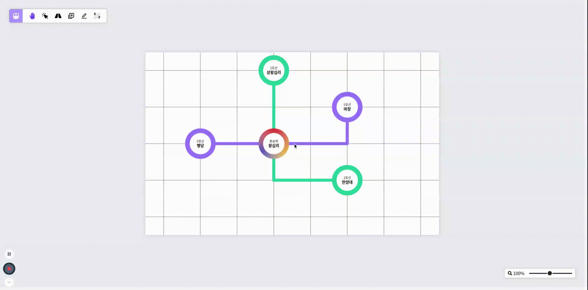
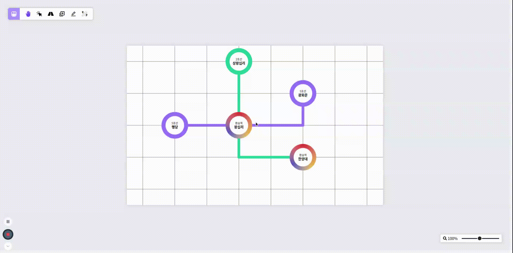
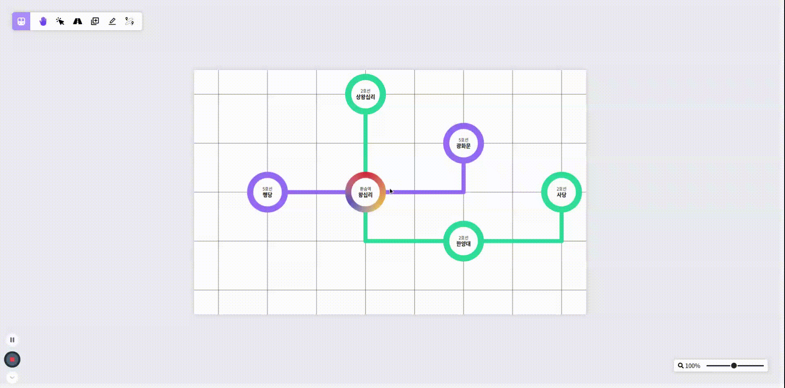
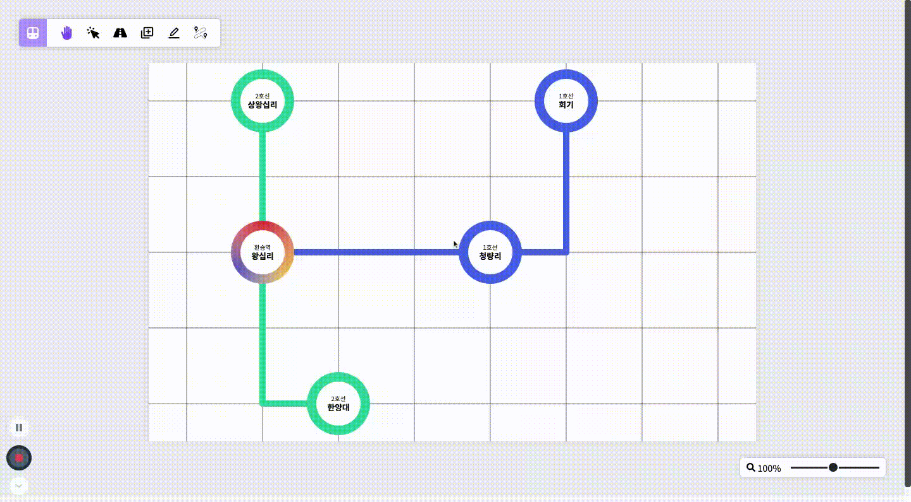
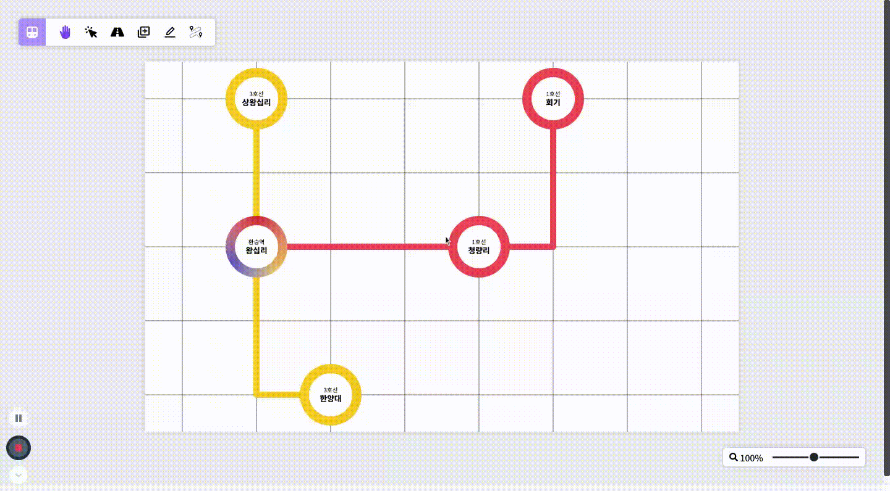
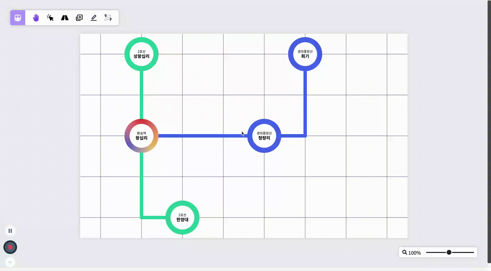

### 지난 50일치의 결과물에 이어서

4월부터 시작해 한참을 달려오던 Train Map Visualizer 프로젝트가 드디어 끝을 맞이했다.

지난 포스트에서는 노선도 확대/축소 및 드래그를 통한 이동 기능과 역 및 선로 추가 기능을 개발했었다.

물론 위의 기능이 노선도를 직접 그려볼 수 있는 이 프로젝트에서의 핵심 기능이지만, 이번에는 그에 못지 않게 중요한 기능을 리뷰하려고 한다.

이번에는 단순히 역이나 선로를 추가하는 것이 아닌, 역과 선로의 속성값을 수정하거나 지울 수 있는 기능과 지금까지 만든 노선을 관리하는 기능, 마지막으로 이 프로젝트의 하이라이트인 최단 경로 검색 기능까지 돌아보자.

### 첫 번째 기능, 새 노선도 생성

 

 

지난 포스팅을 작성하기까지는 노선도 사이즈가 고정된 상태로 작업을 진행했었는데, **사용자가 직접 노선도 크기를 조정할 수 있는 기능**을 추가했다.

이제 처음 페이지에 접속하게 되면 노선도가 뜨는 것이 아닌, 새 프로젝트를 생성하라는 일러스트가 사용자를 반겨줄 것이다.

기존의 최대 크기는 가로 및 세로 30칸이었지만, 최적화를 함과 동시에 여러 테스트를 진행했는데 도저히 30칸으로는 끊김없이 진행할 수 없다고 생각해 20칸으로 줄였다.

### 두 번째 기능, 노선도 이미지 저장

 

 

원래 처음에는 노선도 이미지를 저장하는 기능을 개발할 생각이 없었다.

대신에 역 위치, 선로 경로 등 노선도 데이터를 파일로 추출하는 기능을 개발하고 싶었다.

하지만 데이터 추출 기능 자체는 그리 어렵지 않았지만, 추출한 데이터를 통해 노선도를 복구하는 과정이 너무나도 까다로울 것 같아서 아예 포기했다.

노선도를 복구하는 과정에서는 단순히 데이터를 추가하면 되는 문제가 아니었고, 데이터 하나하나마다 올바른 값인지 검증하는 단계가 필요했는데, 이 과정에 대한 구현이 너무나도 까다로웠다.

그래서 떠올린 대안이 바로 **노선도 이미지 저장**이다.

### 세 번째 기능, 역 선택 및 정보 변경 기능

 

 

노선도를 직접 만드는데 자기가 추가한 역에 대한 정보를 알 수 없다면 아무런 의미가 없을 것이다.

이를 위해 **선택 모드에서 역을 클릭하면 해당 역이 어떤 호선을 지나는지, 역의 이름은 무엇인지 확인할 수 있는 기능**을 추가했다.

위의 이미지는 순서대로 왕십리역, 한양대역, 마장역에 대한 정보를 조회하는 장면이다.

그런데 여기서 한양대역을 지나는 호선을 더 추가하고 싶을 때에는 어떻게 해야할까?

아니면 마장역의 이름을 바꾸고 싶을 때는?

이를 위해 추가로 선택한 역에 대해 정보를 변경할 수 있는 기능을 개발했다.

 

 

만약 더 추가할 수 있는 호선이 존재한다면 위와 같이 추가 모양의 버튼이 보이고, 이를 클릭해 어떤 호선을 추가할 지 선택할 수 있다.

위의 이미지는 한양대역에 5호선을 추가하고, 마장역의 이름을 광화문역으로 바꾸는 장면이다.

단, 변경 사항은 바로 반영되지 않고 변경하기 버튼을 눌러야만 반영이 되는데, 이는 역 이름 변경 시에도 동일하게 적용된다.

 

 

위와 같이 호선을 제거할 수도 있는데, 상하좌우에 해당 호선으로 연결된 선로가 없어야만 제거가 가능하다.

그래서 만약 호선 제거가 가능하다면 hover 시에 조금 밝아지면서 제거 표시가 나타난다.

마지막으로, **해당 역을 완전히 제거**할 수도 있다.

다만 해당 역과 연결되어 있는 모든 선로를 제거되는데, 아래 선로 선택 및 정보 변경 기능에서 보여지는 선로 제거 기능을 통해 데이터가 변경된다.

### 네 번째 기능, 선로 선택 및 정보 변경 기능

 

 

다음 기능은 **선로 선택을 통해 정보를 조회 및 수정할 수 있는 기능**이다.

역 사이에 연결되어 있는 선로를 선택하게 되면 어떤 역이랑 연결되어 있는지, 소요 시간은 어느 정도인지 나타난다.

해당 기능을 구현하기 위해 **BFS 알고리즘**을 사용했는데, 선택된 노선에서부터 시작해 연결되어 있는 역까지 탐색을 진행해 결과를 보여주었다.

여기에서는 역 간 소요 시간을 변경할 수 있는데, 이 부분은 추후에 설명할 최단 경로 찾기 기능에 영향을 끼치는 부분이다.

 

 

또한, 위의 사진과 같이 소요 시간을 변경하는 것뿐만 아니라 **선로 제거**도 가능하다.

### 다섯 번째 기능, 노선 관리 기능

노선은 처음 역을 추가할 때에 같이 추가가 가능하지만, 노선 색도 랜덤이고 이름도 한 번 지정하면 다시 변경할 수 없다.

그래서 이를 위해 **노선 정보를 변경하거나 제거, 또는 추가할 수 있도록 기능**을 추가했다.

 

 

여기에서는 원래 빨간 노선에 이름이 1호선이었던 것을 파란 노선, 그리고 이름을 경의중앙선으로 변경했다.

그리고 노란 노선에 3호선이었던 것을 민트색 노선에 이름을 2호선으로 변경했다.

원래 노선 정보를 변경할 때에는 보통 하나씩 띄워 수정하지만, 여기에서는 실시간으로 데이터가 변경되는 것을 보여주기 위해 두 노선 아이템 모두 띄워놓고 수정했다.

마지막으로 **노선도의 순서를 바꿔주었는데**, 이 바꾼 순서대로 역을 추가할 때 노선을 선택하는 리스트에 변경된 순서 그대로 목록이 보여지게 된다.

 

 

그리고 **노선 아이템을 제거**할 수도 있는데, 만약 제거하게 되면 노선도 상에서 **해당 노선에 대한 모든 요소가 제거**된다.

여기에서는 노선 아이템을 제거하는 것뿐만 아니라 추가도 가능한데, 역을 추가할 때 노선을 같이 추가하는 때와는 다르게 노선 색도 직접 선택할 수 있다.

### 여섯 번째 기능, 최단 경로 찾기 기능

 

 

이 프로젝트에서 제일 마지막으로 개발한 기능인 **최단 경로 찾기** 기능이다.

노선의 소요 시간을 가중치로 삼아 시작점부터 끝점까지 가장 가까운 경로를 찾는다.

해당 기능을 구현하기 위해 **다익스트라 알고리즘**을 사용했는데, 알고리즘 문제를 풀면서 접해보던 것을 실제 프로젝트에 적용하는 것은 또 다른 느낌이어서 되게 새롭게 다가왔다.

그리고 위와 같이 단순히 최단 경로 결과만 보여주는 것이 아닌, 해당 경로를 하이라이트 처리해 더 쉽게 알아볼 수 있도록 개발했다.

### 내 첫 번째 90일간의 대장정

프로젝트 작업 기간은 2021년 4월부터 10월까지지만, 중간에 훈련이나 격리, 전역 준비 등의 여러 이벤트가 겹쳐 실제로 작업한 기간을 따져보면 대략 3개월 정도의 시간이 걸렸다.

예전엔 사이드 프로젝트라고 하면 편협된 생각에 사로잡혀 사용자들이 실제로 사용할 수 있는 서비스만을 생각했었지만, 이 프로젝트를 진행하며 사이드 프로젝트에 대한 생각이 달라졌다는 것이 느껴진다.

사용자가 실제로 사용할 수 있는 서비스가 아닌, 내 자신이 조금 더 배우고, 성장할 수 있는 그런 프로젝트가 진짜 사이드 프로젝트라는 것을 깨달았다.

실제로 이 프로젝트를 통해 어떻게 해야 더 코드를 좋은 방향으로 짤 수 있을지에 대한 많은 생각을 가질 수 있었고, 앞으로의 공부 방향을 정할 수 있게 되었다.

이렇게 내 첫 사이드 프로젝트는 얻어간 것이 너무나도 많아 정말 성공적으로 마무리한 것 같아 참 다행이다.
