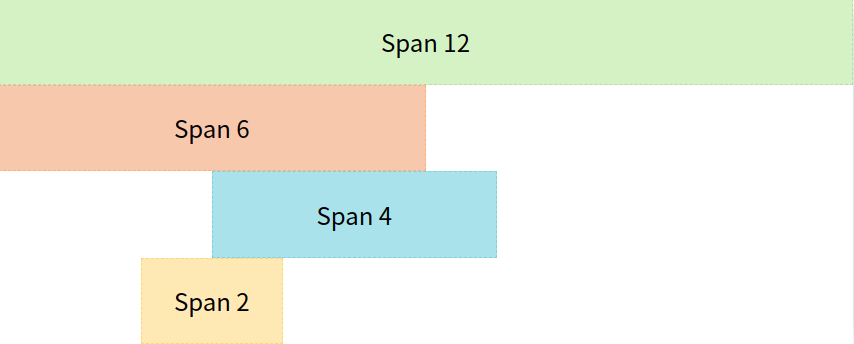

### 1. 단 2줄로 끝내는 가운데 정렬

하나의 엘리먼트를 부모 엘리먼트의 정중앙에 위치하도록 설정하는 CSS 기법으로, grid나 flex가 등장하기 전까지는 가로 세로 가운데 정렬을 위해서는 많은 코드가 필요했으나 이제는 최신 속성의 등장함으로 편하게 정렬을 할 수 있게 되었음.

아래와 같이 코드를 작성하면 다른 추가적인 작업 없이 가운데 정렬이 가능하다.

또한, grid가 아닌 flex로도 작성하여도 동일한 결과가 나타난다.

```css
.parent {
  display: grid;
  place-items: center;
}
```

여기서 집중해서 봐야 할 부분은 `place-items`이라는 속성이다.

해당 속성은 첫 번째 값으로는 `align-items` 속성값, 두 번째 값으로는 `justify-items` 속성값을 받는데, 하나의 값만 설정이 되어 있다면 두 속성 모두 동일한 값을 적용한다.

당연하게도, `align-items` 속성이나 `justify-items` 속성에서 사용하는 값들 모두 `place-items`의 속성 값으로 사용이 가능하다.

하지만, 부모 엘리먼트에 설정된 `display` 속성의 특정 값에 따라 사용할 수 있는 값이 나뉘어져 있다.

### 2. Flex의 기본

다음은 `flex` 속성으로, 이는 하나의 아이템이 자신의 부모 엘리먼트 내에서 공간을 맞추기 위해 크기를 조절하는 방법을 설정하는 속성이다.

`flex` 속성은 이제 잘 활용하는 사람들이 많지만, 그래도 기본기를 다시 다져보자는 차원에서 해당 파트를 담아봤다.

```css
.parent {
  display: flex;
  flex-wrap: wrap;
}

.children {
  flex: 1 1 100px;
}
```

`flex` 속성 값은 총 3개의 값을 받는데, 이는 각각 `flex-grow`, `flex-shrink`, `flex-basis`에 해당하는 값이다.

앞의 두 가지 속성값은 일반적으로 양수를 설정하는데, 이는 부모 엘리먼트의 가로 길이에 따라 자식 엘리먼트의 가로 길이가 늘어나거나 줄어든다는 것을 의미한다.

하지만 0으로 설정되어 있으면 자식 엘리먼트의 가로 길이는 고정된 상태로 부모 엘리먼트의 길이에 따라 레이아웃이 변하게 된다.

세 번째 속성 값은 기본적으로 auto로 지정되어 있지만, 최소 너비를 지정하고 싶을 때는 `flex-shrink` 속성 값을 0으로 설정하고, `flex-basis` 속성값을 지정하면 생각한 대로 레이아웃 구성이 가능하다.

### 3. 사이드바나 헤더와 푸터를 위한 CSS

다음 속성은 grid-template-columns 속성과 grid-template-rows 속성인데 공통적으로 여러 개의 길이 값을 지정하면 그대로 부모 엘리먼트가 쪼개어져 레이아웃이 설정된다.

```css
.parent1 {
  display: grid;
  grid-template-columns: minmax(150px, 25%) 1fr;
}

.parent2 {
  display: grid;
  grid-template-rows: auto 1fr auto;
}
```

parent1 클래스를 살펴보면 `grid-template-columns` 속성이 사용되었는데, 첫 번째 값은 `minmax(150px, 25%)`이고, 두 번째 값은 `1fr`이다.

첫 번째 값부터 살펴보면 해당 구역은 최소 너비 150px, 최대 너비 25%로 지정하라는 뜻으로, 부모 엘리먼트의 왼쪽 부분에 해당 길이만큼 영역을 차지할 것이다.

첫 번째 값은 우리가 많이 보아왔던 단위를 사용했지만, 두 번째 값에서는 처음 보는 단위가 등장한다.

여기서 나오는 fr이라는 단위는 분수를 뜻하는 영어 단어인 fraction의 앞 부분만 따온 것으로, 부모 엘리먼트의 남는 너비 값에서 (해당 fr 크기 / fr 총합) 만큼의 크기를 할당한다.

parent2 클래스에서 설정된 속성값도 방향만 다를 뿐이지 사용 방법은 동일하다.

해당 속성에서 사용된 auto 값은 해당 엘리먼트 내의 컨텐츠에 따라 길이가 달라진다.

일반적으로는 컨텐츠의 길이에 맞도록 설정된다.

### 4. 더 쉽게 만드는 2차원 레아아웃

해당 속성은 `grid-template`이라는 속성인데, 이는 `grid-template-rows` 속성과 `grid-template-columns` 속성을 합쳐놓은 것이다.

먼저 `grid-template-rows` 속성값을 작성하고, "/"로 구분해준 다음에 `grid-template-columns` 속성값을 작성한다.

```css
.parent {
  display: grid;
  grid-template: auto 1fr auto / auto 1fr auto;
}

header {
  padding: 2rem;
  grid-column: 1 / 4;
}

main {
  grid-column: 2 / 3;
}
```

위에서 사용한 속성들을 합쳐놓은 것뿐이므로 상세한 설명은 생략하고, `grid-column`이라는 속성을 살펴보고, 이에 더해 `grid-row` 속성도 같이 알아보자.

grid-column, grid-row 속성은 해당 엘리먼트의 영역을 지정해주는 속성이다.

두 속성은 모두 첫 번째 값으로 `grid-column-start` 또는 `grid-row-start`, 두 번째 값으로 `grid-column-end` 또는 `grid-row-end` 값을 받는다.

grid-template 속성을 통해 레이아웃을 설정하면 임의의 grid 라인 번호가 설정되는데, 이 번호를 통해 영역을 지정해주는 방식이다.

### 5. Repeat을 통한 반복 제거

다음은 grid-template 속성값을 지정할 때 사용할 수 있는 함수인 `repeat`에 대한 설명이다.

```css
.parent {
  display: grid;
  grid-template-columns: repeat(12, 1fr);
}

.span-12 {
  grid-column: 1 / span 12;
}

.span-6 {
  grid-column: 1 / span 6;
}

.span-4 {
  grid-column: 4 / span 4;
}

.span-2 {
  grid-column: 3 / span 2;
}
```

이는 똑같은 `1fr`이라는 값을 12번 작성하는 대신, 함수를 통해 간결하게 표현해주는 방식이다.

따라서 해당 엘리먼트에 12개의 가로 방향의 영역이 생성되었고, `grid-column` 속성이나 `grid-row` 속성을 통해 위치 설정이 가능하다.

따라서 해당 코드는 다음과 같이 레이아웃을 구성한다.

<br />



<br />

### 6. Grid 응용 조합, RAM

여기에서는 `grid-template` 속성을 응용하여 사용하는 방법을 소개한다.

해당 부분에서는 auto-fill과 auto-fit이라는 속성값이 등장하는데 먼저 다음 코드를 살펴보자.

```css
.parent {
  display: grid;
  grid-gap: 1rem;
  grid-template-columns: repeat(auto-fit, minmax(150px, 1fr));
}
```

`grid-template-columns` 속성에서 repeat, `minmax` 함수를 사용했고, auto-fit 이라는 값을 넣어주었다.

이 뜻은 최소 너비인 150px 만큼의 여유 공간이 생기고 그 공간에 자식 엘리먼트가 들어갈 수 있을 경우에 새로운 컬럼을 생성해준다는 뜻이고, 그 이후부터는 모든 컬럼이 동일한 길이로 맞춰진다는 뜻이다.

따라서 auto-fit 속성값을 사용했을 때에는 여유 공간이 없이 부모 엘리먼트를 꽉 채우게 된다.

하지만 auto-fill 속성값을 사용한 경우에는 더 이상 들어갈 자식 엘리먼트가 없어도 계속해서 컬럼이 생성되고, 해당 컬럼은 아무 엘리먼트가 없는 흰 배경으로 출력된다.

### 7. 단 1줄로 길이를 자유롭게

해당 부분에서는 엘리먼트의 특정 값을 설정할 때 사용할 수 있는 함수를 소개한다.

```css
.children {
  width: clamp(100px, 50%, 300px);
}
```

clamp라는 함수는 총 세 개의 값을 받는데, 첫 번째 값은 최소값, 두 번째 값은 기본적으로 적용할 값, 세 번째 값은 최대값이다.

여기서 children이라는 클래스가 적용된 엘리먼트는 최소 100px, 최대 300px의 가로 길이를 가지며, 그 외의 경우에는 부모 엘리먼트 가로 길이의 절반 만큼의 길이를 가지게 된다.

### 8. 요소의 가로 세로 비율 유지

마지막으로, 엘리먼트의 가로 세로 비율을 유지하기 위한 속성인 `aspect-ratio`에 대해 알아보자.

```css
.children {
  aspect-ratio: 16 / 9;
}
```

aspect-raio 속성은 가로와 세로 비율 값을 지정할 수 있고, 부모 엘리먼트의 공간에 따라 비율이 유지된 채로 크기가 조정 된다.

---

### Source

- 10 modern layouts in 1 line of CSS

  [https://www.youtube.com/watch?v=qm0IfG1GyZU&ab_channel=GoogleChromeDevelopers](https://www.youtube.com/watch?v=qm0IfG1GyZU&ab_channel=GoogleChromeDevelopers)
