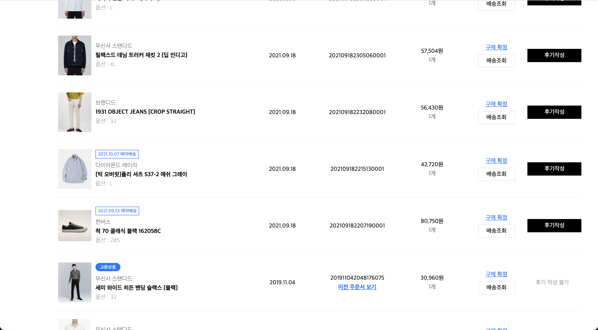
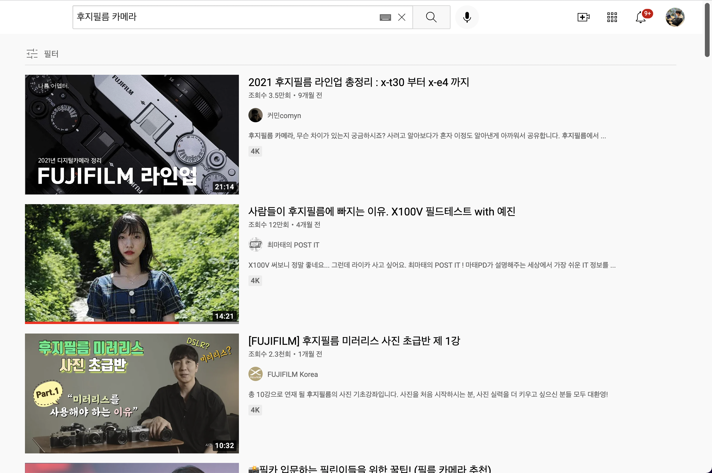

### 밖으로 나온지 1달 조금 넘은 이 시점

군대 안에 있을 때에는 정말 시간이 느리게 흘러갔는데, 밖으로 나오니까 시간이 순식간에 흐르는 느낌이다.

미복귀 전역 후 일주일 내로 이 글을 꼭 써야겠다고 다짐한다는 것이 벌써 11월 말까지 와버렸으니...

계속해서 미뤄두다간 실제 전역일자까지 미뤄질 것 같아 마음을 다잡고 써보려한다.

### 나의 군생활을 다시 돌아보며

지금와서 돌아보니 나는 군생활을 하는 동안 정말 어떤 것 하나 빠짐없이 열심히 하려 노력했던 것 같다.

물론 중간중간 지쳐 잠깐 나태해졌던 때도 있었고, 다른 사람들이 보기에는 그리 열심히 하는 것처럼 보이지는 않았을 수도 있을 것이다.

하지만 난 다시 생각을 해봐도 짧지 않은 1년 9개월이라는 시간을 정말 허투루 낭비하고 싶지 않다는 생각을 굳게 가지고 있었기에, 계속해서 스스로 마음가짐을 잡으며 많은 노력을 했다고 생각한다.

업무부터 시작해 군 E러닝, 코딩 공부, 블로그 관리, 운동까지 되도록 하루하루 최선을 다해 보내고 싶었다.

이런 마음가짐 덕분인지 결론적으로는 많은 것들을 이뤄내고 군생활을 마무리하게 되었다.

### 수없이 찾아온 내적 갈등

군대가기 전에 나는 학교 생활을 하며 정말 도움을 많이 받기도 했고, 정말 친하게 지냈던 형들에게 군대에 가면 꼭 꾸준하게 공부를 하고 나오겠다는 말을 했었다.

그래도 고3때도 정말 꾸준하게 오랜 시간동안 공부를 하며 지냈었는데, 설마 군대에 가서 그러지 않을까 싶었다.

그런데 몸소 겪어보니 그게 정말 쉽지 않은 일인 것 같다.

길고 힘든 업무가 끝나고 찾아오는 휴식 시간이 겨우 하루에 3시간 반이었는데, 이 시간에만 유일하게 핸드폰을 사용할 수 있었고, 개인 정비 시간이 끝나면 연등 시간에 다 같이 모여 이런 저런 재미있는 얘기를 하니 정말 공부가 하기 싫었던 때가 많았다.

이런 경우가 점점 빈번해지면서 주말 어떤 때에는 공부에 손을 떼고 하루종일 핸드폰만 붙잡고 있던 적도 꽤나 있었다.

그래도 그런 유혹을 떨쳐내고 호실에서 나와 공부하러 갈 수 있었던 건 단지 전역 전에 다짐했던 그 순간 때문이지 않을까 싶다.

### 조금 많이 짧은 느낀점?

솔직하게 너무 뻔한 내용이지만 그래도 느낀 점을 적어본다면, 군대에서도 이렇게 열심히 살 수 있는데 밖에서는 뭘 못하겠느냐는 것이다.

마음가짐만 제대로 가진다면, 조금 많이 어렵거나 많은 시간이 드는 길이라 하더라도 중간에 포기하지 않고 끝까지 갈 수 있겠구나 하는 걸 정말 몸소 깨달은 것 같았다.

이걸 느꼈다는 것이 내 군생활 중에서 제일 큰 성과가 아닐까 싶다.

너무 뻔해서 더 적을게 없는 관계로 느낀점은 여기까지만...

### 앞으로의 나는

군대에 있는 동안 정말 하고 싶었던 것들, 사고 싶었던 것들, 가고 싶었던 곳들이 너무나도 많았다.

물론 생각한 것들을 전부 이뤄낼 수는 없겠지만, 나와서 가장 먼저 하고 싶었던 것은 바로 나의 모습을 바꾸는 것이다.

내 모습을 바꾼다고해서 되게 거창한 건 아니고, 단지 군대에 들어가기 전의 내 스타일과는 완전히 다른 스타일을 가져보고 싶다는 말이다.

머리에 파마도 해보고, 피부과를 다니며 여러 흉터를 없애보고, 이것저것 찾아보면서 옷도 많이 사고, 열심히 운동도 해보며 내 스타일을 한 번 바꿔보려고 한다.

 

> 벌써 얼마치 옷을 산건지 모르겠다...

 

다음으로는 내 주변 기기들을 확 바꿔보고 싶었다.

대학교 1학년때 쓰던 LG 노트북, 갤럭시 휴대폰, 줄 이어폰을 모두 애플 제품으로 바꾸고 싶었다.

그래서 돈을 아껴가며 맥북과 에어팟을 샀고, 전역 기념으로 부모님께서 아이폰으로 바꿔주시면서 완전히 애플 제품으로 바꿨다.

그리고 갑자기 카메라가 정말 사고 싶어졌다. 특히 필름 카메라...

혼자 필름 카메라를 들고 여행을 다니면서 여러 사진을 남겨보고 싶다는 생각이 많이 들었었다.

내년에는 꼭 그렇게 비싸진 않더라도 괜찮은 필름 카메라를 하나 장만할 생각이다.

 

> 필름 카메라는 아니지만 후지필름 카메라 정말 사고 싶다. 아마 첫 카메라는 후지필름 카메라이지 않을까?

 

마지막으로는 개발자로서 배워보고 싶었던 것들인데, 주니어 프론트엔드 개발자로서 프론트엔드 분야를 더 깊이 학습하는 것도 물론 중요하겠지만 다른 것들도 배워볼 시간이 충분하다고 생각해 여러 분야를 공부해볼 것이다.

군대에서의 마지막 프로젝트였던 Train Map Visualizer를 진행하면서 문득 떠오른 것은 바로 AR/VR 이었는데, 그 중에서도 특히 AR 분야에 많은 관심이 생겼었다.

아마도 나중에 React Native를 배울텐데, 사이드 프로젝트로 AR을 접목해 진행하지 않을까 싶다.

그 다음으로 배워보고 싶은 분야는 블록체인이다.

예전부터 배워보고만 생각했던 블록체인 분야는 최근에 메타버스와 함께 엄청나게 핫한 키워드로 떠올랐는데 이 기회에 나도 트렌드를 따라 블록체인을 공부해보고 싶다.

지금은 물론 주니어 프론트엔드 개발자로 웹 분야를 더 깊이있게 공부하겠지만, 나도 나중에 제대로 메타버스와 블록체인 시장에 뛰어들 수도 있지 않을까?
