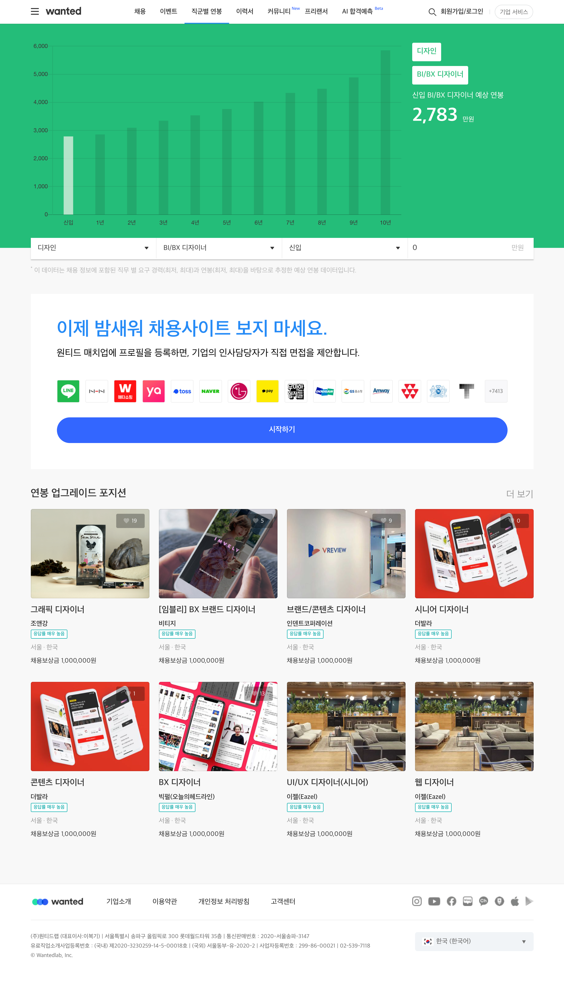
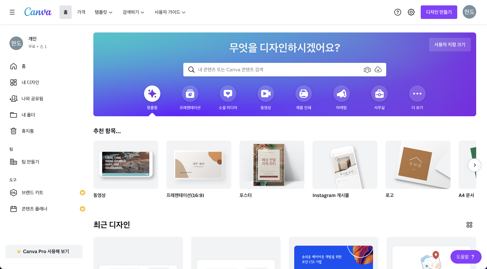

### 시작하기 전,

요새 스타트업에 다니느라 정말 정신없이 지냈다.

그래서 그런지 블로그 마지막 글이 작년 11월 22일에 올린 회고록이다.

블로그에 글 올려야지 올려야지 하면서도 퇴근하고 집에오면 침대에 누워 시간을 보내다 결국 2월까지 오게 되었다...

이번에 곧 자취를 시작하는데 자취방에 들어가면 꼭 2주에 한 번씩은 글을 올려야겠다.

### Template 컴포넌트에 대한 생각의 전환

처음 React Atomic Design을 접하고, Template 컴포넌트 부분에 대한 설명을 봤을 때 가장 처음으로 눈에 들어온 부분은 바로 Template 단은 더 이상 상위 컴포넌트를 구성하기 위한 부분이 아니라는 문구이다.

즉, 해당 부분의 역할은 **상위 컴포넌트에서 Props를 통해 데이터를 받아 뿌려주는 부분일 뿐, 상위 컴포넌트를 구성하는 역할이 아니라는 것**이다.

솔직하게 처음에는 이 Template이라는 단계가 왜 필요한지 전혀 이해를 하지 못했었다.

왜 Organisms 단계로 바로 데이터를 뿌려주지 않고 굳이 Template이라는 단계를 하나 더 만들어서 괜히 부가적인 작업을 만드는 것인지 말이다.

하지만 React Atomic Design에 대해 제대로 이해하지 못했을 때에는 문서가 그렇게 되어있었으니 다 이유가 있어서 그렇게 만들었겠지하며 별 생각없이 문서대로 개발을 진행했다.

```tsx
import TemplateLayout from './TemplateLayout'
import LaunchPadIntro from '../organisms/LaunchPadIntro'
import LaunchPadDesc from '../organisms/LaunchPadDesc'
import LaunchPadProcess from '../organisms/LaunchPadProcess'
import LaunchPadInfrastructure from '../organisms/LaunchPadInfrastructure'

const MainPageTemplate = () => {
  return (
    <TemplateLayout page="main">
      <LaunchPadIntro />
      <LaunchPadDesc />
      <LaunchPadProcess />
      <LaunchPadInfrastructure />
    </TemplateLayout>
  )
}

export default MainPageTemplate
```

위의 코드는 정말 React Atomic Design에 대한 이해도가 많이 떨어졌던 때 작성했던 코드이다.

<br />

이제서야 보이는 문제점 중 첫 번째는 **Template 단의 컴포넌트에서 같은 Template 단의 컴포넌트를 사용했다**는 것이다.

저기서 사용했던 TemplateLayout이라는 컴포넌트는 헤더 및 푸터 컴포넌트를 포함해 Layout을 구성할 수 있도록 하는 컴포넌트이다.

물론 예외적으로 같은 단계의 컴포넌트를 불러와 사용할 수는 있겠지만 기본적으로 가장 작은 단위의 컴포넌트에서부터 시작해 차근차근 조합해 상위 컴포넌트를 구성해간다는 Atomic Design 철학에는 어긋나기 때문에 Page 단의 컴포넌트에서 불러와 사용하는 것이 좋은 방법인 것 같다.

<br />

다음 문제점은 이때 만들었던 페이지가 단순 설명 페이지라 넘겨주는 데이터가 없었기 때문에 **상위의 Page 단의 컴포넌트에서는 정말 MainPageTemplate 컴포넌트만 사용했었다**는 점이다.

물론 다른 훅 코드도 불러와 사용을 했지만 결국엔 컴포넌트 코드는 아래와 같았다는 것이다.

```tsx
import MainPageTemplate from '../templates/MainPageTemplate'

...

const MainPage = () => {
  ...

  return <MainPageTemplate />
}

export default MainPage
```

정말 처음 보자마자 이 코드는 확실히 잘못된 코드라는 것을 깨달았다.

하지만 마감 기한을 맞추기 위해서 일단 넘어갔지만 다음 프로젝트에서는 Template 컴포넌트의 범위에 대한 생각을 바꿔 조금 더 오랫동안 컴포넌트 구조를 생각해보았다.

결론적으로는 Template 컴포넌트의 역할에 대해 완전히 다르게 적용해보자는 것이었는데, 상위 Page 단의 컴포넌트로부터 데이터를 받아 뿌려주는 역할이 아닌, 다른 하위 단계의 컴포넌트처럼 Page 단의 컴포넌트를 구성하는 요소로 생각하고 컴포넌트 구조를 설계했다.

Wanted 페이지를 예시로 들어보겠다.

<br />



<br />

<aside>
💡 컴포넌트 구조 설계 방법은 정답이 없으니 참고만 바란다!

</aside>

이 페이지의 컴포넌트 구조를 설계한다면 예전이나 지금이나 헤더와 푸터를 하나의 템플릿 컴포넌트로 묶는 것은 동일할 것이다.

하지만 예전의 나였다면 저 페이지 전부 메인 페이지 템플릿 컴포넌트로 구성했을테지만, 지금의 나라면 차트 부분과 나머지 부분을 분리할 것 같다.

저 두 부분은 하나의 페이지 내에 존재하지만 엄연히 다른 기능을 수행하고 있다.

또한, 아닐수도 있지만 다른 페이지 단의 컴포넌트에서도 충분히 재사용이 가능할뿐더러 작은 블럭부터 쌓아나가 재사용성을 극대화한다는 Atomic Design의 철학과도 더 근접하다고 생각한다.

### Atom 컴포넌트의 범위는 어디서부터 어디까지일까

내가 처음 읽었던 Atomic Design에 관한 글에서는 Atom을 버튼, 제목, 입력 태그 등과 같은 재사용 가능한 최소 단위의 컴포넌트로 정의했다.

하지만 공식 문서에서의 정의대로 작업을 진행하면서 느낀 점인데, 실제로 프로젝트를 진행하다보면 아무리 같은 요소라도 분명히 다르게 적용되는 부분이 꼭 발생한다는 것이다.

이렇게 다르게 적용되는 부분은 스타일 요소든, 상태 요소든 어떤 것이 될 수 있었다.

그렇게 **최대한 재사용을 하기 위해서 스타일이나 각종 상태 관리 요소들을 Props로 전달해서 적용해주기에는 컴포넌트의 복잡성이 너무나도 올라갈 것**이라는 생각이 들었다.

<br />


<br />

위의 사진은 현재 개발중인 프로젝트에서 사용하고 있는 각기 다른 입력 요소들이다.

사진으로만 봐도 알 수 있듯이 입력 요소라는 것만 같을 뿐이지, 각종 스타일이나 인풋 요소의 속성값 모두 다르다.

이를 모두 Props로 처리해주기에는 너무나도 복잡할뿐더러 쓸데없이 코드가 길어질 가능성이 크다.

지금은 물론 다른 점이 많이 없다고 느낄지도 모르지만, 차별점이 하나 둘 늘어나면 그만큼 Atom 컴포넌트의 복잡성도 올라가고 코드도 길어질 것이다.

<br />

이를 해결하기 위한 해결책은 생각보다 단순하다.

**첫 번째 방법은 상위 컴포넌트에 병합하는 것이고, 두 번째 방법은 재사용을 포기하는 것이다.**

두 번째 방법은 다음 문단에 설명해놨으니 여기에서는 첫 번째 방법에 대한 생각만 작성했다.

여기에서는 다른 예시를 한 번 들어보겠다.

<br />



<br />

해당 사이트는 블로그에 게시글을 올릴 때 필요한 썸네일 사진을 손쉽게 만들 수 있는 사이트이다.

이 사이트에서 Canva Pro 사용해보기라는 좌측 하단의 버튼과 디자인 만들기, 사용자 지정 크기라는 우측 상단의 두 개의 버튼을 살펴보자.

예시의 버튼 모두 각기 다른 영역에 있는 컴포넌트이지만 React Atomic Design의 철학에 따라서 충분히 재사용이 가능한 컴포넌트이다.

하지만 세 버튼 컴포넌트 모두 들어가는 텍스트, 적용된 스타일, 클릭했을 때의 기능이 모두 다르다.

이런 경우에서는 버튼 컴포넌트를 따로 분리해 해당 케이스들을 모두 처리해주기보다는 상위 컴포넌트와 하나로 합치는 것이 오히려 더 좋은 방법일 가능성이 크다.

**그런데 이런 식으로 상위 컴포넌트에 병합하다보면 Atom 컴포넌트의 규모가 비대해질 수도 있기 때문에 경계선을 명확하게 정해놓고 설계해야 한다.**

### 재사용에 대한 집착에서 벗어나다

어떻게 보면 이 부분은 단순히 React Atomic Design 뿐만 아니라 React를 사용하는 모든 프로젝트에 적용이 되는 내용일 것이다.

그래서 재사용과 관련된 내용은 작년에 진행했던 사이드 프로젝트인 Train Main Visualizer의 개발을 끝내고 계속해서 고민하던 문제였는데, FEConf2021 유튜브 채널에 올라온 컴포넌트, 다시 생각하기라는 발표를 통해 어느정도 생각을 정리할 수 있었다.

<br />


<br />

해당 동영상에서는 **의존하는 모델이 같은지 다른지에 따라 재사용의 여부를 결정할 수 있다**고 했는데, 실제 당근마켓에 적용한 예시를 통해서 쉽게 이해할 수 있었다.

지금 진행하고 있는 프로젝트도 찾아보니 마찬가지로 UI 자체는 비슷하지만 모델이 다른 부분들이 꽤 존재했다.

정말 처음, 이 동영상을 보기 전에 코드를 작성했을 때에는 좀 과할 정도로 재사용에 포커스를 맞추고 개발을 했었는데, 어느 순간 점점 코드는 알아보기 힘들어졌을 뿐더러 건드리기 조차 두려워지는 컴포넌트가 돼버린 것이다.

이 게시글의 두 번째 챕터에서 예시로 든 두 개의 인풋이 위의 컴포넌트 예시 중 하나인데, 저 두 인풋은 서로 참조하는 모델도 다를 뿐더러 스타일 또한 다르기 때문에 그 케이스들을 전부 따져주느라 코드가 너무 길어졌었다.

만약 아직까지도 한없이 재사용만을 추구했더라면 새로운 기능 하나 추가해줄 때마다 내가 왜 코드를 이렇게 작성했을까 하는 후회와 함께 코드를 뜯어고치고 있었을 것이다.

### 끊임없이 고민하고 적용해보자

React Atomic Design은 다른 어떠한 애플리케이션 구조 설계 방법론보다도 훨씬 개발자에 따라서 애플리케이션 구조가 천차만별로 달라질 수 있는 방법론이라고 생각한다.

특히나 유저 인터렉션이 많은 웹 서비스는 여러 컴포넌트 스타일링 기법이나 HTTP 통신, 전역 상태 라이브러리 등을 많이 섞어 쓰기 때문에 그에 맞도록 적용할 수 있어야 한다.

이렇게 정말 빠르게 발전하는 React 생태계 속에서는 애플리케이션의 구조에 대한 정답은 없다고 생각한다.

하지만 오답은 존재한다.

그러기 때문에 우리는 끊임없이 어떻게 해야 더 좋은 구조가 될 수 있을지 고민하고, 적용해보며 터득해야 한다.

---

### Source

- Atomic Design and ReactJS

  [https://danilowoz.com/blog/atomic-design-with-react](https://danilowoz.com/blog/atomic-design-with-react)

- FEConf 2021 - 컴포넌트, 다시 생각하기

  [https://www.youtube.com/watch?v=HYgKBvLr49c&t=1768&ab_channel=FEConfKorea](https://www.youtube.com/watch?v=HYgKBvLr49c&t=1768&ab_channel=FEConfKorea)
