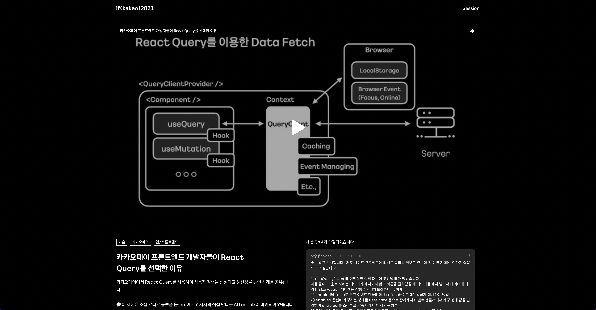

### React Query는 어떤 라이브러리일까?

먼저 공식 문서의 설명에 따르면 React Query 라이브러리는 Global State와의 어떠한 접촉 없이 손쉽게 데이터를 Fetch, Cache, Update 할 수 있도록 도와주는 라이브러리라고 명시되어 있습니다.

공식 문서 첫 페이지에서는 사용하기 친숙해 간단하지만, 강력한 기능을 가졌다고 설명합니다.

만약 이런 라이브러리 없이 서버 데이터를 가져오기 위해서는 아래와 같이 코드를 작성하면서 생길 수 있는 여러 문제점에 대해 고민해봐야 합니다.

- 데이터 캐시 처리
- 중복된 요청 단일화
- 데이터 갱신 필요성 여부 파악
- 성능 최적화 등

Redux, Recoil, MobX 등과 같은 기존의 상태 관리 라이브러리는 클라이언트 쪽의 상태를 관리하기에는 좋지만, 한 번이라도 해당 라이브러리를 통해 비동기 작업을 진행해봤다면 이런 상태 관리 라이브러리를 통해서 서버 데이터를 관리하는 작업은 꽤나 힘들다고 생각할 것입니다.

저 또한 Redux를 통해서 비동기 작업을 처리했던 경험이 있는데, 그 때 당시에는 위에 적혀있는 문제점들을 모두 겪었던 것 같습니다.

캐시 처리는 직접 구현하려면 너무나도 고려해야 할 게 많았고, 캐시 처리가 안되니 당연히 데이터를 언제 갱신해야 하는지 여부를 파악하기 어려워 매번 요청을 보냈습니다.

그렇게 되니 성능 최적화가 되지 않아 당연히 클라이언트쪽과 서버쪽 모두 부담이 됐죠.

그렇게 직접 고생을 하고 나서 React Query에 대해 알게 됐고, 실제로 회사 프로젝트에 적용을 해봤는데 너무나도 사용하기 편리했습니다.

### React Query를 도입하기 전

아무리 React Query가 서버 데이터를 관리하기에 편리한 라이브러리라 하더라도, 이를 어떻게 프로젝트에 녹여내는지에 따라 효율이 천차만별로 달라질 것입니다.

React Query를 도입하기 전의 회사 프로젝트에서는 프론트엔드 단에서 직접 스마트 컨트랙트에서 데이터를 호출했고, 그렇게 가져온 데이터를 모두 Recoil 라이브러리를 통해 관리해주고 있었습니다.

그러다 여러 이유로 백엔드 서버 구축의 필요성을 느끼게 되었고, 그렇게 기존의 스마트 컨트랙트 데이터 호출 부분의 상당수를 서버단으로 옮기게 되어 이제는 API를 통해 데이터를 가져오도록 바뀌었습니다.

그렇게 프론트엔드에서 API 처리를 위해 React Query 라이브러리를 사용하기로 결정했는데, 저는 당연히 이 라이브러리를 처음 사용해보는 입장이라 이를 어떻게 활용해야 효율을 끌어낼 수 있을지 궁금했기에 여러 레퍼런스랑 블로그 게시글을 찾아봤습니다.

역시나 우아한 형제들, 카카오페이, 카카오 엔터테인먼트 등 다양한 대기업에서 이 라이브러리를 어떻게 더 잘 사용할 수 있을지 고민했던 점들을 공유했었죠.

이렇게 찾아본 레퍼런스를 바탕으로 회사 프로젝트에 React Query를 적용했는데, 정말 간단하게 비동기 API 처리를 구현할 수 있었습니다.

그럼 이제 React Query를 프로젝트에 적용하며 어떤 점이 좋았는지, 그리고 어떻게 라이브러리를 적용했는지 알아봅시다.

### 클라이언트 상태와 서버 데이터의 접점을 최소화하다

React Query와 같은 Data Fetching 라이브러리가 등장하기 전까지는, 비동기 API 처리를 위해 Redux와 같은 상태 관리 라이브러리를 도입하는 경우도 꽤나 많았습니다.

하지만 클라이언트 쪽에서만 사용하는 여러 상태와 같이 관리해야하므로 Store의 크기가 자연스럽게 커지게 되고, 이는 곧 확장 및 유지보수의 어려움으로 이어집니다.

당연히 기존 상태 관리 라이브러리로는 캐시 처리나 오래된 데이터의 갱신도 구현하기 쉽지 않죠.

따라서 이와 같이 별도의 처리가 필요한 서버 데이터는 따로 관리하는 편이 좋습니다.

React Query도 서버 데이터를 전역 상태와 분리해서 관리해야한다는 입장이었기 때문에 Fetch한 모든 데이터를 Context API를 통해 관리해주고 있습니다.

그렇기 때문에 서버 데이터 따로, 클라이언트 상태 따로 관리해줄 수 있었죠.

```tsx
// 이렇게 특정 컴포넌트에서 todos라는 키로 데이터를
// Fetch하게 되면 Context API를 통해 관리되므로
useQuery('todos', ...)

// 다음과 같이 Query Client를 통해 todos 키 값으로 Fetch되었던
// 서버 데이터를 손쉽게 가져올 수 있습니다
const queryClient = useQueryClient()
const todos = queryClient.getQueryData('todos')
```

하지만 특정 경우에는 클라이언트 쪽의 상태와 연동이 필요한 경우가 있습니다.

마침 Recoil로 관리해주던 Form 값과 React Query를 양방향으로 맞춰주어야 하는 경우가 있었는데, 마침 useQuery의 옵션 중에서 onSuccess 라는 옵션이 있었습니다.

이 옵션을 통해 Fetch가 성공한 경우에 Recoil State의 상태를 변경해주는 콜백 함수를 연결해줘 별도의 처리 없이 손쉽게 분리된 두 상태를 연동시킬 수 있었죠.

```tsx
export default function useTodosQuery() {
  // 클라이언트 상태 관리 코드
  const [todos, setTodos] = useRecoilState(todosAtom)

  return useQuery(
    'todos',
    async () => {
      // API 호출 코드
      return fetch(...)
    }, {
    onSuccess: data => {
      // Fetch된 데이터를 클라이언트 상태와 연동
      setState(...)
    }
  )
})
```

이렇게 특정 경우를 제외하고는 손쉽게 서버 데이터와 클라이언트 상태를 분리해 관리할 수 있습니다.

따라서 상태 관리 라이브러리를 프론트엔드 상태에 집중함으로써 더 적절한 용도로 사용할 수 있습니다.

### API 별로 훅을 작성해 특성에 맞게 사용하다

이 부분은 if(kakao) 2021의 웹 프론트엔드 세션 중에서 [카카오페이 프론트엔드 개발자들이 React Query를 선택한 이유](https://if.kakao.com/session/118) 세션을 많이 참고했습니다.

<br />



<br />

지금의 회사 프로젝트 구조를 잡는데 많은 도움이 됐던 세션입니다.

카카오페이에서는 React Query를 사용할 때, API 별로 커스텀 훅을 만들어 관리해준다고 했습니다.

이렇게 API 별로 커스텀 훅을 만들어주는 경우에는 보다 더 직관적으로 API를 사용할 수 있고, API 전/후처리가 간편하며, API 별로 옵션을 다르게 설정할 수 있는 등 다양한 장점을 얻을 수 있다고 했죠.

실제로 프로젝트에 적용해보니 커스텀 훅 네이밍을 통해 더 명확하게 어떤 API인지 알 수 있었고, API 별로 특성에 맞도록 옵션을 설정함으로써 더 효율적으로 Fetch 할 수 있었으며, 손쉽게 전/후처리가 가능했습니다.

또, API 별로 만들어준 커스텀 훅 파일 안에 리턴값 타입과 Fetch 함수를 한꺼번에 관리가 가능해 개발 및 유지보수가 너무나도 간편했습니다.

그동안 비동기 처리를 위해 Redux를 사용했던 것이 얼마나 큰 고생이었는지 이때 뼈저리게 알게 되었죠.

아래 코드는 실제 프로젝트에서 사용하고 있는 코드를 조금 바꾼 것입니다.

```tsx
import { useQuery } from 'react-query'
import axios from '../axiosConfig'
import { useManageAvatarState } from '../../state/avatarState'

export type AvatarType = {
  id: number
  name: string
  ...
}

const loadAvatar = async (name: string) => await axios.get(`/api/~~/${name}`)

export default function useAvatarQuery(name?: string) {
  const { setAvatarState } = useManageAvatarState()

  return useQuery<AvatarType>(
    'avatar',
    async () => {
      const {
        data: { data },
      } = await loadAvatar(name as string)

      return data
    },
    {
      enabled: name !== undefined,
      staleTime: Infinity,
      retry: false,
      retryOnMount: false,
      refetchOnWindowFocus: false,
      refetchOnMount: false,
      refetchOnReconnect: false,
      onSuccess: ({ avatar }) => setAvatarState(avatar)
    },
  )
}
```

이렇게 하나의 파일 안에 리턴값의 타입, Fetch 함수, useQuery Hook을 한꺼번에 관리하고 있습니다.

또, API의 특성에 맞도록 옵션을 설정해주고 있으며 후처리로 프론트엔드 상태와 연동시켜주는 작업까지 진행하고 있죠.

이와 같이 useQuery를 사용함으로써, 저희는 비동기 API 처리를 위한 부가적인 작업 없이 오로지 핵심 부분에만 집중해서 코드를 작성할 수 있었습니다.

옵션만 적절하게 넣어주면 나머지는 React Query가 알아서 처리를 해주니 크게 신경쓸 필요가 없어서 너무 편리했습니다.

### 사용 범위를 스마트 컨트랙트까지 확장하다

그동안 스마트 컨트랙트를 통해 호출한 데이터는 단순히 컴포넌트 내의 useState 또는 Recoil State로 관리를 해주고 있었습니다.

또, 단순히 데이터를 호출해 넣어주기만 함으로써 지금 데이터가 Fetching 중인지, Fetch 됐는지 알 길이 없고, 어떤 데이터가 오래된 데이터인지 파악하기 힘들었죠.

물론 이를 위해 추가적으로 작업을 해줄 수도 있었지만, 난이도가 꽤나 높아질 것 같아 그동안은 이런 부가적인 기능 없이 스마트 컨트랙트를 프론트엔드에서 불러와 사용하고 있었습니다.

당연히 이는 데이터를 불러오고 있는지, 다 불러왔는지, 불러오다가 에러가 난 건지, 이 데이터가 오래된 건지 아닌지에 대해 사용자는 알 방법이 없으므로 자연스럽게 사용자 경험은 악화되기 마련입니다.

하지만 스마트 컨트랙트 데이터 호출도 마찬가지로 비동기 처리이므로 useQuery를 사용하게 되면, API 요청을 처리하는 것처럼 사용이 가능하기 때문에 더 손쉽게 데이터를 관리할 수 있게되죠.

```tsx
// 사용자가 가지고 있는 토큰 수량을 반환하는 Custom Hook
export default function useLoadUserBalance(address?: string) {
  return useQuery(
    ['balance', address],
    async () => {
      const balance = await TOKEN_CONTRACT.methods.balanceOf(address).call()
      return caver.utils.convertFromPeb(balance, 'KLAY')
    },
    {
      enable: address !== undeined,
      refetchInterval: REFETCH_INTERVAL_TIME,
      suspense: true,
    },
  )
}
```

이렇게 옵션을 걸어 사용하게 되면 다른 어떠한 부가적인 로직에 신경쓸 필요가 없어집니다.

특히나 suspense 옵션을 통해 Fetching 상태일 때 Loading Shimmer를 띄워주는 등의 처리도 가능하죠.

그렇게 되면 사용자는 현재 데이터 로딩 상태를 명확하게 알 수 있어 사용자 경험을 끌어올릴 수 있는 것입니다.

### 마치며

이렇게 장점이 많은 React Query이지만, Redux처럼 많이 사용되는 개발 컨벤션이 따로 없어 당연하게도 프로젝트가 커지면 커질수록 복잡도도 같이 올라갈 것입니다.

하지만 이는 반대로 말하면 올바른 컨벤션을 확립하고 이를 토대로 개발하면 React Query가 가진 장점을 최대한 활용할 수 있다는 말이 되겠죠.

그러기 위해서는 끊임없이 구조를 개선하기 위해 고민해야만 하는 것 같습니다.

---

### Source

- React Query

  [https://react-query.tanstack.com/](https://react-query.tanstack.com/)

- Store에서 비동기 통신 분리하기 (feat. React Query)

  [https://techblog.woowahan.com/6339/](https://techblog.woowahan.com/6339/)

- 카카오페이 프론트엔드 개발자들이 React Query를 선택한 이유

  [https://if.kakao.com/session/118](https://if.kakao.com/session/118)
