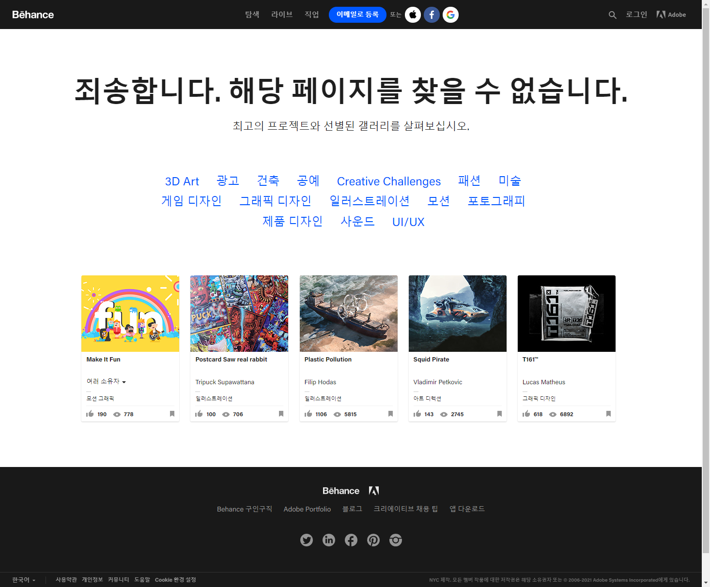
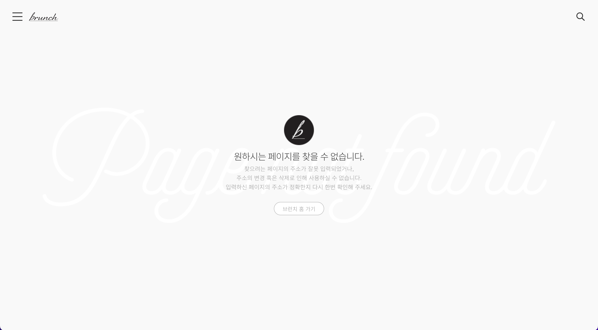
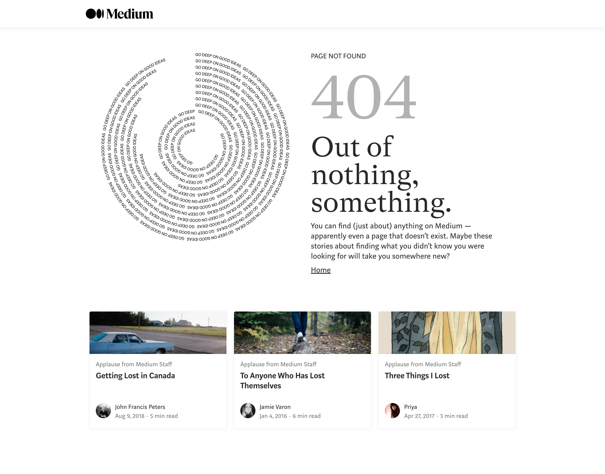
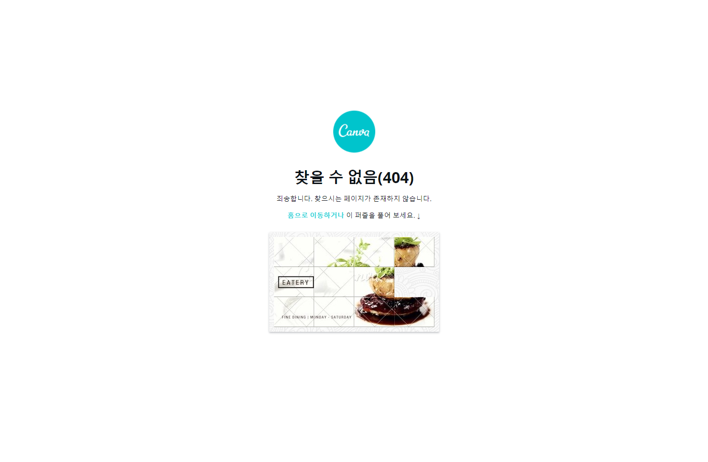
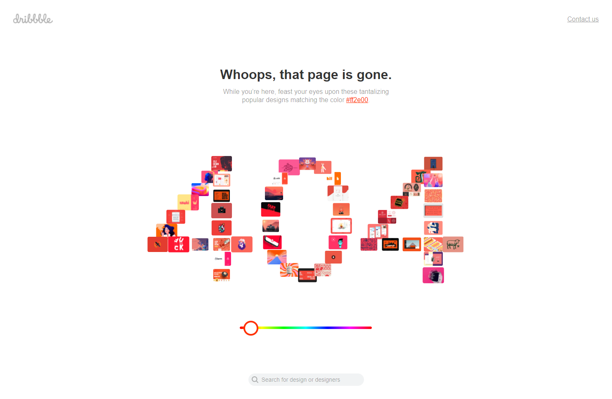

### 한 번은 보았을 404 에러 페이지

우리 모두 웹 페이지를 들여다보면서 한 번 쯤은 페이지를 찾을 수 없다는 404 에러 페이지를 마주친 경험이 있을 것입니다.

물론 이 페이지를 찾을 수 없다는 표현을 명확하게 표시해주는 친절한 404 에러 페이지가 대부분이지만, 그렇지 않은 웹 서비스도 꽤나 많죠.

당연히 웹 개발자 또는 웹 개발 쪽에 지식을 가지고 있는 사람이라면 아주 불친절한 404 에러 페이지를 봐도 무슨 뜻인지 정확하게 알 수 있을테지만 그렇지 않은 사람이라면 어떨까요?

분명히 제대로 링크를 타고 들어간 것 같은데 내가 보고싶은 사이트는 뜨지 않고 이상한 흰 바탕에 404 Not Found 라는 텍스트만 덩그러니 놓여있다면 정말 당황스러울 것입니다.

바로 아래 사진과 같이 말이죠.

 

 

한 눈에 봐도 정말 불친절해보이는 404 에러 페이지입니다.

웹 개발 지식이 거의 없는 일반 사용자들이 처음 이 페이지를 보게 된다면 아마 대부분 이 웹 사이트에 대한 신뢰도가 떨어질거라고 생각됩니다.

당연히 신뢰도가 떨어지면 사용자는 쉽게 이 사이트를 이탈할 수 밖에 없겠죠.

그래서 사용자 경험 측면에서 404 에러 페이지는 꽤나 중요한 문제입니다.

### 흔하게 볼 수 있는 404 에러 페이지 유형

다양한 웹 서비스에서는 친절하게 사용자에게 페이지를 찾을 수 없다는 안내와 함께 다른 메뉴를 볼 수 있도록 링크를 제공하고 있습니다.

이는 가장 흔하게 볼 수 있는 404 에러 페이지 유형으로, 이 페이지를 맞닥뜨린 사용자로 하여금 잘못된 페이지라는 것을 인식시켜주고 다른 콘텐츠를 찾아보도록 의도할 수 있습니다.

 

 

첫 번째 예시는 Adobe Creative Cloud 앱을 통해 제작한 여러 작품을 게시하고 다른 유저의 작품을 탐색할 수 있는 서비스인 Behance입니다.

우선 Behance에서는 크게 페이지를 찾을 수 없다는 안내 문구를 표시해주어 사용자에게 콘텐츠가 표시되지 않는 이유를 명확하게 설명해주고 있고, 다른 작품을 찾아볼 수 있도록 여러 카테고리 링크를 띄워주었습니다.

또한, 그 아래에는 여러 작품에 대한 정보를 띄워주어 손쉽게 확인할 수 있도록 해주었습니다.

물론 작품 상세 보기 페이지로 연결되는 링크도 포함되어 있습니다.

 

 

두 번째 예시는 카카오의 블로그 서비스인 브런치입니다.

브런치에서는 위와 같이 브런치만의 감성을 담아 미니멀하게 페이지를 찾을 수 없다는 문구를 출력해주고, 브런치 메인 페이지로 이동할 수 있는 링크가 연결된 버튼을 표시해주고 있습니다.

또, 바깥 배경에 독특한 폰트로 은은하게 Page not found 문구를 띄워주어 심심하지 않도록 해주었죠.

 

 

세 번째 예시는 온라인 출판 플랫폼을 제공하는 해외 서비스인 미디엄입니다.

미디엄에서는 정확하게 무엇을 표현한 것인지는 모르겠지만 조금 색다르게 텍스트로 만든 문양을 페이지를 찾을 수 없다는 문구와 함께 띄워주고 있습니다.

그리고 Behance와 마찬가지로 다른 게시글을 볼 수 있는 미리보기 데이터를 제공하고 있습니다.

### 404 에러 페이지를 재미있게 풀어낸 서비스

위에서 봤던 예시처럼 단순히 메인 페이지로 이동할 수 있는 링크나 다른 콘텐츠를 볼 수 있도록 해주는 링크를 띄워주는 것도 사용자 경험을 끌어올리는데 효과적이고, 이탈률을 크게 감소시킬 수 있습니다.

하지만 여기에 더해 다른 서비스에서는 제공하지 않는 독특한 경험을 통해 해당 서비스가 가진 개성을 표현해줘 조금 딱딱할 수 있는 404 페이지를 재미있게 풀어낸 서비스도 있습니다.

여기에서는 재미있고 독특한 사용자 경험을 제공하는 서비스 예시를 알아보겠습니다.

 

 

첫 번째 예시는 여러 시각 디자인 콘텐츠를 제작할 수 있는 플랫폼을 제공하는 서비스인 Canva입니다.

겉으로 보기에는 되게 심플한 404 에러 페이지이지만, 다른 서비스에서는 볼 수 없는 재미 요소가 하나 섞여있죠.

그 요소가 하단에 있는 퍼즐인데, Canva에서는 퍼즐을 통해 독특한 유저 인터랙션 경험을 제공함으로써 서비스의 개성을 드러냈다고 볼 수 있습니다.

물론 실제로 퍼즐을 풀어보는 유저는 소수일지라도 다른 곳에서 볼 수 없는 독특한 요소를 넣었다는 점만으로도 충분히 Canva라는 서비스의 정체성을 재미있게 풀어낸 것 같다고 생각합니다.

 

 

다음 예시는 디자이너를 위한 소셜 네트워크 플랫폼 서비스인 Dribble입니다.

Dribble도 404 에러 페이지를 처음 마주했을 때, 진짜 개성있고 독특하게 잘 풀어냈다고 생각했었습니다.

일단 눈에 가장 먼저 들어오는 404라는 텍스트는 일반 텍스트가 아닌 여러 사진으로 구성된 형태입니다.

그런데 여기서 더 신기한건, 404 텍스트를 이루는 사진이 모두 유저가 선택한 색상을 기반으로 하는 사진들이라는 점입니다.

그래서 404 텍스트 하단의 컬러 선택 부분에서 색상을 변경하면 그 색상을 기반으로 하는 사진들로 새롭게 404 텍스트가 구성되는 것입니다.

이를 통해 유저들은 자신이 직접 색상을 선택함으로써 새로운 작품을 만들어내는 느낌을 받을 수 있겠죠.

게다가 저 사진들 모두 작품 상세 보기 페이지로 연결이 되어 있기 때문에 미리보기 역할을 같이하는 셈입니다.

### 404 에러 페이지의 구현 목적

여기까지 404 에러 페이지의 다양한 예시를 알아보았습니다.

그러면 이런 예시들을 분석하면서 어떤 이유로 404 에러 페이지를 직접 만들어서 띄워주는지 정리해봅시다.

1. **긍정적인 사용자 경험을 제공할 수 있습니다**

   단순히 흰 배경에 404 Not Found라는 검정 텍스트를 마주했을 때에는 일반 사용자들은 정확하게 어떤 이유로 콘텐츠가 보이지 않는지 잘 모를 수 있기 때문에 나쁜 사용자 경험을 받게 됩니다.

   하지만 직접 404 에러 페이지를 구현하게 되면 사용자로 하여금 내가 왜 콘텐츠를 확인하지 못하는지 명확하게 이유를 인지할 수 있어 보다 긍정적인 사용자 경험을 느낄 수 있습니다.

   따라서 사용자는 당황스럽고 불쾌한 감정을 덜 느끼게 되어 해당 서비스에 대한 좋은 인상을 유지할 수 있는 것입니다.

    

1. **사용자 이탈률을 감소시킬 수 있습니다**

   위에서 확인한 모든 404 에러 페이지의 공통점이 뭐라고 생각하시나요?

   그것은 바로 404 에러 페이지를 직접 구현하는 가장 큰 목적인 메인 페이지 또는 다른 콘텐츠로 연결되는 링크를 제공한다는 것입니다.

   만약 구글 검색 결과로 접속한 페이지의 링크가 깨진 상태이거나 잘못된 URL을 통해 웹 사이트에 접속하는 경우에는 404 에러 페이지를 맞닥뜨리게 되고, 이를 본 사용자는 곧바로 검색 화면 또는 이전 화면으로 다시 돌아갈 것입니다.

   하지만 위와 같은 과정은 해당 서비스의 이탈률을 크게 증가시키는 요인입니다.

   따라서 404 에러 페이지에서 메인 페이지 또는 다른 콘텐츠로 이동할 수 있는 링크를 제공해주어야만 합니다.

   실제로 페이지 이동 버튼의 유무에 따라 사용자 이탈률이 크게 10% 가까이 변동될 수 있다고 합니다.

    

1. **서비스의 정체성 또는 개성을 표현할 수 있습니다**

   위에서 살펴본 모든 404 에러 페이지 예시를 봐도 충분히 해당 서비스의 정체성이나 개성을 알 수 있을 것이라고 생각합니다.

   Behance, Canva, Dribble과 같은 경우에는 디자인 관련 플랫폼이라는 정체성에 맞게 색다른 유저 인터랙션 경험 또는 다양한 디자인 콘텐츠로 연결되는 요소들을 제공하고 있습니다.

   반면에 Medium이나 Brunch 같은 경우에는 각 서비스만의 감성에 맞게끔 404 에러 페이지를 색다르게 표현해냈죠.

   이런 다양한 요소를 통해 보다 더 사용자 친화적으로 서비스가 가진 개성 혹은 정체성을 느껴볼 수 있고, 이는 곧 서비스나 기업의 브랜딩을 보여주는 것이기 때문에 사용자들에게 확실하게 인상을 남길 수 있습니다.

### 글을 마무리하며

단순히 웹 개발자의 입장이라면 404 에러 페이지가 얼마나 중요할지 잘 모르고 지나칠 수 있을거라 생각합니다.

하지만 만약 단순 개발자의 영역에서만 생각하지 않고, UI/UX 부분에서도 사용자를 생각하는 영역에까지 오게된다면 그렇게 자주 보지 않는 404 에러 페이지도 많이 중요하다는 것을 알 수 있을 거라고 생각되네요.

이제서야 UX 측면을 고려하기 시작한 저로서 많은 레퍼런스를 찾아보며 고민할 수 있었던 주제였던 것 같습니다.

앞으로 UX 관련 게시글도 많이 올려보고 싶은 마음입니다.
