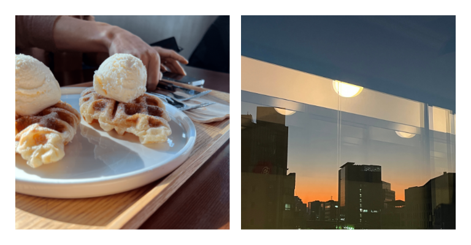
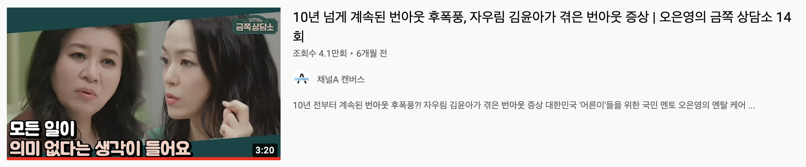

### 나의 첫 서비스 운영 회사

처음으로 이 회사를 알게 된 건 2021년 12월이었는데, 군 생활을 완전히 마무리하고 복학하기 전에 잠깐 돈을 모으기 위해 프리랜서로 활동하면서 알게 되었습니다.

그렇게 외주 업무를 받다가 처음 이 회사를 알게 되었고, 그 당시에는 핵심적인 비즈니스 로직 구현을 제외한 UI 부분만 담당하고 있었습니다.

하지만 외주 업무를 진행하면서 이 회사가 어떤 서비스를 만드는 것인지 조금씩 보이기 시작하고, 블록체인이라는 도메인에 대해서 자세하게 알게 되면서 조금씩 흥미가 생기기 시작했습니다.

그래서 개인적으로도 정말 큰 도움이 될 것 같다고 생각해 나름대로 열정적으로 프로젝트 개발에 참여했습니다.

하지만 그 당시 개발팀에는 큰 문제점이 존재했는데, 그 문제점은 바로 저랑 같이 협업하는 프론트엔드 개발자 2분이 모두 주니어라는 점과 저랑 비슷하게 블록체인 분야에서 서비스를 개발해보는 것이 처음이라는 점이었습니다.

물론 저도 한 번도 서비스 운영 회사에 다니지 않은 주니어 개발자였지만, 그나마 학습 및 프로젝트 경험이 상대적으로 많았기에 다른 개발자분이 작성하신 비즈니스 로직을 리뷰하고, 구조를 개선하여 UI에 합치는 부분까지 담당하며 점점 관여하는 비율이 높아지고 있었습니다.

그렇게 작은 프로젝트 1개와 큰 프로젝트 1개를 오픈하고, 원래대로라면 학교 복학하는 때에 맞게 계약을 마무리했겠지만 정말 감사하게도 같이 일하던 개발자분들의 적극적인 추천으로 이 회사의 팀원으로 합류하게 되었습니다.

 

 

조금 뜬금없는 이야기지만 왼쪽 사진은 2021년 12월 ~ 2022년 초 정도에 뚝섬 공유 오피스에서 근무했을 당시 1층에 있던 카페에서 먹은 크로플 사진인데 정말 맛있게 먹었던 기억이 납니다.

그리고 오른쪽 사진은 2021년 12월 오픈 예정이었던 큰 프로젝트를 준비하는 과정에서 밤을 새웠을 때 동료 개발자분께서 찍으신 사진인데, 새벽해 뜨는 사진이 너무 예뻐 사진을 찍은 분께 쓰고 싶다고 졸라서 받았습니다.

### 어떻게 시니어 타이틀을 달았는가

위와 같은 과정을 통해 이 회사의 어엿한 일원이 되고, 큰 서비스를 오픈을 하고 나서 2개월의 유지보수 기간을 거친 바로 다음 새로운 프로젝트를 준비했습니다.

이때 준비한 프로젝트가 NFT 프로젝트인데, 처음 이 프로젝트를 진행하면서 정말 많은 어려움을 겪었습니다.

우선 저는 마찬가지로 NFT를 한 번도 사본 적도 없었기에 이 분야에 대해 아는 점이 하나도 없었습니다.

그리고 이 프로젝트는 다른 NFT 프로젝트에 비해 꽤 복잡하고 많은 기능을 가지고 있었습니다.

마지막으로 그동안 백엔드 없이 프론트엔드에서 직접 컨트랙트를 호출하는 방식이었는데, 이 프로젝트의 기획상 백엔드 구축이 불가피했습니다.

결국엔 잘 알지도 못하는 도메인에서 도움받을 곳 없이 스스로 필요한 API를 설계 및 개발해야 했는데, 경험이 부족한 주니어 입장에서는 꽤나 어려운 도전이었습니다.

그래도 다행히 당시에는 인프라를 담당해주시는 시니어 개발자분이 계셨기 때문에 기본적인 인프라와 백엔드 틀을 잡아주신 상태에서 그대로 이어받아 프로젝트에 필요한 API 개발을 진행했습니다.

그때에는 남은 시간이 많지 않았는데 개발해야 하는 부분이 많아, 저와 함께 백엔드 개발을 같이 진행했던 개발자분과 함께 끊임없이 야근을 이어가며 쉬지 않고 달려왔던 것 같습니다.

그렇게 저는 결국 프론트엔드 전체와 백엔드 일부 개발을 맡게 되어 업무량이 꽤 많았지만, 이 상황에서 프론트엔드를 중심으로 유니티와 컨트랙트까지 이어주게 되면서 총 4개의 영역을 연결해주는 작업을 진행했습니다.

덕분에 큰 탈 없이 서비스를 오픈할 수 있었고, 그렇게 실적을 인정받아 시니어 직급으로 올라서게 되었습니다.

### 이런 생각을 하게 된 배경

그래서 2022년 5월, 저와 함께 다른 컨트랙트 개발자 한 분이 같이 시니어로 직급이 변경되었습니다.

다른 외부 개발자들이 보기에는 단순히 스타트업을 다니면서 경력을 쌓고 있는 주니어 개발자이지만, 그래도 회사 개발팀 내에서는 프론트엔드와 백엔드를 동시에 담당하고 있는 시니어 개발자라는 생각에 책임감이 들었습니다.

그렇게 계속해서 기능 개발, 성능 개선, 유지 보수를 그동안의 경험을 최대한 짜내가면서 진행했습니다.

하지만 저는 결국 남들과 크게 다를 바가 없는 주니어 개발자일 뿐이고, 그러기 때문에 저 또한 대부분의 주니어 개발자들이 겪는 고민과 문제점들을 마주하고 있었습니다.

모두를 대변하는 것은 아니지만 주니어 개발자가 가지고 있는 큰 문제는 바로 **내가 지금 가고 있는 방향이 맞는지에 대해 확신하지 못하고 계속해서 의심한다는 점** 같습니다.

만약 수없이 많은 경험을 해온 사수가 있다면 정답이라고 확정 짓지는 못하더라도 다른 곳에서, 또는 다른 프로젝트에서 비슷한 문제점이 발생했을 때 어떻게 해결했는지에 대한 해결 방법을 듣고 방향을 찾을 수 있을 것입니다.

하지만 이렇게 방향을 잡아줄 수 있는 사람이 존재하지 않는다면 결국 혼자서 맨땅에 헤딩해야만 할 텐데, 제대로 된 경험이 없는 주니어가 과연 단번에 올바른 길을 찾아갈 수 있을까 싶습니다.

결국 저도 마찬가지로 제대로 된 경험이 없는 분야에서 나 스스로 확신하지 못하고 프로젝트를 이끌어가는 상황에서 다른 개발자들까지 신경 써야 한다는 것이 큰 부담감으로 다가와 나아가야 할 방향을 잃어버리고 말았습니다.

 

 

이런 상황 때문에 저는 극심한 번아웃과 함께 일이 손에 잡히지 않게 되었고, 엎친 데 덮친 격으로 학교 기말고사 기간이 겹쳐버려 결국 잠시 가던 길을 멈추기로 결정했습니다.

그렇게 아무것도 하지 못한 채로 붕 떠버리는 시간이 생겨서 저는 천천히 지난 시간을 곱씹어보며 오랫동안 깊은 생각에 잠기게 되었습니다.

이를 진작 알아차리지 못하고 결국 무너지게 된 계기, 이전에서 비슷한 상황을 겪었을 때의 대처 방법, 내가 지금 당장 이 문제를 해결하기 위해 할 수 있는 것들, 그리고 앞으로 어떻게 해야 하는지까지…

다행히 이 부분은 저와 비슷한 고민, 비슷한 환경에 놓여있거나 먼저 직장 생활을 시작하신 주변 개발자 지인들을 통해 조언을 많이 얻으며 생각을 정리할 수 있었습니다.

그렇게 지금 당장 겪는 문제에 대해서는 어느 정도 정리가 된 상태에서 우연히 저의 롤모델이 되었던 개발자분이 촬영한 유튜브 영상을 보게 되었습니다.

 

 

저는 눈앞에 보이는 문제를 해결한 이 시점에서, 이 동영상을 통해 앞으로 마주하게 될 문제점들에 대해 고민하기 시작했습니다.

바로 모든 사람이 보고 배울 수 있는 시니어는 어떤 역량을 지녔고, 그런 시니어가 되기 위해 어떻게 해야 하는지, 그리고 **지금 이 상황에서 과연 내가 이 회사에서 스스로 시니어라고 칭할 수 있는지** 입니다.

### 시니어가 갖춰야 할 역량은 무엇인가

이 동영상에 출연하는 개발자 두 분은 [우리가 부르는 시니어 개발자는 누구인가?](https://techblog.woowahan.com/2525/) 라는 글로부터 대화를 이어 나가기 시작합니다.

그래서 이 영상에 대한 내용을 정리하기 전에 먼저 이 글에서 말하는 시니어가 갖춰야 할 4가지 역량에 관해서 설명하겠습니다.

1. **기술적 리딩**

   단순히 가르침의 영역이 아닌, 함께 모르는 분야를 헤쳐 나가고, 리뷰 등을 통해 스스로 생각하고 깨우칠 수 있도록 하는 역량을 의미합니다.

2. **업무적 리딩**

   기술적 판단에 대한 책임을 지는 것이 아닌, 상황에 맞는 기술 선택 및 구현 방향, 일정 등에 대해 적극적으로 의견을 내고 팀원 모두의 의견을 일치시킬 수 있는 역량을 의미합니다.

3. **생산성의 우위**

   흔히 손이 빠른 개발자라고도 부를 수 있겠지만, 단지 빠르게 요구사항을 맞추는 것이 아닌 코드 품질을 보장할 수 있고 빠르게 문제에 대처할 수 있는 역량을 의미합니다.

4. **어려운 문제를 해결할 수 있는 능력**

   과거 경험으로 해결하기 어려운 상황을 헤쳐 나갈 수 있는 역량으로, 구현하기 어려운 사항을 여러 오픈 소스를 찾아 직접 커스터마이징하거나 새로 라이브러리를 만들어 해결하는 것을 의미합니다.

하지만 현실에서 위 4가지 역량을 모두 갖춘 시니어는 매우 드물어 찾아보기 어렵고, 어느 한 팀에서 시니어의 역할을 잘 수행했지만, 다른 팀에서는 그렇지 않은 경우가 많다고 했습니다.

그래서 **시니어에 대한 막연한 기대감을 갖기보다는 팀에서 원하는 시니어의 자격 요건을 명확하게 정하고 직접 만들어 나가야 한다**는 말씀으로 결론을 지은 채 글을 마무리하셨습니다.

제가 시청한 유튜브 영상도 이 글과 동일한 내용이었습니다.

초기 스타트업에서 중요한 것은 빠르게 MVP 모델을 개발해 비즈니스 모델이 시장에서 통하는지 검증할 수 있는 것이기 때문에 생산성보다 더 안정적이고 확장적으로 아키텍쳐를 설계하는 것에 특화된 시니어 개발자로서는 이 환경에서 제대로 된 역할을 할 수 없다고 예시를 들어주셨습니다.

마찬가지로 대규모의 투자를 받고 많은 사용자를 끌어모은 회사에서는 반대로 단순히 생산성이 월등히 높은 시니어 개발자보다는 위에서 말한 안정적이고 확장적으로 아키텍쳐를 설계하고 운영하는 시니어 개발자가 더 제대로 된 시니어의 역할을 수행할 수 있다는 것입니다.

그래서 어느 한 회사에서 정말 올바른 시니어의 역할을 수행한 사람이라도, 다른 어느 곳에서는 그 역량에 대한 중요도가 떨어져 제대로 시니어의 역량을 발휘하지 못하는 경우가 많다고 했습니다.

하지만 어느 팀에서라도 올바른 시니어 역할을 할 수 있는, **위와 같은 역량을 모두 골고루 갖춘 육각형 시니어 개발자는 존재할 수 없기 때문에, 상황과 환경에 따라서 크게 달라질 수 있는 팀에서 필요로 하는 역량을 갖추는 것이 중요하다**는 것이었습니다.

### 그래서 나는 회사 내에서 시니어라고 부를 수 있는가

**우선 다른 외부 개발자들이 보기에 시니어라고 부를 수 있는지에 대한 내용은 다루지 않겠습니다.**

물론 무조건 시니어라고 해서 연차가 꽤 있어야만 하는 것은 아니지만, 전 제대로 된 직장에 다닌 기간이 1년이 채 되지 않을뿐더러 저 스스로 경험과 능력이 부족하다고 생각하기 때문에 당연하게도 외부에서는 주니어 개발자로 활동하는 것이 옳습니다.

그래서 여기에서는 회사 내부에서 과연 나 스스로 시니어의 역할을 잘 수행하고 있는지 적어보려고 합니다.

결론부터 말하자면 제 생각은 당연하게도 이 회사 내에서 시니어 역할을 제대로 수행하고 있지는 못하지만, 시니어로서 갖춰야 할 역량의 절반 정도만 발휘하고 있다고 생각합니다.

우선 지금 이 회사에서 시니어로서 요구되는 역량은 다음과 같다고 생각합니다.

1. **빠르게 서비스 운영이 가능한 결과물을 만들어낼 수 있는 능력**

   현재 재직 중인 회사는 최대한 빨리 MVP 모델을 만들어 시장에서 검증해야 하는 초기 스타트업입니다.

   따라서 생산성이 정말 중요하게 작용하는 것 같습니다.

2. **기술적으로든 업무적으로든 다른 동료 개발자들을 이끌어 갈 수 있는 능력**

   아직 회사 개발팀에 CTO도 없고, 경험이 출중한 시니어 개발자도 없는 상황입니다.

   그래서 조금이나마 경험과 실력이 있는 개발자가 다른 개발자들을 이끌고 나갈 수 있어야 합니다.

3. **개발팀뿐만 아니라 다른 팀과도 원활한 커뮤니케이션을 수행할 수 있는 능력**

   해당 능력은 어떤 회사에서도 필요한 능력이지만, 초기 스타트업인 만큼 더 높은 품질의 서비스를 제공하기 위해 프로젝트 기획과 디자인이 정말 끊임없이 바뀌고 있습니다.

   따라서 이렇게 빠른 속도로 여러 변경 사항이 생기는 상황에서는 커뮤니케이션 능력이 중요하게 작용합니다.

4. **개발 과정에서 마주한 어려움을 뚫고 나아갈 수 있는 능력**

   이 회사에서는 다른 어떤 팀이 시도하지 않은 새로운 분류의 프로젝트를 기획하고, 개발하고 있습니다.

   그래서 그 과정에서 다양한 어려움을 겪을 수밖에 없고, 이런 상황에서 참고할 수 있는 레퍼런스가 많지 않아 마주한 어려움을 뚫고 나가야 하는 상황을 자주 마주합니다.

그동안 진행했던 프로젝트를 돌아보았을 때, 제가 생각하기에는 전 서비스 운영이 가능한 수준의 결과물을 빠르게 만드는 데에는 충분히 그 역할을 하고 있다고 생각합니다.

그리고 구현 난이도가 특히나 높았던 NFT 프로젝트도 다행히 큰 탈 없이 오픈할 수 있었기에 개발 과정에서 어떠한 고난을 마주한다고 하더라도 충분히 뚫고 나아갈 수 있다고 생각합니다.

 

하지만 저에게는 우선 **다른 동료 개발자들을 이끌어 나아갈 능력이 크게 부족하다**고 생각합니다.

우선 리더쉽이 가득한 성격도 아닐뿐더러 경험으로만 생각하면 저도 다른 개발자분들과 동일하게 주니어 수준이기 때문에 정확하게 어떤 것이 맞고 틀린 지, 그리고 어떤 것이 최적의 선택인지 제대로 알지 못하는 상황입니다.

물론 이끌어가야 할 사람이 적은 상황이기 때문에 꼭 필요한 상황에서는 개발팀이 함께 나아갈 수 있도록 최대한 노력하지만, 그 과정에서 보인 판단 및 행동이 나중을 봤을 때 오히려 독이 될 수 있다는 생각은 쉽게 버리지 못하겠습니다.

저 또한 마찬가지로 사수가 필요한 상황이고, 아직 한참 가르침을 받아야 할 수준이기 때문입니다.

 

그리고 **원활하게 커뮤니케이션을 할 수 있는 능력도 많이 부족하다**고 생각합니다.

먼저 저는 제 의견을 다른 사람들이 쉽게 이해할 수 있도록 전달하는 능력이 많이 부족하다는 것을 느낍니다.

그래서 어떤 의견을 내더라도 명확하게 내지 못하고 두루뭉술하게 전달하는 편입니다.

프로젝트를 개발하는 과정에서 제가 관여하는 비율이 상대적으로 높은 편인데, 이 때문에 기획상 잘못되거나 구현하기 어려운 부분, 그리고 더 개선되어야 하는 부분을 명확하게 짚어내어 커뮤니케이션이 돼야 한다고 생각합니다.

하지만 이전 프로젝트를 진행하면서도 이 부분이 쉽게 되지 않았고, 지금 새 프로젝트를 기획하고 있는 상황에서도 올바르게 커뮤니케이션이 되지 않는 상황입니다.

이 때문에 서로 이해하는 부분이 다르고, 하나의 기능에 대해 다르게 인지하는 상황이 생김으로써 개발 과정에 대한 속도와 효율성이 점차 낮아지는 경험을 겪었습니다.

### 글을 마무리하며

최근에는 정말 실력적인 측면보다 제대로 된 시니어란 어떤 모습일지에 대해 더 많이 생각한 것 같습니다.

다행히 경험이 많고 여러 사람이 보고 배울 수 있는 시니어분들의 좋은 글과 영상을 통해 스스로 많이 생각을 정리할 수 있었다고 생각합니다.

아직 저도 경력이 1년이 되지 않은 주니어지만, 회사 내에서는 시니어의 능력을 발휘해야 하는 만큼 어떻게 해야 더 좋은 시니어가 될 수 있는지 끊임없이 고민해봐야 할 것 같습니다.

### Source

- 우아한형제들 기술 블로그 - 우리가 부르는 시니어 개발자는 누구인가? (신정호님)

  [https://techblog.woowahan.com/2525/](https://techblog.woowahan.com/2525/)

- 코딩 잘하면 시니어가 될 수 있을까? - 둘이합쳐 아이큐 200으로 결론을 도출한다!

  [https://www.youtube.com/watch?v=ikBAIDVomQ8&ab_channel=개발바닥](https://www.youtube.com/watch?v=ikBAIDVomQ8&ab_channel=개발바닥)

- [번아웃] 아무것도 하기 싫은 내가 나약한 걸까? | 기분부전장애 & 번아웃 & 자존감

  [https://www.youtube.com/watch?v=XDzxE6PEtGo&ab_channel=14F일사에프](https://www.youtube.com/watch?v=XDzxE6PEtGo&ab_channel=14F일사에프)

- 10년 넘게 계속된 번아웃 후폭풍, 자우림 김윤아가 겪은 번아웃 증상 | 오은영의 금쪽 상담소 14 회

  [https://www.youtube.com/watch?v=ZlE4-Bur-NY&ab_channel=채널A캔버스](https://www.youtube.com/watch?v=ZlE4-Bur-NY&ab_channel=채널A캔버스)
