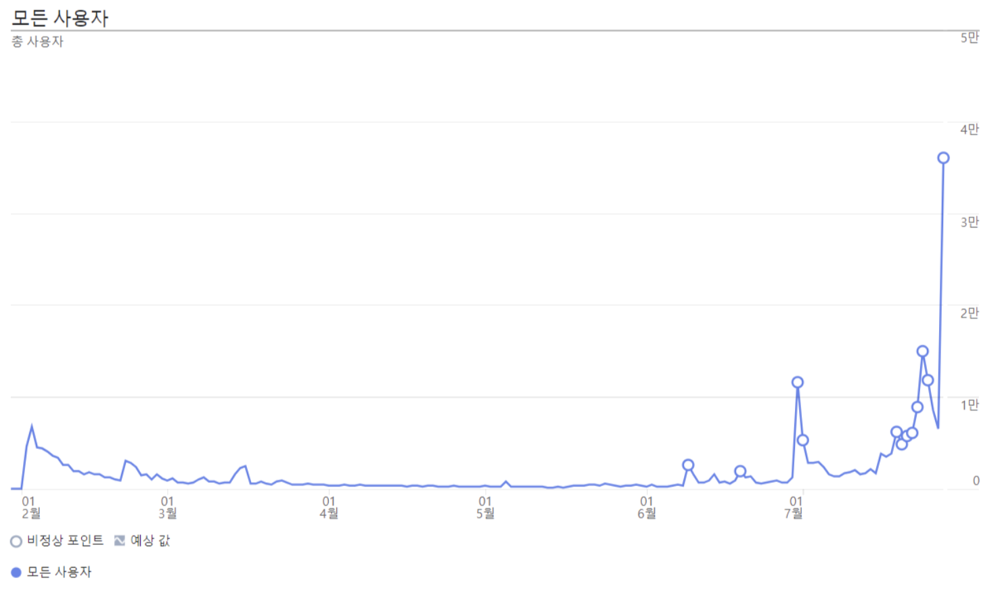
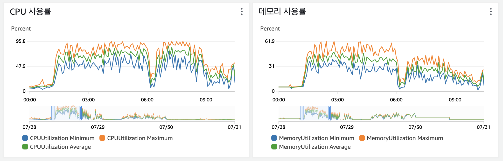
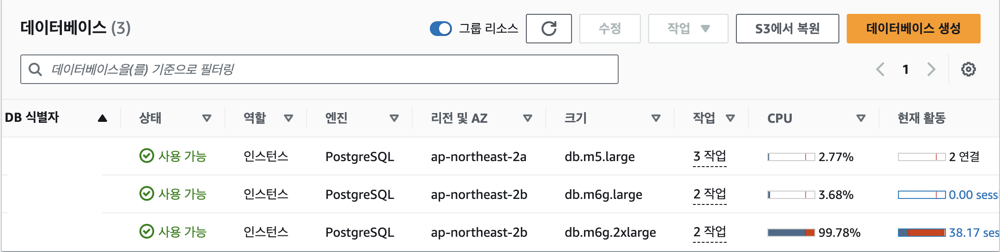
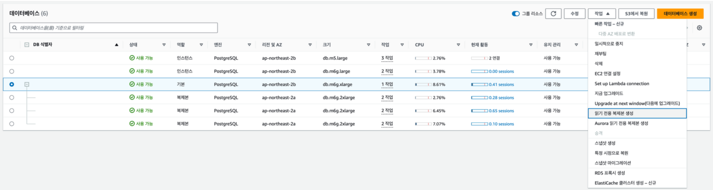
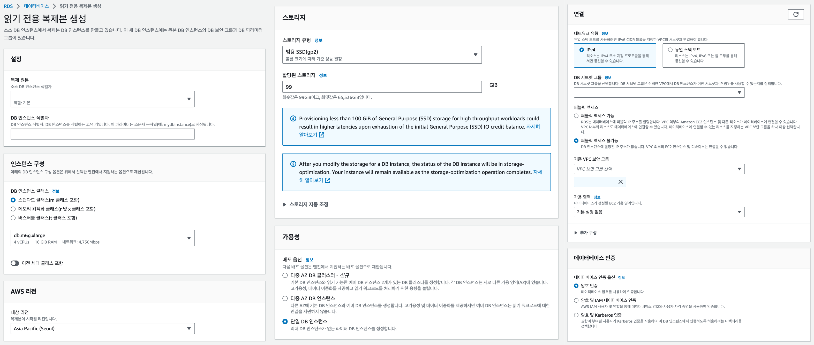
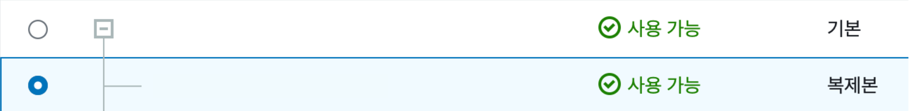

### 처음으로 맛본 트래픽 증가 대응 경험

2023년 1월, 처음으로 오픈한 우리 스타트업의 서비스는 7개월 동안 유저 트래픽이 크게 발생하지 않아 그동안 백엔드 서버 1개, 데이터베이스 1개로도 잘 운영되고 있었습니다.

하지만 7월 말, 천천히 늘어가던 유저 수가 우리 서비스의 좋은 소식과 함께 갑자기 크게 증가하기 시작했는데 서버와 데이터베이스 1개로만 잘 운영하던 서비스가 엄청나게 느려지기 시작했던 것이었습니다.



그 당시 토요일 밤 하필 저는 양양에 놀러 간 상황이었는데, 그때에는 다들 무섭게 쌓여가는 유저 문의를 처리하는데 바빠 당장 인프라 문제에 대응할 수 있는 개발 인력이 없었습니다.

엎친 데 덮친 격으로 끊임없는 유저 문의와 함께 거래 내역이 대략 15,000개가 밀려있는 상황이 발생했었습니다.

거래 내역이 밀리게 됨에 따라 서비스를 사용하는 유저는 실시간으로 거래 내역 상황을 받아볼 수 없을뿐더러 거래가 밀려 가상 자산을 받지 못하는 상황까지 일어났습니다.

또한 거래가 발생하게 되면 일일 미션을 달성하게 되어 포인트를 받는 기능이 있는데, 이 또한 계속해서 밀려 제때 포인트를 받지 못해 장애가 발생한 날에만 포인트를 받지 못하는 경우도 생길 수 있었습니다.





그래서 그 당시 EC2 인스턴스의 CPU와 메모리 사용률이 크게 증가하고, 데이터베이스 CPU 사용률이 거의 100퍼센트에 도달했었습니다.

그렇게 정말 급하게 엄청난 트래픽의 증가에 대응해야하는 때를 마주하게 되었습니다.

### 백엔드 서버는 금방 대응하는데 데이터베이스는..?

백엔드 서버는 당시 AWS ECS를 통해 관리되고 있었기에 손쉽게 EC2 인스턴스 사양 증가 및 Auto Scaling 설정을 조정하여 서버가 6대까지 실행되도록 설정했습니다.

그렇게 로드 밸런서를 통해 서버의 트래픽은 안정적으로 분산되도록 했지만 그다음 관문인 데이터베이스가 문제였습니다.

처음으로 데이터베이스의 CPU 사용률을 저렇게 높게 유지시키는 SQL 문을 찾아봤었는데, 포인트를 지급할 때 중복 지급을 막기 위해 그동안의 내역을 조회하는 쿼리문이 문제였습니다.

쿼리 최적화 또는 캐시 처리를 해야 했던 상황이지만, 아직 제대로 된 테스트 코드가 존재하지 않았고 이 부분은 유저의 자산과 직결되는 문제라 중요한 부분이었기에 추후 충분한 테스트와 함께 개선해야 한다 생각해서 미뤄두었습니다.

일단 백엔드 코드 개선 말고 인프라 부분에서 개선할 수 있는 방법을 찾아 보았는데, 예전부터 찾아보고 있었던 Auto Scaling을 통해 자동으로 트래픽 분산을 지원해 주는 AWS RDS Aurora가 떠올랐지만, 그 당시 급한 상황에서 충분한 테스트도 거치지 않고서 섣부르게 도입하는 건 엄청난 도박이었습니다.

### RDS 읽기 전용 복제본은 어떨까

그렇게 결국 인프라 단에서의 남은 방법은 RDS 읽기 전용 복제본을 통한 방법밖에 없었습니다.

하지만 읽기 전용 복제본을 만들어서 적용하는 방법은 처음이었지만 너무나 다행히도 이미 블로그 포스팅이나 예시가 꽤 많이 나와 있었기 때문에 어려운 점이 없었습니다.

게다가 지금 사용하고 있는 ORM 라이브러리인 Sequelize에서도 읽기 전용 복제본 설정을 손쉽게 할 수 있어서 빠른 시간 내로 트래픽 증가 대응이 가능했습니다.

그래서 당시 급한 상황 속에서 정말 자세하게 찾아보지는 못했지만 빠르게 읽기 전용 복제본을 넉넉하게 만들어서 프로덕션 서버로 배포해 데이터베이스 부하를 잘 분산시켰습니다.

이런 새로운 경험 이후에 RDS 읽기 전용 복제본에 대해 여러 포스팅을 찾아봤었는데 볼수록 너무나도 괜찮은 기능이라고 생각했는데, 이유는 아래와 같습니다.

1. **RDS 인스턴스 당 읽기 전용 복제본은 최대 5개까지 생성할 수 있다.**

   필요에 따라 언제든 손쉽게 읽기 전용 복제본의 수를 늘리고 줄일 수 있습니다.

2. **읽기 전용 복제본은 일반 RDS 인스턴스로 승격할 수 있다.**

   데이터베이스 샤딩, 장애 복구 등의 이유로 독립된 데이터베이스로 분리할 수 있습니다.

3. **데이터베이스 엔진에 따라 읽기 전용 복제본에 쓰기 기능이 가능하도록 설정이 가능하다.**

   아쉽게도 나는 물리적 복제 방식이 적용된 PostgreSQL을 사용하고 있어서 쓰기 기능을 사용할 수 없지만 논리적 복제 방식이 적용된 MySQL/MariaDB 같은 경우에는 쓰기 기능을 사용할 수 있다고 합니다.

너무나도 손쉽게 만들 수 있어서 그 당시 상황에서 선택할 수 있는 최선의 방법이었지만, 조금 우려되는 부분도 있었습니다.

1. **새로운 읽기 전용 복제본의 적용까지 걸리는 시간이 짧은 편은 아니다.**

   이번과 마찬가지로 갑작스럽게 치솟는 트래픽으로 인해 기존에 생성해 놓았던 읽기 전용 복제본으로도 감당이 안 되는 수준이라면 추가로 증설해서 트래픽 증가에 대응해야 합니다.

   하지만 복제본을 생성하는 시간이 짧지 않은 편이고, 새로 추가된 복제본의 엔드포인트를 Sequelize 레플리카 옵션에 추가하고 서버를 새로 배포해야 하는 과정이 필요합니다.

   결국 이 작업이 완료되기 전까지 계속해서 다운 타임이 길어지는 건데 이런 트래픽 스파이크를 장애 없이 대응하기가 조금 어려울 것 같다고 생각했었습니다.

2. **마스터 인스턴스에서 처리된 변경 작업이 전파되는 데까지 딜레이가 생길 수 있다.**

   Standby 인스턴스에 동기적으로 변경 사항을 반영하는 다중 AZ 배포 방식과는 다르게 읽기 전용 복제본에는 비동기적으로 반영이 이루어집니다.

   그래서 변경 사항이 반영되기까지 딜레이가 생길 수도 있었는데, 가상화폐가 오고 가는 시스템에서 딜레이가 길어져 데이터를 제대로 처리하지 못하는 상황이 발생한다면 서비스 신뢰성에 큰 타격을 입히게 됩니다.

   그래서 이 부분은 읽기 전용 복제본을 적용하기 전부터 우려한 부분이었지만, 더 이상 계속해서 길어지는 다운 타임을 지켜보고만 있을 수는 없었기에 일단 먼저 적용한 후에 모니터링을 진행했었습니다.

   다행히 거의 딜레이가 발생하지 않았었고, 조금 딜레이가 발생하더라도 시간이 엄청 짧았기 때문에 프로덕션 환경을 운영하면서 문제가 발생한 적은 없었습니다.

### 그래서 만드는 방법은?

해당 글에서는 Node.js 서버에서 Sequelize를 사용하는 환경을 기준으로 설명하고 있는데, Sequelize를 사용하면 RDS 읽기 전용 복제본을 만들고 적용하는 과정이 되게 간단해집니다.

먼저, AWS RDS 콘솔 페이지에서 읽기 전용 복제본 생성을 희망하는 인스턴스를 선택하고 작업 메뉴의 읽기 전용 복제본 메뉴를 선택합니다.



해당 메뉴를 선택하면 읽기 전용 복제본 생성 페이지로 이동하게 됩니다.

저는 포스팅을 위해 제 환경에서 생성 페이지에 접속했을 때 나타나는 기본 설정을 그대로 캡쳐했지만, 필요에 따라 옵션을 다르게 설정할 수도 있습니다.



그런데 여기서 확인할 수 있는 큰 특징이 2가지 더 보입니다.

첫 번째는 읽기 전용 복제본의 사양을 마스터 노드와 다르게 설정이 가능하다는 점인데, 마스터 노드보다 더 높은 사양으로 복제본을 운영할 수 있습니다.

그리고 두 번째는 읽기 전용 복제본 또한 일반적인 RDS 인스턴스와 같이 높은 가용성을 위해 다중 AZ 배포 옵션을 사용할 수 있다는 점입니다.

이렇게 읽기 전용 복제본을 생성하게 되면 아래와 같이 마스터 노드 아래 복제본이 표시됩니다.



이제 이렇게 생성한 복제본의 엔드포인트를 Sequelize의 replication 옵션에 추가하고 배포해야 합니다.

Sequelize는 읽기 및 쓰기 전용 엔드포인트를 구분할 수 있게끔 옵션을 설정할 수 있습니다.

읽기 전용 복제본을 구성하기 전의 코드는 아래와 같습니다.

```tsx
export const sequelize = new Sequelize(
  config.get<string>('PG_DATABASE'),
  config.get<string>('PG_USERNAME'),
  config.get<string>('PG_PASSWORD'),
  {
    host: config.get<string>('PG_HOST'),
    dialect: 'postgres',
    port: config.get<number>('PG_PORT'),
    timezone: config.get<string>('PG_TIMEZONE'),
    models: [~~],
  },
)
```

예시 코드에서는 config 모듈을 통해 환경 변수 파일을 불러오고 있습니다.

각자 환경에서 작업하는 경우에는 적절하게 데이터베이스 인증값을 넣어서 테스트해야 합니다.

단일 인스턴스에 접속하기 위해서는 위와 같이 코드를 작성해야 했습니다.

하지만 여러 읽기 전용 복제본을 추가하기 위해서는 아래와 같이 코드를 변경해야 합니다.

```tsx
export const sequelize = new Sequelize({
  dialect: 'postgres',
  database: config.get<string>('PG_DATABASE'),
  port: config.get<number>('PG_PORT'),
  timezone: config.get<string>('PG_TIMEZONE'),
  replication: {
    read: [
      { host: config.get<string>('PG_HOST_REPLICA_1'), username, password },
      { host: config.get<string>('PG_HOST_REPLICA_2'), username, password },
      { host: config.get<string>('PG_HOST_REPLICA_3'), username, password },
    ],
    write: { host: config.get<string>('PG_HOST'), username, password },
  },
  models: [~~],
})
```

위와 같이 replication 옵션을 통해 읽기 전용 복제본을 추가할 수 있고, 쓰기 작업을 위한 마스터 노드 설정까지 손쉽게 할 수 있습니다.

그런데 위의 코드에서 모든 인스턴스에 대한 패스워드가 동일한 것을 확인할 수 있습니다.

기본적으로 읽기 전용 복제본 생성 페이지에서는 데이터베이스 암호를 설정하는 부분은 없지만, 생성 후에 변경이 가능합니다.

이제 이렇게 변경한 코드를 배포하면 RDS 읽기 전용 복제본 추가가 완료됩니다.

---

### 출처

1. AWS RDS 공식 문서 - DB 인스턴스 읽기 전용 복제본 작업

   https://docs.aws.amazon.com/ko_kr/AmazonRDS/latest/UserGuide/USER_ReadRepl.html

2. AWS RDS 공식 문서 - Amazon RDS for PostgreSQL의 읽기 전용 복제본 작업

   https://docs.aws.amazon.com/ko_kr/AmazonRDS/latest/UserGuide/USER_PostgreSQL.Replication.ReadReplicas.html
