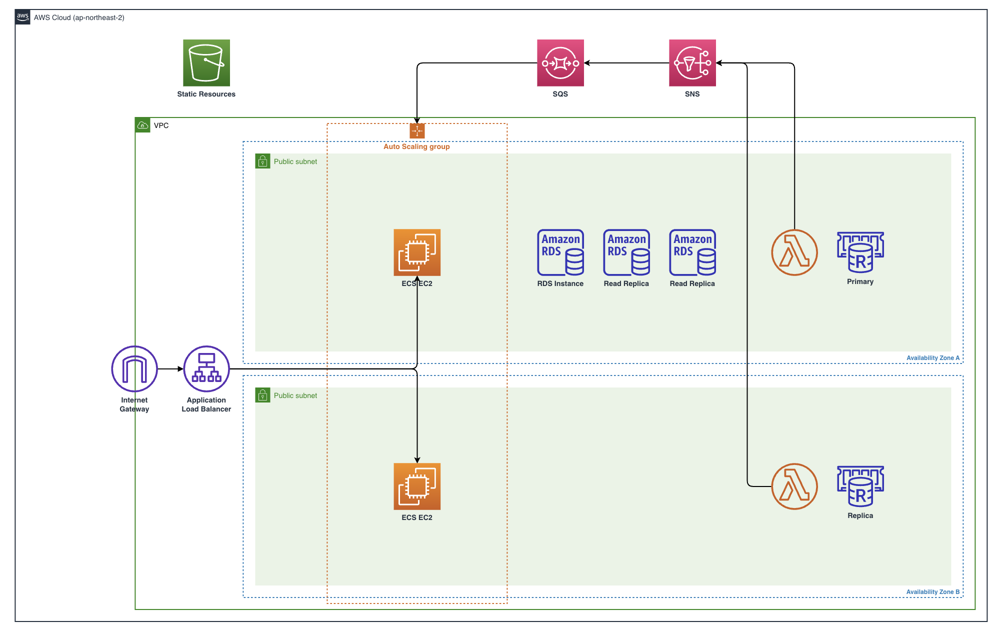
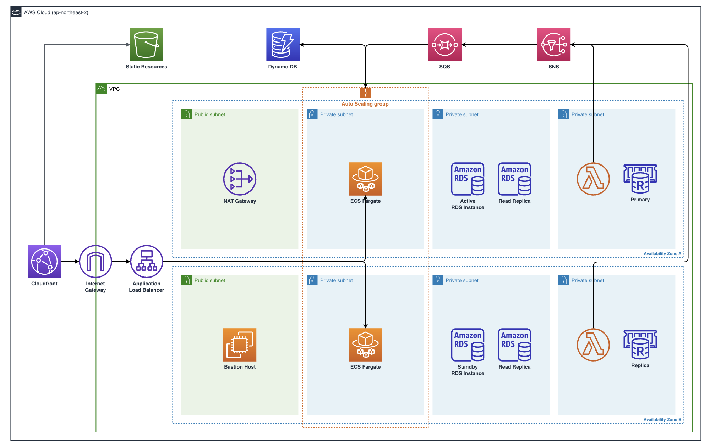

### AWS에 대해 잘 모르던 때 구축한 인프라

처음 프로젝트를 진행할 당시에는 AWS에 대해 잘 알지 못하던 상태였지만, 그때는 다행히 인프라 구조를 잡아주신 시니어 개발자분이 있으셨던 때라 저는 주로 백엔드 코드를 작성하는 데 집중하고, AWS는 어깨너머로만 배우고 있었습니다.

하지만 시간이 지나고 다른 프로젝트를 진행하게 되면서 인프라를 한 번 더 구축해야 하는 일이 생겼는데, 제대로 된 지식도 없는 상태에서 진행하는 거라 정말 맨땅의 헤딩을 하며 AWS를 배워 나가야 하는 처지에 놓였습니다.

그렇지만 결국 저는 AWS에 대해 아는 게 없었기 때문에 그전에 계셨던 분께서 구축했던 구조를 거의 그대로 따라가며 배우는 수밖에 없었습니다.

그런데 그렇게 따라만 하다 보니 에러가 나면 원인을 찾지 못하고, 똑같이 따라 한 것 같은데 나중에 보면 조금씩 달라져 있어 지우고 다시 만드는 걸 수없이 반복하면서 계속된 야근과 밤샘을 이어 나갔습니다.

그렇게 계속된 반복 작업 및 학습을 이어가며 결국 인프라 구축은 어찌저찌해서 마무리하긴 했는데, 그때에는 몰랐지만, 그 당시 구축했던 구조는 안정성, 보안성, 효율성 등 여러 측면에서 좋지 않은 구조였습니다.

급한 대로 인프라 문제를 해결하고 AWS에 대해 다시 공부해서 제대로 된 구조를 잡자 생각하고 한동안 AWS에 빠져있다가 다시 구조를 보니 조금씩 문제점이 보이기 시작했습니다.

그렇게 실시간으로 운영 중인 서비스의 인프라 개선을 시작했고, 제 지식과 경험을 생각해 봤을 때 충분히 성공적인 개선이라고 생각했습니다.

하지만 깊은 지식을 가지고 있는 편이 아니기 때문에 인프라 전문가분들이 보시기에 개선안에도 여러 문제가 보일 수 있으니 해당 부분에 대해서는 따끔하게 충고 부탁드립니다.

### 당시 구축했던 인프라 구조 및 문제점

아래 사진은 AWS를 잘 모르던 때의 제가 구축했던 인프라 구조입니다.

지금 와서 보면 왜 이렇게 했는지 생각이 들었어서 사진을 올리기에 정말 민망했지만, 저와 비슷한 상황에 놓인 분들을 위해 구조도를 첨부했습니다.

<br />



<br />

아마 조금이라도 AWS에 대해 공부를 해본 분이라면 충분히 어디가 문제인지 금방 파악하실 거라 생각합니다.

아래는 AWS에 대해 공부를 하고 나서 생각한 해당 인프라 구조의 문제점입니다.

위의 다이어그램으로 확인되지 않는 내용도 여럿 포함되어 있습니다.

1. 모든 EC2 인스턴스 및 RDS, ElastiCache 리소스가 전부 퍼블릭 서브넷에 위치해 있어 보안성 측면에 문제가 있다.
2. 해당 서비스에서 사용하기 위한 여러 이미지 또는 영상을 S3에 저장해서 불러오고 있었는데, 별도의 도메인 없이 S3 퍼블릭 링크를 직접 사용해 보안성 측면에 문제가 있다.
3. RDS 인스턴스 및 읽기 전용 복제본이 전부 동일한 가용 영역에 존재했기 때문에 해당 가용 영역에 장애가 생기면 데이터베이스 연결이 불가능해 가용성 측면에 문제가 있다.
4. 보안 그룹에 대한 이해도가 낮았기 때문에 임시로 모든 인바운드/아웃바운드 트래픽을 허용해 Access Key와 같은 중요한 데이터가 탈취되면 어디서든 백엔드 리소스에 접근이 가능하다.
5. EC2 인스턴스가 모두 구버전으로 설정되어 있어 불필요하게 요금이 더 많이 발생했고, 인스턴스가 죽는 경우가 많아 그때마다 5xx번 에러율이 크게 높아졌다.
6. IAM에 대한 이해도가 낮았기 때문에 AWS를 사용하는 모든 사용자에게 관리자 권한을 부여해 사용했다.

그 외에도 자세하게 살펴보면 미처 발견하지 못한 여러 문제가 발견될 수 있지만, 아직까지 지식의 수준이 깊지 않아 찾지 못한 것 같습니다.

### 인프라 구조 개선 방안

그렇게 문제점을 정리하고 이를 어떻게 개선할 수 있을지 생각해 봤습니다.

정말 다양한 포스트를 찾고, 강의를 참고했으며, 인프라에 대한 경험이 있는 여러 지인한테도 조언을 얻은 결과, 저는 위와 같은 문제를 해결하기 위해 아래와 같은 개선안을 생각하게 되었습니다.

<br />



<br />

이번에 구조를 개선하면서 서비스 운영 중에 겪는 문제를 해결하기 위해 DynamoDB를 추가로 도입했는데, 이에 대해서는 다루지 않고 온전히 구조 개선에 포커스를 맞추겠습니다.

그렇게 저는 아래와 같이 기존 구조에서 겪은 문제점을 해결하려고 했습니다.

1. 모든 리소스가 퍼블릭 서브넷에 있어 보안성 측면에 문제가 있음
   - 외부에서 접근하면 안 되는 모든 리소스들은 프라이빗 서브넷으로 이동
   - 프라이빗 서브넷에서 외부 인터넷과 통신하기 위해 퍼블릭 서브넷에 NAT Gateway 추가
   - 개발자들이 프라이빗 서브넷의 리소스에 접근하기 위해 Bastion Host를 퍼블릭 서브넷에 구축
2. S3 퍼블릭 링크를 사용해 보안성 측면에 문제가 있음
   - 앞단에 Cloudfront를 추가하고, S3에 저장된 데이터에 접근하기 위한 별도의 도메인 설정
   - Cloudfront 캐시 기능을 사용해 프론트엔드에서 이미지를 더 빨리 불러올 수 있다는 장점도 추가됨
   - S3뿐만 아니라 Load Balancer 앞단에도 Cloudfront를 연결해 데이터 송수신 비용 절감
3. RDS 인스턴스들이 모두 한 가용 영역에 있어 가용성 측면에 문제가 있음
   - 메인 RDS 인스턴스를 단일 인스턴스가 아닌 Multi-AZ 인스턴스로 전환
   - 읽기 전용 복제본을 여러 가용 영역에 고르게 배치
4. 보안 그룹이 느슨해 보안성 측면에 문제가 있음
   - 규칙이 느슨한 보안 그룹을 여러 리소스가 공유해서 사용하고 있었는데, 각 리소스별로 보안 그룹을 생성
   - 리소스별로 보안 그룹의 인바운드/아웃바운드 트래픽을 서로 통신하는 리소스에 맞게 강하게 조정
   - Bastion Host의 경우에는 특정 IP만 허용해 지정된 네트워크가 아니면 접근이 불가능하도록 설정
5. ECS 위에서 돌아가는 EC2가 구버전이고, 자주 인스턴스가 다운됨
   - 용량 공급자를 기존 EC2에서 서버리스 컴퓨팅 엔진인 Fargate로 전환
   - Fargate로 전환하면서 다양한 이점이 생겼는데, 그 이점에 대해서는 다음 포스트에서 다룰 예정
6. IAM 사용자 모두 관리자 권한을 사용
   - 모든 계정의 관리자 권한을 제거하고 필요한 권한만 설정
   - MFA를 설정해 보안성 강화

이로써 원래는 기존 구조로 운영하면서 보안성, 가용성, 안정성 등 다양한 부분에서 불안한 마음이 컸지만, 지금은 꽤 그런 걱정이 해소되었습니다.

또, 이번 기회에 AWS를 공부하면서 그동안 원리를 알지 못해 그냥 따라만 하던 것들, 정확하게 어디서 문제가 발생하고 어떻게 해결할 수 있는지, 다양한 기업은 어떻게 인프라 구조를 잡고 있는지 등에 대해 앎의 정도가 커졌을뿐더러 인프라 분야에 관심을 가지게 된 계기가 되었습니다.

위에서 설명한 과정은 다음 포스트에서 더 구체적으로 다룰 예정이고, 해당 포스트에서는 어떻게 해결했는지 간략하게 소개만 했습니다.

하지만 위처럼 다양한 문제를 해결했음에도 불구하고 아직 해결하지 못한 부분이나 추가로 더 개선하고 싶은 점이 많아 그 부분에 대해 말씀드리려고 합니다.

### 아직 해결하지 못한 문제

이렇게 구조를 완전히 바꾸면서 기존에 문제가 있던 부분을 많이 해결했지만, 그래도 아직 해결되지 못한 채로 남아있는 문제가 여럿 있습니다.

아직 해결하지 못한 것 중에서 가장 먼저 떠오르는 것은 IAM 관련 문제입니다.

위의 인프라 다이어그램에서 볼 수 있듯이 현재 저희는 SQS, SNS, DynamoDB, Lambda, Redis 등 여러 서비스를 사용하고 있는데 강력한 보안을 위해서는 서비스별로 IAM Role을 만들어 적용해 줘야 한다고 했습니다.

이번에 인프라 구조를 변경하면서 IAM 사용자에 대해 개별적으로 정책을 설정했지만, 각 서비스에 대해서는 아직 제대로 된 IAM Role 설정이 안 되어 있습니다.

물론 기본적으로 AWS 서비스를 사용할 때 생성되는 Role에 대해서는 어느 정도 적절한 정책 설정이 되어있지만, 그렇지 않은 Role도 있기 때문에 해당 부분에 대한 개선이 필요합니다.

다음으로는 계정 관련 문제입니다.

현재 저희는 개발 서버와 프로덕션 서버를 운영하고 있는데, 기본적으로 보안을 위해서는 개발 서버를 위한 계정과 프로덕션 서버를 위한 계정을 분리해야 합니다.

하지만 인프라 구조 변경을 위한 시간이 그리 많이 주어지지 않아서 일단 당장은 분리하지 말고 하나의 계정으로 관리하도록 했지만, 추후 완전히 환경을 격리하기 위해서는 계정 관리에 대한 개선이 필요합니다.

다음은 중요하지는 않지만 계속 개선 계획을 생각해 왔던 RDS 관련 문제입니다.

지금은 쓰기 전용으로 사용하고 있는 RDS 마스터 인스턴스에 읽기 전용 복제본을 사용하여 데이터베이스를 구성하고 있습니다.

당장은 이렇게 구성해도 문제가 없지만, 예전에 한 번 트래픽이 크게 증가했던 경험이 있었는데, 그때 데이터베이스에 트래픽이 몰려 급하게 읽기 전용 복제본을 생성해 트래픽 증가에 대응했던 경험이 있습니다.

그런데 앞으로도 이렇게 트래픽이 갑자기 증가하는 순간이 또 올 것이 분명한데, 매번 읽기 전용 복제본을 추가로 생성해서 대응하기에는 꽤 오래 걸려 결국 다운타임의 증가로 이어지게 될 것입니다.

그래서 오토 스케일링과 클라우드에 최적화되어 더 높은 성능을 제공하는 Aurora 인스턴스로 개선을 하고 싶었지만, 기존 RDS 인스턴스와 다른 클러스터 구조에 대한 이해와 Failover 대응과 관련된 부분을 파악하고 있어야 하기에 더 관련 정보를 찾아보고 개선을 진행하려고 합니다.

### 개선하고 싶은 점

이렇게 위와 같은 문제처럼 이번에 인프라 구조를 변경하면서 추가로 해결할 수 있지만 아직 해당 서비스에 대한 이해도가 부족하거나 추가적인 학습이 필요한 경우로 인해 해결하지 못한 문제도 있지만, 그 외에도 부가적으로 인프라를 운영하는 데 있어 적용하면 좋을 것 같은 점도 있습니다.

추가로 개선하고 싶은 점은 위에서 작성한 아직 해결하지 못한 문제 중에서 개발 서버와 프로덕션 서버를 운영하고 있다는 문제에서 파생되는 부분인데, 바로 코드를 통한 인프라 관리 소프트웨어 중 하나인 Terraform입니다.

저희 서비스에서는 여러 AWS 서비스를 사용하고, 개발 서버와 프로덕션 서버를 분리하여 운영하고 있기 때문에 2개의 동일한 인프라 구조를 관리하고 있습니다.

하지만 지금은 인프라를 관리하기 위한 인력이 없는 상황이어서 현재는 제가 맡아서 담당하는지라 더 효율적으로 관리하기 위한 방법을 찾고 싶었습니다.

그렇게 찾은 방법이 Infrastructure as Code(IaC) 도구 중 하나인 Terraform입니다.

그러나 Terraform은 HashiCorp 사가 자체적으로 개발한 언어인 HCL(HashiCorp Configuration Language)를 사용하는데, 결국 Terraform을 도입하기 위해서는 이 HCL 언어에 대한 학습이 불가피했습니다.

아래는 Terraform을 사용해 EC2 인스턴스를 프로비저닝하는 예시 코드입니다.

물론 딱 하나의 EC2 인스턴스를 올리기 위한 거의 최소한의 설정만 해놨지만, 비교적 쉽게 인프라 구성을 파악할 수 있다는 생각이 들었습니다.

```
terraform {
  required_providers {
    aws = {
      source  = "hashicorp/aws"
      version = "~> 4.16"
    }
  }

  required_version = ">= 1.2.0"
}

provider "aws" {
  region  = "us-west-2"
}

resource "aws_instance" "app_server" {
  ami           = "ami-830c94e3"
  instance_type = "t2.micro"

  tags = {
    Name = "ExampleAppServerInstance"
  }
}
```

하지만 결국 Terraform을 도입하기 위해서는 추가적인 학습이 필요하기 때문에 실제 도입은 희망 사항으로만 남겨놓았습니다.

그런데 2023년도 인프콘 발표를 보고 있는데 현재 인프랩의 CTO를 맡고 계신 [이동욱 님의 인프런 아키텍처 2023~2024 발표](https://inf.run/piKX)를 보았습니다.

원래 인프랩에서 인프라 관리를 위해서 Terraform을 사용했었고, 실제로 작년도 인프콘 발표에서도 Terraform 도입에 대한 얘기를 보게 되었는데요, 하지만 1년 만에 IaC 도구인 Pulumi에 TypeScript를 활용한 방법으로 전환했다고 합니다.

<br />


<br />

해당 발표에서 나온 장점으로는 기존에 사용하던 언어를 그대로 사용할 수 있고, 선언형이 아니기 때문에 IDE의 도움을 받을 수 있어 높은 품질로 관리할 수 있으며, 추상화된 설계 및 단위 테스트도 가능하다고 나와 있었습니다.

그래서 Pulumi 관련 문서와 각종 블로그를 찾아봤었는데, 만약에 저희 서비스에 IaC를 도입하게 된다면 어떤 도구를 사용할지 고민해 본 결과 Pulumi를 도입하는 게 좋을 것 같다는 생각이었습니다.

### 글을 마무리하며

처음 인프라 설정을 위해 예전에 구축해 놓은 구조를 참고하면서 열심히 따라 하는 수밖에 없어서 계속한 야근 속에서 꽤 고생했었는데, 이제는 AWS 공부를 병행하게 되면서 예전에 비해 많이 발전했다고 생각합니다.

하지만 글을 쓰는 지금에서도 아직 AWS에 관한 지식이나 학습량이 그리 많다고 생각하지 않아 잘못된 정보를 적었을 수도 있습니다.

해당 글에서는 과거 인프라 구조와 현재 인프라 구조를 비교하고, 기존에 어떤 문제가 있었고, 이를 어떻게 해결했는지 작성했지만 이번에 인프라 구조 개선기를 블로그에 올리기 위해 추가로 관련 정보를 더 찾아봤는데, 그래도 틀린 정보가 있을 수 있어서 지적해 주시면 정말 감사할 것 같습니다.

다음 포스트에서는 실제로 인프라 구조를 개선하는 과정을 구체적으로 보여드리겠습니다.

---

### 출처

1. HashiCorp - Build AWS Infrastructure with Terraform

   https://developer.hashicorp.com/terraform/tutorials/aws-get-started/aws-build

2. 인프런 - 인프콘 2023

   https://inf.run/piKX
