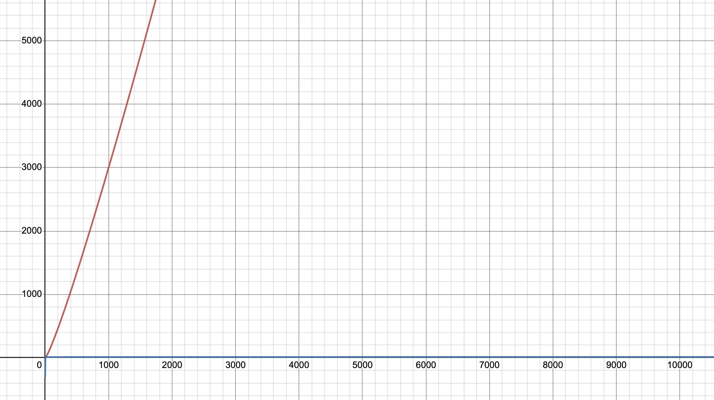

### 랭킹 시스템 개발 배경

처음 서비스 개발을 시작한 제작년, 서비스 활성도 증가를 위한 일일 미션과 포인트 제도에 대한 기획이 나와 해당 기능을 개발해야 했었습니다.

당시 유저 테이블에 포인트 데이터를 함께 저장하도록 기획했기 때문에 처음 코드를 작성할 때에는 제대로 된 백엔드 트래픽을 느껴본 적이 없기도 했고, 관련 지식도 거의 없다시피 했기에 단순히 SQL로만 랭킹 조회 기능을 구축했었습니다.

그래서 저때 개발한 기능은 랭킹 시스템이라고 부르기도 애매했습니다.

그래도 어찌저찌 기능은 잘 동작하고, 서비스 오픈 후로도 유저 수가 크게 증가하는 과정에서도 문제가 없었기 때문에 개선할 생각 없이 쭉 방치해왔지만 어느 순간 이로 인해 조금씩 문제가 생기기 시작했습니다.

조금씩 발견되는 문제점으로 인해 인덱스를 설정할까 했지만 초대 시스템이 존재했기 때문에 자신이 직접 포인트를 취득하지 않고서도 다른 유저에 의해 포인트가 쌓이는 상황이 빈번하게 발생해서 결국 인덱스를 설정하지 않았습니다.

그러다 결국 데이터 수가 1000만개도 되지 않는 상황에서도 TOP 100 목록을 조회하는데 기본적으로 2~3초가 걸릴 정도로 속도가 많이 느려졌고, 트래픽이 높아지면 유저의 개인 랭킹을 조회하는 부분에서 심한 병목이 발생했습니다.

덕분에 데이터베이스의 응답이 계속 지연되면서 서버도 같이 문제가 되고, 일단 해당 기능을 비활성화 하고나서 개선 방안을 생각하기 시작했습니다.

### Redis의 Sorted Set

랭킹 시스템을 구축하기 위해 구글링을 해봤는데, 대부분의 포스트에서 Redis의 Sorted Set을 사용했었습니다.

Sorted Set은 이름에서도 확인할 수 있듯이 순서가 보장되지 않고, 고유한 값을 저장하는 Set 자료구조에 정렬 기능이 포함되어 있는 자료구조입니다.

key 하나에 여러 개의 score와 member가 존재하고, 기본적으로 score 기준으로 정렬되지만 중복되는 경우에는 member를 기준으로 정렬됩니다.

보기에는 특별한 점 없어보이지만 레코드 정렬을 위한 ORDER BY를 사용한 SQL문과 정렬된 데이터 조회를 위한 Redis의 ZRANGE의 시간복잡도를 비교하면 큰 차이가 존재한다는 것을 쉽게 확인할 수 있습니다.

일반적인 상황에서 ORDER BY를 사용한 SQL문의 시간복잡도는 O(N logN)이고, Redis의 ZRANGE의 시간복잡도는 O(logN + M)입니다.

이렇게만 생각해봐도 엄청나게 큰 차이가 느껴질테지만 시간복잡도 그래프를 보시면 어마어마한 차이라는 것을 느끼실 수 있습니다.

<br />



<br />

### 중복이 없다는 특징으로 인한 동점자 처리 문제

Sorted Set을 사용하면 모든게 해결될 줄 알았지만 아쉽게도 해결해야 하는 문제가 하나 있습니다.

바로 동점자가 생기는 부분인데요, Sorted Set에서 동일한 점수에 대해서는 member를 기준으로 정렬되므로 동점자가 있는 경우에 member를 통해 인덱스 값을 조회하는 ZRANK 명령어를 사용하면 올바른 랭킹이 뜨지 않을 수 있습니다.

이를 방지하기 위해 다양한 동점자 처리 방식이 존재하는데, 아래와 같이 처리가 가능합니다.

1. 아무런 처리 없이 member를 통한 정렬 사용하기

   이 방법은 서버 단에서 부가적인 동점자 처리 없이 Redis 명령어를 통해 조회한 순위를 그대로 사용하는 방법입니다.

2. 공동 순위로 처리

   단순히 점수가 동일한 경우에는 공동 순위로 처리할 수 있습니다.

   대신 순위를 구하기 위해서는 ZRANK 명령어 대신, 자신의 스코어보다 높은 유저들의 수를 구한 값에 1을 더한 값을 랭킹값으로 처리하면 됩니다.

3. 소수점을 통한 순위 조정
   
   스코어는 정수값이 아닌 소수값으로도 설정이 가능한데, 이를 통해 세부적으로 순위를 조정할 수 있습니다.

   이를 활용하면 다양한 스코어를 하나의 소수값으로 변환해 세심하게 랭킹을 조정하는 것이 가능합니다.

   대신 유저에게 순위를 보여주기 위해 소수점을 제거하는 추가적인 과정이 필요합니다.

### Node.js 환경에서 랭킹 시스템 구현하기

그럼 본격적으로 Redis를 사용해 랭킹 시스템을 구현해봅시다.

기본적으로 포인트 시스템을 운영하는 경우, 포인트를 갱신하는 과정에서 Redis에도 업데이트를 해줘야 하기 때문에 업데이트 구문에 아래와 같이 ZADD 명령어를 사용해줘야 합니다.

```tsx
const updatePoint = async (userId: string, point: number) => {
	// SQL 포인트 업데이트 구문
	
	// Redis에도 업데이트
	await redis.zadd('ranking', point, userId);

	...
}
```

그리고 포인트가 높은 순으로 랭킹을 조회하기 위해 아래와 같이 ZREVRANGE 명령어를 사용해줍시다.

저는 랭킹 시스템을 구현할 때, 동점자를 공동 순위로 처리했기 때문에 해당 로직도 추가해줬습니다.

```tsx
import { chunk } from 'lodash';

type RankingItemType = {
  userId: string;
  point: number;
  rank: number;
}

const getRanking = async (n: number) => {
	// WITHSCORES 옵션을 추가하면 아래와 같은 형식으로 데이터가 반환된다.
	// ['user_a', '1500', 'user_b', '1200', 'user_c', '1000', ...]
	const ranking = await redis.zrevrange('ranking', 0, n - 1, 'WITHSCORES');

  return chunk(ranking, 2).reduce<Array<RankingItemType>>(
    (result, [userId, point], index) => {
      if (index === 0) return [{ userId, point: parseInt(point), rank: 1 }];
      else {
        // 기본적으로 ranking 값이 내림차순으로 정렬되어있기 때문에 기본적으로 index 값으로 순위를 지정할 수 있다.
        // 따라서 바로 이전 내역의 포인트와 동일하면 공동 순위로 설정하고 다르면 index + 1로 설정한다.
        const rank = result[index - 1].point === parseInt(point) ? result[index - 1].rank : index + 1;
        return [...result, { address, point: parseInt(point), rank }];
      }
    },
    [],
  );
}
```

그럼 이제 특정 유저의 순위를 알고 싶은 경우도 생길 수 있습니다.

해당 경우는 동점자 처리 방법에서 설명한 것과 같이 자신의 스코어보다 높은 유저들의 수를 구한 값에 1을 더한 값을 자신의 순위로 설정하면 쉽게 처리가 가능합니다.

```tsx
const getRankingByUserId = async (userId: string) => {
  const user = await getUser(userId);

  // ZCOUNT 명령어를 통해 스코어가 user.point + 1 이상인 유저의 수를 쉽게 구할 수 있다.
  const count = await redis.zcount('ranking', user.point + 1, '+inf');

	return count + 1;
}
```

### 서비스 중단 없이 데이터베이스와 싱크 맞추기

이제 랭킹 시스템을 모두 구현했다고 가정해봅시다.

그럼 어떻게 Redis의 랭킹 데이터와 데이터베이스에 저장된 유저 포인트의 싱크를 서비스의 중단 없이 맞출 수 있을까요?

빠르게 데이터의 싱크를 맞추기 위해 따로 데이터 삽입을 위한 배치 서버 없이 대용량 데이터를 손쉽게 추가하기 위한 목적으로 Redis의 Pipeline 기능을 사용했습니다.

Redis는 TCP 프로토콜을 사용하기 때문에 하나의 명령어를 호출하면 그에 대한 응답을 기다려야 합니다.

따라서 명령어를 5번 호출하면 요청을 보내고 응답을 받는 과정을 총 5번 반복하게 되는 것입니다.

Pipeline은 위의 문제를 해결하기 위해 한 번에 여러 명령을 실행시켜 성능을 향상시킬 수 있는 기능입니다.

이번 서비스를 개발하면서 삽입한 데이터의 수인 540만개 기준으로 Pipeline 기능을 사용했을 때 걸린 시간은 대략 1초 정도로, Pipeline 기능을 사용하면 무척 빠른 속도로 여러 명령을 한 번에 실행시킬 수 있습니다.

그럼 이제 어떤 순서로 데이터베이스와 Redis 간의 싱크를 맞출 수 있었는지 알아봅시다.

1. 데이터베이스의 유저 테이블 데이터 Export
2. 해당 데이터로부터 각 유저별로 ZADD 명령어를 하나의 txt 파일에 생성
3. CLI에 접속하여 Redis Pipeline을 통해 ZADD 명령어 집합 실행
4. 랭킹 시스템 반영본 배포
5. 1번에서 실시한 데이터 Export 시점 이후에 갱신된 데이터에 대해 Redis에 반영

하지만 데이터가 훨씬 많은 경우에는 위의 과정으로는 안정적으로 데이터의 싱크를 맞추기 어려워 아래와 같이 단계적으로 랭킹 시스템을 적용하는 과정이 필요할 것 같습니다.

1. 백엔드 서버의 포인트 변경 로직에 Redis ZADD 명령어 추가 후 배포
2. 배치 작업을 통해 데이터베이스의 데이터를 Redis에 추가
3. 데이터가 올바르게 들어갔는지 검증
4. 랭킹 시스템 적용 버전 배포

### Redis를 사용한 랭킹 시스템 적용 후

기존에 SQL문을 사용하던 때에는 포인트 TOP 10 목록을 조회하는데 대략 2~3초 정도 소요됐지만, Redis를 사용한 랭킹 시스템을 적용하고 나서는 평균 0.2초 정도로 90% 이상 조회 속도가 향상되었습니다.

게다가 데이터베이스의 병목 지점도 제거되어 보다 안정적으로 높은 트래픽을 받아낼 수 있어 안정성도 향상된 모습을 보였습니다.

다만 Redis에 저장된 데이터의 개수가 5~600만개 정도이고 대략 700MB를 차지하는데, 처음에 계산한 메모리 보다 더 많았어서 제한된 메모리에서 랭킹 시스템을 구축해야 하는 경우에는 체계적으로 메모리 계산을 해야할 것 같습니다.

---

### 출처

1. Redis 공식 홈페이지

   https://redis.io/

2. Redisgate

   http://redisgate.kr/redisgate/education/redis_education.php

3. Redis 랭킹 동점 처리 - 장형이의 일기

   https://developstudy.tistory.com/89